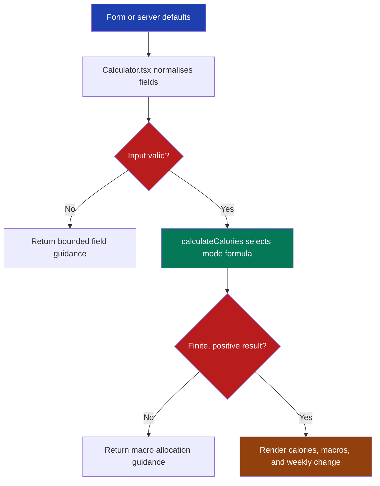

# Calorie calculator architecture

## Purpose

The calculator replaces the compiled Vue bundle in `js/one.js` with `domain/calculate.ts::calculateCalories` and `Calculator.tsx::Calculator`. The migration preserves the observable defaults, modes, labels, conversions, thresholds, rounding, and results from audited commit `9bf25d0`.

The pure domain owns all calculations and validation. The React component owns only form state, unit controls, query-mode enhancement, validation presentation, result presentation, and clipboard interaction.

## File structure

```text
src/features/calculator/
├── Calculator.tsx         # React form and result presentation
├── calculator.css         # Calculator-scoped responsive styles
└── domain/
    ├── calculate.ts       # Formula pipeline and safe result contract
    ├── constants.ts       # Legacy options, defaults, and conversion constants
    ├── conversion.ts      # Pure unit and decimal conversion helpers
    ├── query.ts           # Exact legacy query-mode selection
    ├── types.ts           # Domain input, output, and error types
    └── validation.ts      # Input bounds and field guidance
```

## Processing flow



## Authoritative legacy behaviour

The formula source is the computed-property block in `js/one.js`. `domain/constants.ts::DEFAULT_CALCULATOR_INPUT` sets age `25`, weight `80 kg`, height `180 cm`, male, Sedentary activity, a `-20%` goal, `1 g` protein per pound, and a `50%` fat share of non-protein calories. LeanGains also defaults to `5,000` steps, Standard muscle mass, the neutral body-fat range, a `-500 cal` male goal, and `50%` protein. Keto defaults to `1 g` protein per pound and `20 g` carbs.

The required golden results are:

| Mode | BMR | TDEE | Target | Protein | Fat | Carbs | Weekly change |
| --- | ---: | ---: | ---: | ---: | ---: | ---: | ---: |
| Standard | 1805 | 2166 | 1733 kcal | 176 g | 57 g | 129 g | -0.39 kg |
| LeanGains | not shown | 2240 | 1740 kcal | 218 g | 48 g | 109 g | -0.45 kg |
| Keto | 1805 | 2166 | 1733 kcal | 176 g | 105 g | 20 g | -0.39 kg |

## Formula flow

### Standard and keto

1. Convert imperial weight with `lb / 2.20462` and imperial height with `in / 0.393701`.
2. Calculate BMR with the legacy Mifflin-St Jeor form: `10 × kg + 6.25 × cm - 5 × age + gender constant`.
3. Use the exact legacy gender constants: male `+5`, female `-160`.
4. Round BMR to an integer, multiply by the activity value, then round TDEE to an integer.
5. Multiply TDEE by `1 + goalPercent / 100`, then round target calories to an integer.

Standard protein is `body weight in pounds × protein grams per pound`. Remaining calories are divided between fat and carbs. Fat uses `9 kcal/g` and carbs use `4 kcal/g`.

Keto protein uses the same body-weight calculation. Carbs use the entered gram limit. Fat receives all remaining calories: `(target - protein × 4 - carbs × 4) / 9`.

### LeanGains

LeanGains does not calculate or display BMR. Its TDEE is `weight in kg × adjusted base value`, rounded to an integer. Imperial LeanGains conversion deliberately uses the bundle's separate `2.205` divisor.

The male base is `28`. The female base is `26`. These modifiers are added before multiplication:

- Age: below `25` adds `0.5`; above `45` subtracts `0.5`; all other ages add `0`.
- Male height: above `185 cm` or `73 in` adds `1`; below `167 cm` or `65 in` subtracts `1`.
- Female height: above `170 cm` or `67 in` adds `1`; below `153 cm` or `60 in` subtracts `1`.
- Steps: below `6,000` adds `0`; `6,000` to `7,499` adds `0.5`; `7,500` and above follows `0.5 + 0.5 × ceil((steps - 7,499) / 1,250)`.
- Muscle mass: Standard `0`, Muscular `0.5`, Very Muscular `1`.
- Body fat: the exact gender-specific values in `constants.ts::MALE_BODY_FAT_OPTIONS` and `constants.ts::FEMALE_BODY_FAT_OPTIONS`.

The male goal changes TDEE by `-500`, `0`, or `+500` calories. The female goal changes it by `-350`, `0`, or `+350`. Protein is the selected percentage of target calories divided by `4 kcal/g`. Fat and carbs split the calories left after protein.

### Weekly change and rounding

Weekly change uses the legacy estimate of `3,500 kcal` per pound: `7 × (target - TDEE) / 3,500`. Metric results divide pounds by `2.20462`. The display rounds to two decimals with the extracted decimal-shift helper. All other displayed results use JavaScript `Math.round`, including its positive half-value behaviour.

The unit control uses one-decimal display conversions. For example, `80 kg` becomes `176.4 lb`, and `180 cm` becomes `70.9 in`.

## Validation contract

The legacy number inputs did not define explicit minimums or maximums. That omission could produce `NaN`, infinite values, negative macros, or implausible results. `validation.ts::CALCULATOR_BOUNDS` adds these defensive bounds without changing any valid legacy preset or golden result:

| Field | Accepted range |
| --- | --- |
| Age | 13 to 100 years |
| Metric weight | 30 to 300 kg |
| Imperial weight | 66.1 to 661.4 lb |
| Metric height | 120 to 250 cm |
| Imperial height | 47.2 to 98.4 in |
| Standard/keto calorie change | -50% to +50% |
| Fat share | 0% to 100% |
| LeanGains steps | 0 to 25,000 |
| LeanGains protein | 30% to 80% of calories |
| Keto protein | 0.6 to 1.6 g per pound |
| Keto carbs | 0 to 100 g |

`validation.ts::validateCalculatorInput` returns field guidance instead of a result when a value is outside its bound or is not finite. `calculate.ts::calculateCalories` also rejects a combined calorie and macro selection if it would produce a non-positive target or a negative protein, fat, or carb result.

## Query modes and server output

`query.ts::calculatorModeFromSearch` recognises only the exact searches `?leangains` and `?keto`. Other searches use Standard. The React component renders a complete Standard default form and result during server rendering, then applies either exact alternate query after hydration. This keeps useful labels, defaults, and fallback content in the server HTML.

The Astro calculator route must be the only route that imports and hydrates this React component.

## Clipboard feedback

The Copy control (`#copyB`) reproduces the legacy `btn btn-sm btn-outline-secondary` button inline after the `Results` heading (Bootstrap `vertical-align: middle`, `margin-left: 5px`, `margin-bottom: .6rem`, 7px radius). Its feedback uses the shared project tooltip primitive from `src/scripts/project-tip.ts` rather than inline text:

- hovering or focusing the button shows `Click to Copy (reddit-style markdown)` to the right of the button (legacy tooltip placement, 10px popper offset, muscle theme, `shift-toward-extreme` motion, 50 ms delay);
- activating it copies the Reddit-style markdown table, hides the hint, and replays a separate `Copied!` tooltip above the button for 750 ms (`Copy Failed` for 1 s when the clipboard rejects);
- a visually hidden `role="status"` element still announces the outcome for screen readers.

Any form change invalidates pending clipboard attempts so an older promise cannot report against newer calories or macros.

## Layout contract

`calculator.css` follows the legacy Bootstrap 4 grid: a two-column `Diet`/`Units` row and a 25/33.3/41.7 percent `Stats`/`Modifiers`/`Results` row (30px gutters) down to 768px, the `#app-format` border removed at or below 1023px, and the legacy 767px mobile stack (18px body copy, 25px row gaps, `.app-h3 { margin: 10px 0 5px }`, 1rem field gaps, 62px percentage suffixes, the 26px pill `Estimated` heading, 22px energy heading margins). Information icons are the 18px legacy `.info` image with the black 10px-radius `Click for more info` popper to their right. The share icons reuse the legacy `#icon-twit` and `#icon-book` symbol paths at 35px.

## Known legacy ambiguities

- The public explanation describes the standard Mifflin-St Jeor equation, whose common female constant is `-161`. The bundle uses `-160`. The implementation preserves `-160` because live output is authoritative.
- The prose body-fat example says a man at `22%` subtracts `1.5`, but the bundle's visible `20-24%` option subtracts `0.5`. The implementation preserves the bundle option.
- The bundle uses `2.20462` for normal pound conversion but `2.205` inside the imperial LeanGains TDEE formula. Both constants remain separate.
- Repeated unit switches can display `180.1 cm` after `180 cm` becomes `70.9 in`, because the legacy display rounds each switch to one decimal. This behaviour is retained by the display conversion helpers.
- The old fields accepted unbounded manual values even when their sliders had limits. The documented validation bounds are new safety constraints required by the migration plan.

## Tests

The focused calculator suites lock the three golden defaults, server-rendered output, query modes, conversion parity, LeanGains thresholds, bounded validation, unsafe macro rejection, finite non-negative preset results, and clipboard feedback invalidation.
