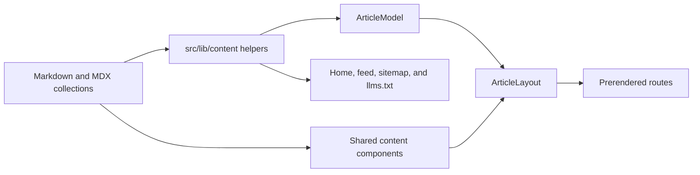

# Site architecture

## Request flow

Cloudflare Static Assets serves prerendered files from `dist/client` before the Worker. `assets.run_worker_first` selects only `/api/subscribe`; `src/worker.ts` delegates that endpoint to the Astro Cloudflare entrypoint. The build disables automatic HTML routing and generates `dist/client/_redirects` from `src/config/routes.ts`. These Static Assets rewrites and redirects preserve the mixed legacy route contract: article routes use no trailing slash, section routes use a trailing slash, and unknown routes use the prerendered custom 404.

`POST /api/subscribe` is the only request-time Astro route. No document page uses server rendering.

The endpoint-only Worker cannot implement the apex-to-`www` redirect. The local preview therefore serves an apex-host request as a static request. Production cutover remains blocked until an external Cloudflare redirect rule, its exact zone target, and its inverse rollback are documented and explicitly approved.

## Sources of truth

| Concern | Owner |
| --- | --- |
| Public paths, slash mode, indexability | `src/config/routes.ts` |
| Canonical origin and approved site facts | `src/config/site.ts` |
| Document metadata composition | `src/lib/metadata.ts` and `src/components/head/PageMetadata.astro` |
| Article and long-form body and frontmatter | `src/content/blog/` and `src/content/pages/` |
| Article defaults, cards, listing, and navigation | `src/lib/content/` |
| Authored figures, callouts, video, references, TOC, and affiliate links | `src/components/content/` |
| Generated published blog slug union | `src/config/blog-slugs.generated.ts` |
| Shared page metadata and shell | `src/layouts/` |
| Security and cache headers | `public/_headers` |
| Worker name, compatibility date, assets | `wrangler.jsonc` |
| Built route rewrites and redirects | `scripts/shape-routes.mjs` |
| Built route and budget enforcement | `scripts/verify-dist.mjs` |

The legacy source files remain as audited migration input. Astro does not import their Bootstrap, jQuery, Popper, Tippy, AnchorJS, Vue, or Universal Analytics runtime.

## Authored content flow

Collection helpers exclude drafts and future-dated entries before they reach routes or discovery output. Blog navigation is chronological by default. Frontmatter stores only exceptions. Document titles are composed once from an uncomposed content title and the separators in `src/config/site.ts`.

## Heading links, share rail, callouts, and back-to-top

- Heading self-links reproduce the production AnchorJS 5 inline contract in `src/styles/global.css` (prepended control, `margin-left: -1.25em`, `padding: 0 .25em`, `font: 1em/inherit anchorjs-icons`, normal weight, antialiased, `-1.125em` hover travel over 0.25 s) and the production font in `public/fonts/anchorjs-icons.ttf`.
- Tooltips use one tippy.js-equivalent primitive (`.project-tip-root`, `.project-tip-box[data-theme][data-placement][data-state]`, `.project-tip-content`, `.project-tip-arrow`) with the legacy `pretty-tippy.css` themes and `shift-toward-extreme` motion. `src/scripts/project-tip.ts` builds the DOM, the `#b-gradient` arrow fill, and the shared clipboard helper; `src/scripts/heading-links.ts` owns the two heading tooltips; the calculator island renders the same structure for its copy control; `src/components/SocialShareRail.astro` renders the share tooltips and `src/scripts/social-share.ts` drives them.
- Heading self-links follow the legacy AnchorJS scope: `.post-body h2, #how-to-use, .post-body h3:not(#share-t,#comm-t), h4, h5`. Headings inside `[data-content-ending]` (bottom newsletter, Share, Comment, previous/next navigation), the visually hidden supplement filter heading, and any `[data-heading-links="off"]` container (the legacy calculator article, which never loaded AnchorJS) receive no control.
- Prose links inherit the legacy `addon.css` inset underline in every article, callout, confirmation, join, and 404 container. The site does not enable OpenType ligatures in Chromium: legacy only sets the Firefox-prefixed `-moz-font-feature-settings`, and enabling `liga` changed line wrapping.
- The calculator page's newsletter prompts follow the legacy scripts: the floating panel appears at or above 1440px once `pageYOffset > 660` (`js/eml-flt-right.js`), and the exit prompt is a full-viewport `rgba(33,33,33,.8)` overlay with the centred 700px `.n-lett` panel that opens 30 seconds after load (`js/e-on-delay.min.js`) and closes on its hide button, an overlay click, or Escape.
- The share rail uses the exact legacy markup, SVG paths, ids, and `pretty-tippy.css` icon geometry.
- Callouts share the legacy `addon.css` palette (`#2F81F7` Note, `#A371F7` Important, `#D29922` Warning) and an inline-flex title row.
- The back-to-top control renders only on `/calorie-calculator/` and `/supplements/`, matching the legacy 60px fixed circle, icon background, and 1000px reveal. The site has no CSS smooth scrolling, matching legacy.
