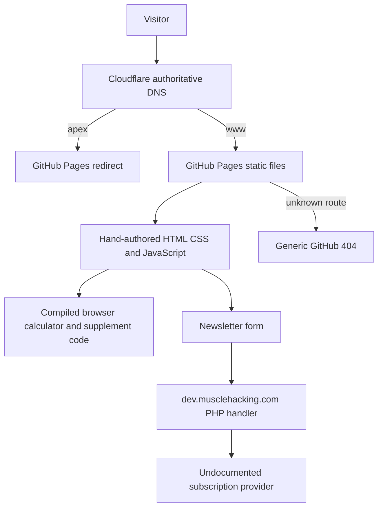
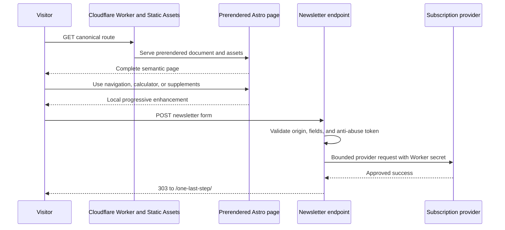

# Astro and Cloudflare Workers Migration Plan 🔄 **IN PROGRESS**

<critical_warning>
> **CRITICAL WARNING:** No agent may change the `musclehacking.com` DNS records, bind the production custom domains, make the GitHub repository private, or retire GitHub Pages until a human approves the exact cutover packet. The packet must identify the tested Git commit, Cloudflare Worker version, complete DNS before-state, exact proposed DNS diff, and exact rollback actions.
</critical_warning>

<important_note>
> **IMPORTANT NOTE:** The target is a faithful rebuild, not a redesign. Preserve the current public design, copy, route shapes, calculator results, supplement interactions, and newsletter outcome. Fix only verified technical defects and additions required for a secure Astro and Cloudflare implementation. Any copy, identity, canonical, crawler, analytics, or legal-policy decision that is not provable from the current site requires human approval before cutover.
</important_note>

## 1. Goal

Replace the hand-authored GitHub Pages build with a current Astro site deployed through Cloudflare Workers Builds and Workers Static Assets. The agent owns discovery, implementation, content migration, interaction parity, testing, Cloudflare preview setup, documentation, and the cutover rehearsal. A human owns the final production cutover approval.

The migration is complete when:

- every existing public route renders the approved content and layout at desktop and mobile widths;
- existing URL and redirect behaviour remains compatible, including the current mixed trailing-slash policy;
- the calorie calculator and supplement filters match recorded legacy results and interactions;
- newsletter submissions use one narrow Cloudflare Worker endpoint and reach the verified existing subscriber destination;
- all pages remain prerendered except the newsletter POST handler;
- the Cloudflare preview passes functional, visual, accessibility, security, SEO, agent-readiness, and performance checks;
- the exact verified Worker version serves both production hosts after human-approved DNS changes;
- `https://www.musclehacking.com` remains canonical and the apex host redirects to it once;
- the existing GitHub repository becomes private only after the new production origin is healthy and Cloudflare's GitHub App access is verified; and
- a tested rollback remains available without reconstructing the legacy site.

---

## 2. Current State Analysis

### 2.1 Current Implementation Overview

- Repository: `musclehacking/musclehacking.github.io`, currently public, default branch `master`.
- Audited baseline: Git commit `9bf25d0` on a clean working tree.
- Hosting: GitHub Pages, with `CNAME` set to `www.musclehacking.com`.
- DNS: Cloudflare is authoritative. The apex currently resolves through four GitHub Pages A records, and `www` is a CNAME to `musclehacking.github.io`. Email and unrelated subdomain records must remain unchanged.
- Build: hand-authored HTML, CSS, and JavaScript. `.cursorrules` describes a retired Harp workflow, `.nvmrc` pins Node 12, and there is no useful `package.json`, CI workflow, Astro configuration, or Wrangler configuration.
- Inventory: 20 HTML routes, 20 JavaScript files, 8 CSS files, local fonts, images, `feed.xml`, `robots.txt`, and `sitemap.xml`. There is no custom `404.html` or `llms.txt`.
- Interactivity:
  - a compiled Vue calculator bundle controls standard, LeanGains, keto, metric, and imperial calculations;
  - the supplements page uses inline code plus Bootstrap, jQuery, Popper, and Tippy for filtering, ordering, navigation, and popovers;
  - shared scripts control the responsive navigation, anchor links, share links, newsletter prompts, back-to-top behaviour, and email UI.
- Newsletter: browser JavaScript posts reCAPTCHA-backed form data to `https://dev.musclehacking.com/subscription-handler.php`, expects JSON, and redirects to `/one-last-step/` after success. The PHP handler source and downstream provider credentials are not present in this repository.
- Analytics: every page includes the retired Universal Analytics property `UA-120945323-1`. No current analytics destination is documented.
- Response policy: GitHub Pages provides only basic caching. The site currently lacks a project-owned CSP, `nosniff`, referrer, permissions, frame, and HSTS headers.

### 2.2 Current Flow

### 2.3 The Core Problem

The source is a collection of duplicated pages and opaque browser bundles rather than a maintainable site model. Shared layout, metadata, navigation, scripts, and newsletter forms are repeated across files. The live origin also contains verified defects:

- all six feed item links are emitted as `/blog/[object Object]`;
- `/join/` uses the `/one-last-step/` canonical and title;
- the blog index has no canonical;
- the home page contains invalid heading markup;
- the sitemap omits indexable routes;
- the production site has no custom recoverable 404 page or `llms.txt`;
- obsolete Universal Analytics code and multiple legacy CDN dependencies run on every applicable route; and
- the newsletter depends on an undocumented PHP service outside the repository.

A direct file conversion would preserve this fragility. The rebuild must first extract stable content, route, interaction, metadata, and service contracts, then render all public surfaces from one source of truth.

### 2.4 Affected User Scenarios

| Scenario | Current expectation | Migration risk |
| --- | --- | --- |
| Open an article from a saved link or search result | The existing no-trailing-slash article URL returns `200` | A global Astro slash policy could create redirects or `404` responses |
| Open a section route without its slash | GitHub Pages redirects to the slash form | Static Assets defaults may not reproduce the same status and location |
| Use Standard, LeanGains, keto, metric, or imperial calculator mode | Inputs produce stable calorie and macro results | Replacing the opaque bundle can alter formulas, rounding, or defaults |
| Filter and inspect supplements | Buttons reorder and hide entries, and popovers expose supporting text | Removing Bootstrap and jQuery can break ordering, focus, or content access |
| Submit any newsletter form | The handler validates the anti-bot token, subscribes the address, and redirects | The downstream provider and secret contract are not in the repository |
| Browse without JavaScript | Core content remains readable | Excess hydration could hide or duplicate content |
| Request an unknown route | A real `404` status is returned | A single-page fallback could incorrectly return `200` |
| Use a crawler or feed reader | Canonicals, sitemap, robots, and feed describe the site | Existing defects can be copied into the new build |
| Roll back after cutover | GitHub Pages is the current fallback while the repository is public | Making the repository private can remove that fallback |

### 2.5 Technical Constraints

- Preserve the production canonical origin `https://www.musclehacking.com`.
- Preserve the exact mixed URL contract unless the human separately approves an SEO URL migration:
  - slash routes: `/`, `/blog/`, `/books/`, `/calorie-calculator/`, `/join/`, `/lose-fat-gain-muscle/`, `/one-last-step/`, and `/supplements/`;
  - no-slash article routes: `/blog/australian-health-star-rating`, `/blog/best-protein-powder-for-building-muscle`, `/blog/breakup-energy`, `/blog/calorie-calculator-how-to`, `/blog/change`, `/blog/healthy-low-calorie-foods`, `/blog/healthy-organic-post`, `/blog/idols`, `/blog/normal`, `/blog/reject-modernity-embrace-masculinity`, `/blog/weak`, and `/blog/what-is-intermittent-fasting`.
- Keep all document pages prerendered. Only `/api/subscribe` may run per request.
- Use the current stable Astro, Cloudflare adapter, Wrangler, React integration, TypeScript, test tooling, and a supported Node LTS at implementation time. Pin exact resolved versions and commit the pnpm lockfile.
- Use Web APIs in Worker code. Do not enable `nodejs_compat`, observability, Smart Placement, a database, sessions, storage, authentication, or another Cloudflare service without a tested requirement.
- Do not copy Bootstrap, jQuery, Popper, Tippy, AnchorJS, or the compiled Vue bundle into the new architecture merely for convenience.
- Do not invent provider credentials, analytics identifiers, legal claims, business addresses, or identity details.
- Do not submit real visitor data during testing. Use provider sandbox settings or a human-approved test recipient.
- Do not change or delete `dev.musclehacking.com` until the new newsletter path is accepted and its rollback no longer needs the old service.
- Before any DNS write, use Cloudflare's authoritative API to capture every affected record and all available fields in a checked project runbook. Never print or persist the API key.
- Use `trash`, not permanent deletion, when the implementation removes legacy files.

### 2.6 Existing Infrastructure That Can Be Reused

- The audited Git commit and current live site are the visual, content, route, and behaviour baseline.
- Existing article copy, images, SVGs, GIFs, WOFF fonts, social profile URLs, source links, and email address can be migrated after integrity checks.
- Existing calculator defaults and live results provide golden regression fixtures.
- Existing supplement categories, rankings, descriptions, references, and visible order provide deterministic data fixtures.
- Existing `robots.txt` archive-bot exclusions can be preserved until the human approves a policy change.
- Cloudflare already manages the authoritative DNS zone, so no nameserver migration is required.
- The existing GitHub repository can remain the source repository and become private after cutover.

### 2.7 Reopened Visual and Interaction Parity Audit - 1 September 2026

Human review of the hosted Astro Worker found material parity defects that the original page-wide screenshot threshold and interaction suites did not catch. This audit uses the thirteen supplied screenshots, the live production site, the hosted Astro preview, the audited legacy source at commit `9bf25d0`, and computed browser styles at a 1440-pixel desktop viewport. Screenshots 12 and 13 are byte-identical, so the evidence set contains twelve unique images but all thirteen reported items remain tracked below.

The prior visual-completion claim is superseded. The affected implementation steps and automated quality gate are reopened until every row below passes its route and state matrix.

| ID | Surface and evidence | Verified parity defect | Required target and ownership |
| --- | --- | --- | --- |
| UI-01 | Home sidebar newsletter, screenshot 1 | Human review reports the `Email Me` control as visually off-centre and detached from the field. The shared Astro form hard-codes a 120-pixel button and one layout for placements whose live widths, font sizes, and proportions differ. | Reproduce the live sidebar input/button baseline, vertical centring, 67/33 width split, border join, type metrics, and responsive stacked state. Give `NewsletterForm.astro` explicit placement variants rather than one universal geometry. |
| UI-02 | Note callouts, screenshots 2-4, and human review on 2 September 2026 | New Astro callouts originally rendered the Unicode string `ⓘ`; the current local component now uses project-owned SVGs, but the visible layout is still wrong. The icon occupies its own line and the `Note`, `Important`, or `Warning` label appears on a separate line instead of sharing one baseline. | Keep one project-owned callout contract and use the exact live SVG path, 16 by 16 size, colour, gap, baseline, border, and label typography on home, calculator, supplements, books, guide, and every article callout. The icon and title word must be visibly inline on the same row at every supported width. Preserve the separate approved Important and Warning icons. |
| UI-03 | Supplement filters and evidence badge, screenshots 3-7 | The live active filter uses `muscle2` at 16 px, white text, `#1f618d`, a 1-pixel border, 16-pixel radius, 6 by 12 pixel padding, and the legacy shadow. Astro uses Georgia fallback metrics, no border, a 10-pixel radius, and different padding. The live `What is this?` text is white but Astro is dark. The live `high` badge is 18.9 px semibold with white text; Astro is 16 px bold with dark text. | Match active, inactive, hover, pressed, focus, wrapping, spacing, shadow, font, badge, and colour states at desktop and mobile widths in `SupplementExplorer.astro` and supplement styles. |
| UI-04 | Supplement evidence popover, screenshot 7 | Hovering the live `high` badge opens a right-side popover with the heading `What is this?` and the research explanation. Dispatching the same hover state on Astro leaves `aria-expanded="false"` and renders no visible popover. Current tests cover keyboard activation but not hover. | Open the same content on pointer hover and keyboard focus/activation; position it beside the badge; keep it reachable, dismissible, and touch-safe; and assert content, placement, visibility, and focus behaviour. |
| UI-05 | Heading self-links, screenshots 5, 6, 8, and 9, and human review on 2 September 2026 | The local heading anchor still does not look like production: it is too thick, its visible position differs, and its entrance/hover motion is not the same. The `Click to Copy` arrow points away from the AnchorJS control instead of toward it, and the `Link Copied` state does not appear or animate like production. | Reproduce the exact observable live contract from the locally retained legacy HTML/CSS/JavaScript: match the AnchorJS glyph weight, size, baseline, offset, colour, hover movement, hit area, blue gradient panel, project font, bouncy `shift-toward-extreme` motion, and arrow orientation. The arrow tip must visibly target the anchor control. `Click to Copy`, `Link Copied`, and failure states must use the production placement, timing, animation, and dismissal while preserving the canonical clipboard and no-navigation contract. |
| UI-06 | Header brand image and geometry, user rejection on 1 September 2026 | The first correction rendered `Muscle Hacking` as text. The authoritative legacy header uses the actual `/img/musclehacking.png` wordmark beside `/img/muscle-hacking.png` on wide screens. At 1994 pixels the wordmark is 416 by 30 pixels and begins 20 pixels after the 52 by 50 symbol. | Render the real project-owned wordmark image with its intrinsic geometry and the legacy breakpoint behaviour. Match the full header container, brand, navigation, icons, social controls, and spacing at 1994, 1750, 1440, intermediate, and mobile widths. Do not substitute text for the image. |
| UI-07 | Calculator floating prompt and exit modal, screenshot 2 and legacy source | The first correction did not prove optical centring of the `Email Me` label. The user reports the button as visibly off-centre. The floating prompt in screenshot 2 is a 360-pixel panel with a 500-pixel form constrained to the panel, a 67/33 joined split, centred control text, and centred surrounding copy. The exit modal is a separate 700-pixel centred panel. | Reproduce both legacy states independently. Measure the visible text centre against the button centre, not only the input and button box centres. Match panel width, padding, form width, 67/33 split, control line height, content, close control, backdrop, vertical centring, trigger, outside-click/Escape dismissal, focus containment, and focus return at desktop and mobile widths. |
| UI-08 | Calculator guide and table of contents, screenshot 10 | Astro reuses the standalone `/blog/calorie-calculator-how-to` entry as the calculator-page guide. That entry starts at `Stats`, so `/calorie-calculator/` omits the live introduction, the Diet section with Standard/Leangains/Keto children, and `/img/leangains-calculator.jpg`. Its table of contents therefore starts at `Stats`, uses different labels and IDs, and appears before the missing image and intro copy. | Extract the calculator-page guide from `calorie-calculator/index.html` as its own content source. Restore the exact intro sequence, note blocks, image and alternative text, TOC hierarchy/order/labels/targets, Diet sections, and remaining guide content without changing the standalone article’s distinct contract. |
| UI-09 | Article and supplement heading hierarchy, human comparison | The defect is systemic. A representative live article H3 is 40 px with 46-pixel line height; the Astro equivalent is 20.8 px with 24.544-pixel line height. Live calculator-guide H4 headings such as `Activity Level` are 32 px; Astro renders 21 px. The supplement `Creatine` H2 is 40 px live and 36 px in Astro. | Restore the live desktop and mobile H1-H5 type scale, weights, line heights, tracking, top margins, anchor offsets, and fixed-header scroll clearance for all twelve articles, long-form pages, calculator guide, and supplements. Keep calculator application headings as a separately tested scale. |
| UI-10 | Home post layout, alignment, overlay, and hover, user rejection on 1 September 2026 | The first correction only checked the border. Direct 1994-pixel comparison shows the Astro post column starts 135 pixels too far right and the sidebar starts about 92 pixels too far left. The title overlay is positioned against the link that also contains the excerpt, so the title falls below the image and collides with the excerpt. The legacy title is contained by the image figure, and every post image/excerpt follows the legacy column edges and vertical rhythm. | Restore the legacy wide-screen and responsive column grid, 700-pixel post edge, sidebar edge, card figure geometry, image-contained title/date overlay, excerpt position, 25-pixel post rhythm, six-pixel hover/focus border, and complete linked hit area. Compare first, middle, and final posts at each breakpoint and assert exact edge/centre deltas against legacy fixtures. |
| UI-11 | Global footer, human report and browser comparison | The live audited home, supplement, calculator, and article routes have no footer. `BaseLayout.astro` injects a new `site-footer` by default on every Astro route except `/join/`. | Remove the unapproved footer from all parity routes and delete its reserved spacing and navigation output. Add a negative route-matrix assertion so a footer cannot return without separate human approval. |
| UI-12 | Article endings and floating social-share controls, user rejections on 1 and 2 September 2026 | The previous/next ending work remains part of this requirement. The current human review also finds that Facebook, LinkedIn, and copy-link icons are not correctly sized or centred; only Twitter and email are accepted. The `Share on Twitter`, `Share on Facebook`, and equivalent tooltip entrances do not reproduce the production bouncy motion. | Prove every article ending and floating rail on its complete route matrix. Match each icon independently by visible path bounds, rendered size, optical centre, circle centre, hover ring, and active state. Reproduce the locally retained production share-tooltip placement, arrow, labels, duration, easing, overshoot/bounce, and copied state. Do not accept a single generic width rule or a simple linear slide as parity proof. |
| UI-13 | Bottom-of-content newsletter, screenshots 12 and 13 | The shared Astro bottom form uses a 380/120 split inside 500 pixels; the live article form uses a 335/165 67/33 split and 18.9-pixel control type. Human evidence also shows the Astro button text wrapping/clipping in the affected layout. Calculator, long-form, article, sidebar, floating, modal, and join placements currently share too much geometry. | Define and test placement-specific widths, font sizes, button alignment, border joins, assurance spacing, and mobile stacking. The button label must remain on one line and fully centred at every supported width. |

### 2.8 Cross-Site Propagation and Similar Defects

The audit found the following shared causes beyond the individual screenshots:

- `BaseLayout.astro` makes the unapproved footer a default, so the defect propagates to the home page, blog index, all twelve articles, books, calculator, guide, confirmation, supplements, and 404 unless explicitly hidden.
- `NewsletterForm.astro` supplies one fixed 120-pixel button to seven different placement contracts. Each placement must be tested separately: home/sidebar, article bottom, long-form bottom, calculator bottom, calculator floating prompt, calculator exit modal, and join page.
- `heading-links.ts` now implements clipboard and DOM tooltip states, but the 2 September review confirms that its rendered glyph weight, movement, tooltip pointer direction, and copied-state presentation still diverge from the locally retained production implementation. Its route scope includes every eligible H2-H5 in `.legacy-content` and `[data-heading-links]`, so the defect propagates site-wide.
- `social-share.ts`, `SocialShareRail.astro`, and the global rail styles contain the required labels, SVGs, and state hooks, but the Facebook, LinkedIn, and copy-link visible paths are not sized or optically centred like production, and the tooltip entrance is a simple slide rather than the retained bouncy production motion.
- Global H3 and H4 defaults override the legacy article hierarchy. The mismatch is reproduced on `/blog/what-is-intermittent-fasting`, `/blog/calorie-calculator-how-to`, `/calorie-calculator/`, and `/supplements/`, so all twelve articles and both long-form content routes require a complete heading matrix review.
- The supplement suite verifies category membership and keyboard activation but not pointer hover, exact computed styles, popover placement, badge type, or heading-copy behaviour.
- The calculator content model treats the standalone calculator article as interchangeable with the longer calculator-page guide. They are distinct public surfaces and need distinct content sources with shared fragments only where the audited copy is identical.
- The original 2 percent full-page image threshold can pass a locally broken component because the error occupies a small part of a tall page. Broad masks and the two approved supplement viewport exceptions can also hide component geometry. State-specific component crops, DOM/style assertions, and human side-by-side review are required in addition to the page-wide threshold.
- Desktop-only initial screenshots cannot prove hover, focus-visible, clipboard, popover, delayed prompt, modal, article-end, lazy-image, or mobile stacking parity. Those states now form an explicit test matrix in Steps 4-7 and 10.

### 2.9 Fourth Human Visual Review - 2 September 2026

The human reviewed the corrected local Worker at `http://localhost:8787/` and rejected the visual-parity completion claim again. Functional tests and the 1 September comparison packet are not acceptance evidence for the following visible states. These findings are open and block local UI acceptance, hosted-preview acceptance, and cutover candidacy:

- **Heading anchor appearance remains open:** the anchor to the left of eligible headings does not look the same as production. Its visible glyph is too thick and its position and movement differ from the production AnchorJS control.
- **Heading anchor animation remains open:** the hover and entrance animation does not reproduce the production timing, easing, travel, or visual weight.
- **Callout title alignment remains open:** Note, Important, and Warning icons are not visibly inline with their title words. The icon is on one line and the word is on another.
- **Heading `Click to Copy` pointer remains open:** the tooltip pointer faces away from the AnchorJS control. It must point toward and visually terminate at the anchor control.
- **Heading `Link Copied` feedback remains open:** the copied state does not appear, move, hold, or dismiss like production.
- **Social icon geometry remains open:** Facebook, LinkedIn, and copy-link icons are incorrectly sized and/or optically centred in their circles. Twitter and email are the only accepted floating-rail icon geometries in this review.
- **Social tooltip motion remains open:** `Share on Twitter`, `Share on Facebook`, and the equivalent floating-rail tooltips do not use the same bouncy production entrance animation.

This is a bug-fixing and integration task, not a from-scratch visual recreation. The authoritative implementation material already exists locally:

- the retained legacy pages under `calorie-calculator/index.html`, `supplements/index.html`, and `blog/*.html` contain the production social-rail markup, SVG paths, AnchorJS/Tippy wiring, and animation references;
- `src/styles/legacy-addon.css` retains the legacy callout, icon, popover, tooltip, share-rail, and heading geometry needed for direct comparison;
- `src/scripts/heading-links.ts`, `src/scripts/social-share.ts`, `src/components/Callout.astro`, `src/components/SocialShareRail.astro`, and `src/styles/global.css` contain the current Astro implementation.

The correction must compare those local sources directly, isolate the specific translation or styling bugs, and reuse the existing paths, geometry, placement, labels, and motion contract. It must not invent a new icon set, generic animation, or approximate visual treatment.

---

## 3. Desired State

### 3.1 Desired State Requirements

- **REQ-1 (MUST):** Render all existing routes from Astro layouts, components, content collections, and typed data rather than duplicated HTML.
- **REQ-2 (MUST):** Preserve current copy, approved visual appearance, public URL shapes, internal links, route statuses, redirects, and interactive results.
- **REQ-3 (MUST):** Keep all documents prerendered and limit request-time code to the newsletter POST endpoint.
- **REQ-4 (MUST):** Generate titles, descriptions, canonicals, Open Graph data, structured data, sitemap, robots, feed, and `llms.txt` from reviewed site and content data.
- **REQ-5 (MUST):** Provide a real HTML `404` response with recovery links and no false `200` fallback.
- **REQ-6 (MUST):** Rebuild calculator logic as pure tested TypeScript plus one React island, and rebuild other interactions as small processed TypeScript modules.
- **REQ-7 (MUST):** Accept newsletter POST requests through Cloudflare, validate and bound every field, protect secrets, prevent log leakage, and return a `303` redirect on success.
- **REQ-8 (MUST):** Pass the complete local and authorised Cloudflare preview test matrix before any DNS change.
- **REQ-9 (MUST):** Keep the repository public and GitHub Pages recoverable until the new custom domains pass the approved cutover checks.
- **REQ-10 (MUST):** Make the existing repository private after production host verification, then prove Cloudflare Workers Builds still has selected-repository access.
- **REQ-11 (MUST NOT):** Push, merge, promote a production version, bind a custom domain, change DNS, change repository visibility, or retire the legacy origin outside the authority gates in this plan.
- **REQ-12 (MUST NOT):** add hidden user-agent routing, query-based agent mode, per-page public Markdown duplicates, or unverified third-party scripts.
- **REQ-13 (SHOULD):** Achieve a median Lighthouse score of at least 95 in Performance, Accessibility, Best Practices, and SEO on representative mobile preview routes, with LCP at or below 2.5 seconds and CLS at or below 0.1.
- **REQ-14 (SHOULD):** Keep first-party compressed JavaScript at or below 35 KB on non-calculator routes and route-specific compressed calculator JavaScript at or below 100 KB, excluding explicitly approved provider scripts.
- **REQ-15 (MUST):** Pass the reopened UI parity matrix for initial, hover, focus, keyboard, clipboard, popover, floating-prompt, modal-open, article-end, desktop, intermediate, and mobile states. Page-wide pixel thresholds may not override a failed component-level or human parity review.

### 3.2 Defaults and Fallbacks

- **Migration scope default:** visual, copy, URL, and behaviour parity plus verified technical fixes. No redesign.
- **Canonical default:** self-canonical for every indexable route. Any exception, including `/blog/calorie-calculator-how-to`, requires an explicit approved canonical matrix.
- **Indexing default:** index the home page, blog index, twelve articles, books, calculator, fat-loss guide, supplements, and approved trust pages. Set `/join/`, `/one-last-step/`, `/404.html`, API routes, and internal build assets to `noindex` or exclude them from discovery as appropriate.
- **Agent-readiness default:** file-only readiness. Serve semantic HTML, `robots.txt`, `sitemap.xml`, `feed.xml`, `llms.txt`, and a real HTML 404. Do not add same-URL Markdown negotiation, an `ASSETS` selector, `Vary: Accept`, or generated per-page Markdown in this migration.
- **Analytics default:** remove retired Universal Analytics. Add no replacement until the human supplies an approved destination, privacy basis, and current provider snippet.
- **Crawler default:** preserve the current `archive.org_bot` and `ia_archiver` exclusions and allow ordinary crawling. Add no training-specific policy without a human content-use decision.
- **Newsletter provider fallback order:** recover the current provider contract and credentials from authorised infrastructure; otherwise implement the provider's current documented API with a new scoped secret; if neither is possible, block cutover rather than silently changing the subscription destination.
- **Anti-abuse fallback order:** preserve and validate the current reCAPTCHA flow when its secret and provider contract are recoverable; otherwise propose Cloudflare Turnstile as a separately approved replacement; never ship a client-only challenge check.
- **Route compatibility fallback order:** reproduce the route matrix with Astro output and portable redirects first; use the smallest Cloudflare route rule needed for any proven host limitation; request human approval before normalising a public URL.
- **Failure fallback:** retain the old GitHub Pages origin while the repository is public and retain a recorded legacy Cloudflare Worker version after privacy changes.

### 3.3 Verification Checklist

**Functional:**

- [x] All existing route, redirect, status, canonical, and internal-link assertions pass.
- [x] Standard, LeanGains, keto, metric, imperial, and boundary calculator fixtures pass exactly.
- [x] Every supplement category produces the recorded visible set and order.
- [ ] Newsletter success, validation, anti-abuse, provider failure, timeout, and no-JavaScript flows pass.
- [x] Unknown HTML routes return the custom body with status `404`.

**Defaults and fallbacks:**

- [x] File-only agent readiness contains no per-page Markdown output or `Vary: Accept` claim.
- [x] No analytics code ships without an approved replacement configuration.
- [x] The legacy origin and legacy Worker version both remain available until retirement approval.
- [x] Provider or secret discovery failure blocks only newsletter completion and cutover, not the rest of the rebuild.

**Compatibility:**

- [ ] Visual diffs and component-state captures match approved baselines at desktop, intermediate, and mobile widths.
- [ ] Content is complete and navigable with JavaScript disabled, including the calculator guide's live introduction, image, Diet section, and nested table-of-contents order.
- [ ] Keyboard, focus, semantics, screen-reader names, contrast, hover, clipboard, popover, and modal checks pass.
- [x] The Cloudflare preview uses production canonicals without exposing its preview host in discovery output.

**Operations and documentation:**

- [ ] Workers Builds can reproduce the exact commit with pinned dependencies.
- [ ] Preview branch builds upload a version without promoting it.
- [ ] The cutover packet contains the exact DNS snapshot, diff, Worker version, evidence, and rollback.
- [ ] After privacy changes, Cloudflare rebuilds the same commit from the private repository.
- [ ] Project architecture, content, testing, deployment, secret, cutover, and rollback documentation reflects the reopened UI parity work and its final implementation.

---

## 4. Additional Context

### 4.1 User-Provided Context

The requested outcome is to get “the current website from its existing build to Cloudflare workers + Astro,” make the repository private “on switch,” and make the agent responsible for full reproduction on Cloudflare while “only swapping over the DNS when approved by human re: cutover.”

This plan therefore separates work into three authority boundaries:

1. **Plan only:** this document performs no branch, GitHub, Cloudflare, DNS, or production mutation.
2. **Authorised implementation:** after the human asks the agent to execute this plan and authorises branch creation, the agent may rebuild locally, configure the exact Cloudflare preview resources in scope, connect the repository, upload non-production versions, and run non-production checks. These actions must not route production traffic.
3. **Human-approved cutover:** the agent may promote the tested version, bind production hosts, apply the exact DNS diff, and change repository visibility only after the human approves the cutover packet.

The human selected parity plus verified fixes, a Cloudflare Worker newsletter endpoint, and static-file agent readiness. These are fixed planning decisions unless the human explicitly revises them before implementation.

### 4.2 Background and Decisions

- Use the existing repository rather than creating a second source repository. A dedicated `codex/astro-cloudflare-migration` branch keeps `master` and GitHub Pages stable during implementation. Creating or switching to that branch requires explicit implementation authority.
- Use pnpm and a supported Node LTS. Replace the empty legacy lockfile and Node 12 pin only within the migration branch.
- Use Astro content collections for the twelve articles and typed data for supplement records. Shared routes use Astro pages and layouts.
- Use React only for the calculator island because it is one coherent stateful interface. Keep formula logic in framework-free TypeScript so results are independently testable.
- Use processed project-owned TypeScript for navigation, supplement filtering, popovers, prompts, and other small interactions. Remove jQuery, Bootstrap JavaScript, Popper, Tippy, AnchorJS, and the opaque Vue bundle after parity tests pass.
- Preserve existing local fonts and owned media where quality is adequate. Generate responsive image output and explicit dimensions; do not replace brand imagery without human approval.
- Use `output: 'static'` with the current `@astrojs/cloudflare` adapter only because `/api/subscribe` is a proven request-time handler. Do not add a general server-rendered page.
- Use `public/_headers` as the platform header owner. Keep `script-src` free of `'unsafe-inline'`; use Astro's current CSP support or externalised processed scripts after verifying the installed major and final Wrangler responses.
- Do not enable negotiated Markdown in this migration. It would add a document-path Worker selector, additional cache dimensions, private generated assets, and request-time cost without a stated same-URL Markdown requirement. `llms.txt` and semantic HTML satisfy the selected file-only profile.
- Keep the current reCAPTCHA integration only if its complete server contract can be recovered and tested. Do not assume the public site key proves server verification.
- Treat visible identity as a factual approval item. The current site presents “Jay” but its JSON-LD uses an Organisation. Draft `/about/`, `/contact/`, `/privacy/`, and structured data from verifiable facts, then require human approval before publishing them.

### 4.3 Primary Technical References

- [Astro configuration reference](https://docs.astro.build/en/reference/configuration-reference/)
- [Astro Cloudflare deployment guide](https://docs.astro.build/en/guides/deploy/cloudflare/)
- [Cloudflare Workers Static Assets](https://developers.cloudflare.com/workers/static-assets/)
- [Cloudflare Workers Builds](https://developers.cloudflare.com/workers/ci-cd/builds/)
- [Cloudflare Workers Builds configuration](https://developers.cloudflare.com/workers/ci-cd/builds/configuration/)
- [Cloudflare Workers build branches](https://developers.cloudflare.com/workers/ci-cd/builds/build-branches/)
- [Cloudflare Worker version previews](https://developers.cloudflare.com/workers/versions-and-deployments/preview-urls/)
- [Cloudflare Git integration](https://developers.cloudflare.com/workers/ci-cd/builds/git-integration/)

---

## 5. Implementation Plan

### ~~Step 1: Freeze and Record the Legacy Contract~~ ✅ **COMPLETED**

**Objective:** Turn the current source and live site into an explicit parity contract before structural work begins.

#### 1.1 High-Level Approach

- After implementation and branch authority is granted, create `codex/astro-cloudflare-migration` from audited commit `9bf25d0` without changing `master`.
- Create `documents/migration/legacy-baseline.md` with the complete route matrix, status and redirect matrix, canonical and indexability matrix, shared UI inventory, third-party network inventory, current response headers, public DNS observations, and known defects.
- Capture deterministic desktop and mobile screenshots, DOM snapshots, visible text, titles, descriptions, headings, links, forms, and interaction states from the audited commit and live origin. Store reduced regression fixtures under `tests/fixtures/legacy/`; keep large screenshots in a documented test-artifact location that does not bloat Git.
- Record calculator golden inputs and outputs, including:
  - Standard metric defaults: BMR `1805`, TDEE `2166`, target `1733 kcal`, protein `176 g`, fat `57 g`, carbs `129 g`, and estimated change `-0.39 kg/week`;
  - LeanGains defaults: TDEE `2240`, target `1740 kcal`, protein `218 g`, fat `48 g`, carbs `109 g`, and estimated change `-0.45 kg/week`;
  - keto defaults: BMR `1805`, TDEE `2166`, target `1733 kcal`, protein `176 g`, fat `105 g`, carbs `20 g`, and estimated change `-0.39 kg/week`.
- Record supplement filter fixtures, including the exact current order for Muscle Growth, Sleep, and Show All.
- Inspect only authorised infrastructure for the PHP subscription handler source, downstream provider, request schema, reCAPTCHA verification, secrets location, error mapping, and subscriber destination. Do not submit a form during discovery.

**Success criteria:**

- `documents/migration/legacy-baseline.md` names all 20 current routes and every tested status, redirect, canonical, and indexability expectation.
- Baseline artefacts cover every page at one desktop and one mobile viewport and every interactive state used later by tests.
- Calculator and supplement fixtures reproduce the live values listed above.
- The newsletter provider contract is documented without exposing secrets, or the document marks newsletter cutover as blocked with the exact missing access or fact.
- `master` and production remain unchanged.

### ~~Step 2: Establish the Astro, Cloudflare, and Project Policy Foundation~~ ✅ **COMPLETED**

**Objective:** Create a reproducible static-first project with one narrow Cloudflare runtime boundary.

#### 2.1 High-Level Approach

- Create and pin a supported Node LTS, pnpm package manager, current stable Astro, TypeScript, `@astrojs/cloudflare`, `@astrojs/react`, React, Wrangler, Vitest, Playwright, and required lint or check packages in `package.json` and `pnpm-lock.yaml`.
- Replace the obsolete Node 12 and empty lockfile setup on the migration branch. Move removed legacy files to Trash during execution rather than deleting them permanently.
- Configure `astro.config.mjs` with `output: 'static'`, `site: 'https://www.musclehacking.com'`, strict TypeScript, explicit build output, image support, and the selected mixed-route compatibility policy.
- Configure `wrangler.jsonc` against the installed Wrangler schema with the exact Worker name, pinned compatibility date, `dist/` assets, custom `404-page` behaviour, and only the bindings required by the newsletter endpoint. Generate binding types from that configuration.
- Add scripts for `dev`, `check`, `test`, `test:e2e`, `test:agent-a11y`, `build`, `preview:worker`, `verify:dist`, and non-promoting Worker version upload.
- Add a root `AGENTS.md` and the required `documents/AGENTS.md` bundle for architecture, design, content, testing, deployment, and operational ownership. Make these files route readers to the detailed project documents rather than duplicating them.
- Prove the mixed URL contract with a route-shape spike before content migration. Prefer Astro and portable redirects. Add a Cloudflare-specific routing rule only if the local Wrangler response matrix proves it is necessary.

**Success criteria:**

- A clean install followed by `pnpm check`, `pnpm test`, and `pnpm build` succeeds from the pinned lockfile.
- `dist/` contains a custom `404.html` and representative slash and no-slash routes.
- Local Wrangler responses reproduce all four route-shape assertions: article no-slash `200`, article slash `404`, section no-slash `301`, and section slash `200`.
- Generated Worker binding types match `wrangler.jsonc`; no handwritten binding interface, `nodejs_compat`, observability, Smart Placement, database, or unused service exists.
- Project policy and architecture documents identify the single content, metadata, route, header, API, deployment, and cutover owners.

### ~~Step 3: Create the Site, Content, Route, and SEO Sources of Truth~~ ✅ **COMPLETED**

**Objective:** Eliminate duplicated page facts and make route and discovery output deterministic.

#### 3.1 High-Level Approach

- Add `src/config/site.ts` for canonical origin, site name, approved identity, contact address, social links, default metadata, and crawler policy.
- Add `src/config/routes.ts` for each public path, slash mode, content owner, indexability, canonical rule, sitemap inclusion, and navigation label.
- Define the twelve blog entries in `src/content/blog/` with a strict schema for slug, title, description, publication data, optional update data, image, image alt text, canonical override, and body content.
- Create typed content or data owners for books, guide cards, calculator copy, supplement records, supplement categories, evidence levels, references, and newsletter form variants.
- Add a build verifier that fails on a duplicate route, duplicate canonical, missing title, missing description, missing single `h1`, missing semantic `main`, missing image dimensions or alt policy, cross-origin canonical, broken internal link, unsafe URL, missing public route, or unapproved canonical override.
- Define the approved index policy in data, not scattered templates. Generate self-canonicals by default. Keep `/join/` and `/one-last-step/` out of the sitemap and mark them `noindex`.
- Have the human approve the identity facts and every non-self canonical before Step 11 completes.

**Success criteria:**

- One typed route registry accounts for all 20 legacy routes and any approved `/about/`, `/contact/`, and `/privacy/` additions.
- All twelve article bodies and metadata fields are represented once, with no copied shared chrome or script markup.
- The build fails when a route or required metadata field is removed from a test fixture.
- The approved canonical and indexability matrix has no accidental `/join/` to `/one-last-step/` mapping and no missing blog index canonical.

### Step 4: Rebuild the Shared Shell, Styles, Fonts, and Media 🔄 **IN PROGRESS**

**Objective:** Reproduce the visible site with reusable Astro components and owned, optimised assets.

#### 4.1 High-Level Approach

- Create `src/layouts/BaseLayout.astro`, `ContentLayout.astro`, and `ArticleLayout.astro` with one title, description, canonical, social metadata, semantic header, navigation, `main`, and the route-appropriate sidebar contract. Do not add a global footer that the legacy routes do not have.
- Create focused components for the header, responsive navigation, article cards, sidebar about block, newsletter form, social links, share controls, back-to-top control, email prompt, content callouts, and references.
- Port the current CSS into layered project-owned styles, then consolidate repeated rules without changing approved output. Remove Bootstrap CSS only after parity fixtures pass.
- Preserve current local fonts through explicit `@font-face` sources and preload only the fonts used above the fold. Do not fetch owned typography from a remote provider.
- Move owned media into `src/assets/` when Astro should transform it and `public/` only when the URL must remain stable. Use Astro image components, explicit intrinsic dimensions, responsive sources, and route-appropriate eager or lazy loading.
- Implement small browser behaviour as processed TypeScript. Keep content and navigation usable when scripts fail or JavaScript is disabled.

#### 4.2 Reopened Shared-Shell Parity Work

- Update `Header.astro` and its styles to keep the constrained container while showing the words `Muscle Hacking`, restoring the audited navigation-icon classes, per-icon dimensions and offsets, brand/nav spacing, social hit areas, and desktop/intermediate/mobile breakpoints.
- Replace Unicode note markers in `HomeListing.astro`, the calculator page, `SupplementExplorer.astro`, and the supplement page with one shared SVG callout title component. Audit the existing raw-content callouts so Note, Important, and Warning retain their distinct approved icons and colours. Fix the current flex/markup bug so the SVG and title word occupy one inline title row and share the production baseline instead of wrapping onto separate lines.
- Give `NewsletterForm.astro` explicit placement variants. Record exact live geometry for sidebar, article/long-form/calculator bottom, floating prompt, exit modal, and join placements rather than allowing one fixed 120-pixel button to control all forms.
- Restore the article and long-form H1-H5 type scale, line height, tracking, margins, fixed-header scroll offset, and anchor position from the legacy desktop and mobile CSS. Keep calculator-application headings and supplement headings as named variants instead of inheriting article defaults.
- Remove `Footer.astro` from the default shared shell and remove the associated CSS/output from every legacy-parity route. A footer may return only through a separately approved design change.
- Restore the complete home card interaction region and legacy left-border hover/focus effect without introducing a new animation system.

**Success criteria:**

- Every route uses the shared layouts and contains exactly one semantic `main` and one visible `h1`.
- Desktop and mobile visual diffs stay within a 2 percent pixel threshold, with every intentional difference listed and human-approved.
- No page loads Bootstrap, jQuery, Popper, Tippy, AnchorJS, or a remote font.
- Every content image has stable dimensions, correct alternative text policy, and no visible layout shift from a missing intrinsic size.
- Core content, links, navigation, and newsletter form remain available with JavaScript disabled.
- The header shows the approved icon-plus-`Muscle Hacking` brand within the constrained container and matches the recorded per-icon and social hit-area matrix at 1440, 1000, 820, 560, 390, and 320 pixels.
- Every Note callout uses the same audited 16-pixel information SVG and title geometry; Important and Warning callouts keep their own approved SVGs. At 1440, 820, 390, and 320 pixels, the visible SVG centre and title-text centre differ by no more than the production measurement, and the icon and title word never occupy separate lines.
- Every newsletter placement passes its own desktop and mobile geometry fixture, and `Email Me` remains centred, single-line, and unclipped.
- No route in the parity matrix contains `.site-footer`, footer navigation, footer copyright copy, or footer-reserved spacing.

### Step 5: Migrate All Pages, Blog Content, and Discovery Files 🔄 **IN PROGRESS**

**Objective:** Produce the complete public information architecture from Astro and repair verified discovery defects.

#### 5.1 High-Level Approach

- Build Astro pages for home, blog index, books, calorie calculator, join, fat-loss guide, confirmation, supplements, and all twelve article routes.
- Add `/about/`, `/contact/`, and `/privacy/` only from approved facts. Reuse existing visible about copy where accurate. The privacy page must describe the actual newsletter, anti-abuse, Cloudflare, and approved analytics data flows without invented legal claims.
- Generate `sitemap.xml` from the indexable route registry, `feed.xml` from the blog collection, `robots.txt` from the approved crawler policy, and `llms.txt` from canonical HTML routes.
- Fix feed item URLs so every item resolves to its actual article. Keep preview origins out of every canonical, feed, sitemap, JSON-LD, and `llms.txt` value.
- Add a custom `404.astro` with absolute recovery links to home, blog, calculator, supplements, sitemap, `llms.txt`, and contact.
- Add truthful Person or Organisation structured data only after the human approves the identity and required properties. Do not emit an incomplete Organisation merely to preserve the old JSON-LD type.

#### 5.2 Reopened Page and Article Parity Work

- Re-audit each route against its exact legacy file and live DOM for omitted blocks, order changes, unexpected additions, and layout-only markup. Do not treat the standalone calculator article as the source for the longer calculator-page guide.
- Restore all twelve article previous/next navigation blocks with their live desktop two-column and mobile stacked presentation, including previous-only, next-only, and two-link cases.
- Restore each article and long-form bottom newsletter placement after the navigation block in the exact live order. Verify that share/comment controls and headings do not acquire stray self-links.
- Restore the home listing’s linked hover/focus region and ensure each lazy image loads after scrolling before its parity capture.

**Success criteria:**

- `dist/` contains every expected page, custom 404, sitemap, robots, feed, and `llms.txt` output.
- Every feed item URL returns `200` and no generated file contains `[object Object]`, a preview hostname, or the retired Universal Analytics identifier.
- Every sitemap URL is indexable, canonical, production-hosted, and returns `200`; every noindex route is absent.
- Direct requests to unknown routes return the custom body with status `404` through local Wrangler.
- `llms.txt` returns `Content-Type: text/plain; charset=utf-8`, links only to canonical HTML, and contains no claim of same-URL Markdown support.
- Every route-specific content block, image, table of contents, article navigation item, and newsletter placement matches its audited source order and appears exactly once.
- All twelve article endings pass previous-only, next-only, and two-link fixtures on desktop and mobile, with no run-together labels or stray heading-link glyphs.

### Step 6: Reimplement and Prove the Calorie Calculator 🔄 **IN PROGRESS**

**Objective:** Replace the opaque Vue bundle without changing formulas, defaults, rounding, labels, or modes.

#### 6.1 High-Level Approach

- Extract formulas, unit conversion, validation, defaults, mode changes, goal handling, macro allocation, and display rounding into pure modules under `src/features/calculator/domain/`.
- Document formula provenance and every legacy ambiguity in `documents/architecture/calculator.md`. Resolve ambiguous results from the recorded live baseline, not from a cleaner synthetic formula.
- Build one React island for the complete calculator interaction. Hydrate only on `/calorie-calculator/`; render meaningful labels, defaults, explanatory copy, and fallback content in the server HTML.
- Preserve the current query modes `?leangains` and `?keto`, metric and imperial controls, validation boundaries, dependent control changes, and result units.
- Add golden, property, conversion, boundary, and browser tests before removing the old bundle.

#### 6.2 Reopened Calculator Page Parity Work

- Create a calculator-page guide source from `calorie-calculator/index.html`. Restore the live intro paragraphs, both Note callouts, `/img/leangains-calculator.jpg`, full TOC, Diet/Standard/Leangains/Keto sections, Stats, Modifiers, Results, Leangains sections, and their exact order and IDs.
- Keep `/blog/calorie-calculator-how-to` as its distinct standalone article. Share a fragment only when the audited copy and structure are identical on both public surfaces.
- Restore the live application heading scale and information icons independently from the article heading scale. Check Diet, Units, Stats, Modifiers, Activity Level, Results, and mode-specific controls at every supported viewport.
- Treat the scroll-triggered floating newsletter prompt and exit modal as two distinct components or modes. Reproduce live eligibility, timing, positioning, copy, form proportions, dismissal, backdrop, focus containment, and focus return.
- Prevent an automatic pointer/delay open from painting an accidental orange focus ring on the close button. Preserve a visible focus indicator when the user reaches the close button by keyboard.

**Success criteria:**

- The Standard, LeanGains, and keto golden fixtures in Step 1 pass exactly, including rounding and units.
- Metric-to-imperial equivalent inputs produce equivalent results within the documented rounding tolerance.
- Invalid ages, heights, weights, percentages, and macro allocations produce bounded field guidance and never `NaN`, `Infinity`, or a negative macro.
- The route ships one calculator island and no Vue runtime or legacy calculator bundle.
- Keyboard-only use can reach, change, and understand every control and result.
- The calculator guide’s TOC begins with `Diet`, includes `Standard`, `Leangains`, and `Keto`, and all links target a present heading in the live order.
- `/img/leangains-calculator.jpg` renders at the recorded point before the TOC with the audited dimensions and alternative text.
- The floating prompt and exit modal each pass their own trigger, screenshot, geometry, close, Escape, outside-click, focus, and responsive fixture.

### Step 7: Reimplement Supplement and Shared Browser Interactions 🔄 **IN PROGRESS**

**Objective:** Remove legacy browser libraries while preserving all observable interaction contracts.

#### 7.1 High-Level Approach

- Move supplement categories, evidence levels, descriptions, links, and ranking rules into typed data.
- Render the full supplement content in semantic HTML, then enhance category filters, ordering, active state, table of contents, and popovers with one small processed TypeScript module.
- Keep supporting text reachable by focus and keyboard. Prefer native details, popover, or dialog semantics only where current target-browser support and tests prove the behaviour.
- Rebuild responsive navigation, anchor links, share links, back-to-top, email prompt, and exit-intent behaviour as focused processed modules with explicit ownership and cleanup.
- Do not add `prefers-reduced-motion` branches, animation timing gates, or requestAnimationFrame wrappers forbidden by project policy.

#### 7.2 Reopened Interaction Parity Work

- Match supplement filter and evidence-badge computed styles to the live component in default, active, hover, focus-visible, pressed, wrapped, and disabled/not-applicable states. Preserve the project font and recorded colour contrast.
- Open evidence help on pointer hover as well as the approved keyboard and touch action. Match the live heading, body copy, arrow, placement, width, stacking, and dismissal behaviour.
- Correct `heading-links.ts` and its owned CSS against the locally retained production implementation. Match the audited chain glyph's visible stroke weight, size, baseline, left offset, hover movement, and hit area. Reproduce the production `shift-toward-extreme` timing and easing, orient the SVG pointer so its tip points toward the anchor control, and match the exact `Click to Copy`, `Link Copied`, and failure-state placement, motion, hold, and dismissal while preserving the existing canonical clipboard and no-navigation behaviour.
- Correct `SocialShareRail.astro`, `social-share.ts`, and their owned CSS against the locally retained production rail. Keep the accepted Twitter and email icon geometry. Independently match the Facebook, LinkedIn, and copy-link path sizes and optical centres. Reproduce the production bouncy tooltip entrance for `Share on Twitter`, `Share on Facebook`, `Share on Linkedin`, `Email this to Someone`, and `Click to Copy URL`, including its arrow orientation, overshoot, easing, duration, and copied state.
- Ensure home cards, header/social links, back-to-top, prompts, supplement filters, evidence help, heading links, and social-share controls expose equivalent hover, focus, copied, failure, and dismissal states without reintroducing jQuery, Bootstrap JavaScript, Popper, Tippy, or the AnchorJS runtime.

**Success criteria:**

- Muscle Growth initially shows `Creatine`, `Whey Protein`, `Beta-Alanine`, `Alpha GPC`, `Ashwagandha`, `Melatonin`, `Fish Oil`, `Spirulina`, `What is this?`, and `References` in the recorded order.
- Sleep shows `Melatonin`, `Ashwagandha`, `L-Theanine`, `What is this?`, and `References` in the recorded order and evidence ranking.
- Show All returns the complete recorded sequence of 19 supplements followed by `What is this?` and `References`. The audited source contains Glucosamine as record 19; the earlier count of 18 was incorrect.
- Navigation, popovers, share links, back-to-top, prompts, and filters pass mouse, touch, keyboard, refresh, and script-failure tests. Motion checks must measure multiple animation frames or use a deterministic playback capture; checking only the final tooltip box is insufficient.
- No jQuery, Bootstrap JavaScript, Popper, Tippy, AnchorJS, or legacy shared bundle remains in the built dependency graph.
- Hovering a supplement evidence badge reveals the exact help content and placement; keyboard and touch users can reveal and dismiss the same content.
- Hovering or focusing every eligible heading self-link shows the production-equivalent `Click to Copy` treatment; activation copies the canonical URL plus fragment, shows the production-equivalent `Link Copied` state, and never creates an unhandled clipboard rejection. The pointer tip visibly terminates at the anchor control rather than pointing away from it.
- Facebook, LinkedIn, and copy-link icons match their production visible-path width, height, and optical centre inside the 40-pixel circles. Twitter and email remain unchanged unless a fresh production comparison proves a regression.
- Every floating-rail tooltip uses the production bouncy entrance, with matched direction, overshoot, easing, duration, arrow orientation, final placement, and label.
- The supplement filter and badge style matrix matches the live computed values within the recorded tolerance at desktop and mobile widths.

### Step 8: Move Newsletter Submission to a Narrow Cloudflare Worker Endpoint 🧪 **PENDING TESTING**

**Objective:** Reproduce subscription outcomes on Cloudflare without exposing secrets or making page rendering dynamic.

#### 8.1 High-Level Approach

- Create `src/pages/api/subscribe.ts` as the only `prerender = false` endpoint under the current Cloudflare adapter.
- Replace JavaScript-only fetch submission with a normal `method="post"` form to the canonical handler. Use optional progressive enhancement only for pending state and field feedback.
- Define one server schema for email, campaign, form identifier, approved source URL, and honeypot. Bound request size and field lengths, normalise expected values, reject unexpected fields, verify the production origin, and accept POST only.
- Verify the existing reCAPTCHA token server-side if its full secret contract is recovered. Otherwise stop and obtain approval for the documented Turnstile fallback before changing the visible or privacy contract.
- Call the recovered subscription provider through a bounded Web API request with a timeout and scoped Worker secret. Separate preview and production destinations and secrets.
- Return a `303` redirect to `/one-last-step/` on success. Return stable, non-sensitive validation and upstream failure responses. Never place the email address or provider result in a URL.
- Log only request ID, deployment version, result class, duration, and stable error code. Do not log the full email, tokens, request body, complete headers, or provider response body.
- Keep the PHP endpoint and `dev` DNS record untouched through cutover and acceptance.

**Success criteria:**

- GET, HEAD, PUT, PATCH, and DELETE return `405` with `Allow: POST`.
- Valid preview submissions reach only the approved sandbox or test destination and return `303 Location: /one-last-step/`.
- Missing, malformed, oversized, unexpected, cross-origin, honeypot, challenge-failure, repeated, provider-timeout, and provider-error cases return the documented safe response without a provider call where prohibited.
- The built site and browser output contain no secret, full test email, provider token, or private error detail.
- The form completes without JavaScript and its enhanced failure state is announced and focused correctly.
- If the provider contract or secrets remain unavailable, the cutover checklist fails closed and production DNS cannot be approved.

### ~~Step 9: Add Metadata, Security, Cache, and Performance Controls~~ ✅ **COMPLETED**

**Objective:** Make final Cloudflare responses secure, cache-correct, and fast without relying on development-server assumptions.

#### 9.1 High-Level Approach

- Add `public/_headers` as the owner for static response headers and cache policy. Use a strict CSP with `script-src` free of `'unsafe-inline'`, `frame-ancestors 'none'`, `base-uri 'self'`, `object-src 'none'`, `nosniff`, a strict referrer policy, and a minimal permissions policy.
- Add only the exact reCAPTCHA or approved anti-abuse origins required by final network tests. Record each external origin and its purpose in `documents/architecture/security.md`.
- Use Astro's current CSP support or externalised processed scripts so the built script policy is reproducible. Do not duplicate the same directive in Astro and `_headers`.
- Apply long immutable caching only to fingerprinted assets. Keep HTML, `404.html`, feed, sitemap, robots, `llms.txt`, and stable non-fingerprinted assets revalidatable.
- Add HSTS only after both production hosts and every intended subdomain scope have been reviewed. Do not use `includeSubDomains` or preload by default because `dev.musclehacking.com` is a separate service.
- Remove retired Universal Analytics. If analytics is later approved, place the exact current provider code in the skill-defined script registry and re-run CSP, privacy, performance, network, and event tests.
- Enforce JavaScript and image budgets in CI and run Lighthouse CI against representative built and authorised preview routes.

**Success criteria:**

- Local Wrangler and the authorised preview return the documented headers on HTML, assets, API failures, 404, feed, sitemap, robots, and `llms.txt`.
- Browser tests report zero CSP violations, console errors, mixed content, blocked project scripts, and unexpected third-party requests.
- Fingerprinted assets are immutable; HTML and discovery files are not.
- No built route contains Universal Analytics, an unapproved third-party script, or `'unsafe-inline'` in `script-src`.
- Representative preview pages meet the budgets in REQ-13 and REQ-14, or the cutover packet contains a human-approved exception with measured cause and impact.

### Step 10: Build the Automated Parity and Quality Gates 🔄 **IN PROGRESS**

**Objective:** Make regressions fail before a Worker version can be considered for cutover.

#### 10.1 High-Level Approach

- Add Vitest suites for route data, metadata, feed and sitemap generation, calculator domain logic, supplement filtering, form validation, provider mapping, and header helpers.
- Add Playwright suites for all routes at desktop and mobile sizes, current redirects, unknown routes, navigation, newsletter no-JavaScript flow, calculator modes, supplement filters, focus order, and visual baselines.
- Add accessibility tests with axe plus explicit semantic, keyboard, focus, landmark, heading, form-name, link-name, and no-JavaScript checks.
- Add build-output verification for expected files, forbidden legacy files and strings, internal links, production origins, asset dimensions, content types, cache rules, and secret patterns.
- Run the final response and header suite through Wrangler rather than `astro dev` or `astro preview`.
- Keep hosted mutation tests separate from ordinary preview browsing and require an approved test destination.

#### 10.2 Reopened Component-State Parity Gate

- Keep the full-page 2 percent diff as a coarse regression signal, but fail on any unapproved component-state mismatch even when the page-wide percentage passes.
- Add stable component crops and computed-style/geometry assertions for the header, callout title, each newsletter placement, home card, supplement filters and badges, evidence popover, heading copy control, calculator TOC/image/heading hierarchy, both calculator prompts, article navigation, and article ending.
- Capture initial, hover, focus-visible, pressed, popover-open, tooltip-open, floating-prompt-visible, modal-open, article-bottom, lazy-image-after-scroll, and mobile-stacked states. Use 1440, 1000, 820, 560, 390, and 320 pixel widths where the component exists.
- Replace broad visual masks with the smallest deterministic region. Each mask must name its changing provider-owned pixels, and no mask may cover a project-owned control, callout, heading, form, navigation block, or footer region.
- Add negative assertions for footer output, Unicode note icons in project-owned callouts, missing calculator-guide IDs/image, wrapped `Email Me` labels, absent hover popovers, and missing `Click to Copy` feedback.
- Add direct visual-path and motion assertions for the fourth human review: callout icon/title same-line geometry; heading-anchor stroke weight, position, hover travel, and `shift-toward-extreme` frames; tooltip arrow-tip direction toward the anchor; `Link Copied` entrance, hold, and dismissal; Facebook, LinkedIn, and copy-link visible-path centres; and every floating share tooltip's bouncy entrance. A passing final-state box assertion does not satisfy an animation requirement.
- Require a human side-by-side review of every shared component and every intentional difference before Step 10 can return to completed.

**Success criteria:**

- `pnpm check`, `pnpm test`, `pnpm test:e2e`, `pnpm test:agent-a11y`, `pnpm build`, and `pnpm verify:dist` all exit successfully from a clean install.
- The complete 20-route matrix passes at desktop and mobile widths.
- Every source-of-truth calculator and supplement fixture can fail when a controlled value or order is changed.
- Visual differences outside the approved list fail the test threshold.
- The suite proves a real `404`, correct redirects, safe newsletter failures, correct final headers, and absence of legacy dependencies.
- Local and hosted parity suites fail when any UI-01 through UI-13 fixture is intentionally changed, removed, hidden behind a mask, or tested only in its initial state.
- The suite fails if the callout icon and title wrap onto separate lines; if the heading arrow points away from the anchor; if the anchor glyph is thicker than production; if `Link Copied` uses a different motion or placement; if Facebook, LinkedIn, or copy-link is not optically centred; or if share tooltips use a non-bouncy substitute animation.
- The visual report separates raw full-page difference, evaluated component difference, masks, viewport, interaction state, live baseline timestamp, and reviewer decision.

### Step 11: Complete Human Content and Policy Review

**Objective:** Resolve facts that code and public source inspection cannot authoritatively decide.

#### 11.1 High-Level Approach

- Present a compact review packet containing only decisions that affect published truth: identity type and name, about copy, contact facts, privacy copy, non-self canonical exceptions, indexability exceptions, crawler policy, analytics choice, newsletter destination, and any reCAPTCHA-to-Turnstile change.
- Incorporate approved changes into typed configuration and content sources, not directly into generated output.
- Re-run the full build, link, metadata, structured-data, privacy, network, and screenshot suites.
- Record approvals and final policy matrices in project documentation without copying secrets.

**Success criteria:**

- No structured-data identity, contact claim, privacy statement, canonical exception, crawler rule, analytics integration, or newsletter destination remains inferred.
- Every approved fact has one named source file and one documented owner.
- The rebuilt output and tests reflect the approved packet with no generated-file edits.

### Step 12: Configure Cloudflare Workers Builds and Prove Hosted Preview Parity 🧪 **PENDING TESTING**

**Objective:** Reproduce the site on Cloudflare without sending production traffic to it.

#### 12.1 High-Level Approach

- Resolve and record the exact Cloudflare account, zone, Worker name, repository, branch filters, build root, install command, build command, non-production upload command, production deploy command, and secret scopes before any write.
- Connect the exact GitHub repository through Cloudflare's GitHub App with selected-repository access. Do not add a duplicate GitHub Actions deployment.
- Configure migration-branch builds to upload a Worker version without promotion. Generate production canonicals and discovery output in every environment, and protect preview access if unpublished content appears.
- Upload and record one legacy static version from baseline commit `9bf25d0` to the same Worker version history before the Astro candidate. This is the post-privacy application rollback.
- Upload the Astro candidate version, record its commit and Worker version identifiers, and use its version preview URL for hosted verification.
- Treat current Astro version `88b47e15-e6fb-408a-8379-1b7997f67645` as review evidence only. It is not a cutover candidate because UI-01 through UI-13 remain open.
- Configure separate preview secrets and subscriber destination. Do not attach `musclehacking.com` or `www.musclehacking.com`, change DNS, or promote the candidate.
- Verify Cloudflare-specific 404 handling, route shapes, content types, headers, caching, TLS on the preview host, API runtime, build reproducibility, request count, latency, and rollback between the candidate and legacy versions.
- After the reopened parity implementation, rerun UI-01 through UI-13 on the hosted preview across the required routes, viewports, and interaction states. Record component crops, computed geometry, clipboard and focus results, and human side-by-side approval.

**Success criteria:**

- The preview URL identifies the intended Git commit and Worker version.
- The migration branch uploads a version without changing the active production version or DNS.
- A clean Cloudflare build reproduces the local output and passes the hosted non-mutation suite.
- The approved preview newsletter test passes with preview-only credentials and destination.
- Both legacy and Astro Worker version identifiers are recorded, and a rehearsal can switch between them without rebuilding.
- No preview hostname appears in generated canonicals, sitemap, feed, structured data, robots, or `llms.txt`.
- The hosted component-state matrix passes UI-01 through UI-13, and the human reviewer accepts the hosted result before its Worker version can enter the cutover packet.

### Step 13: Prepare the Exact Cutover and Rollback Packet 🔄 **IN PROGRESS**

**Objective:** Give the human one evidence-backed approval decision with no hidden external changes.

#### 13.1 High-Level Approach

- Create `documents/migration/cloudflare-cutover-runbook.md`.
- Immediately before the approval request, query the exact Cloudflare zone and record the complete current state of every affected apex and `www` record, including record ID, type, name, content, TTL, proxied state, comment, tags, and every field returned by the authoritative API. Record unrelated records as explicitly preserved, without exposing secrets.
- Verify the exact account, zone, Worker, custom-host binding method, certificate state, and whether Cloudflare will replace, proxy, or route each current GitHub Pages record.
- Add the exact proposed DNS operations in execution order and exact inverse rollback operations. Do not use unresolved variables, broad record matching, or globs.
- Attach the candidate Git commit, Worker version, preview URL, complete test summary, approved visual differences, performance results, newsletter evidence, security headers, route matrix, legacy Worker version, and known residual risks.
- State that repository privacy happens only after the production hosts pass and that Cloudflare GitHub access will be re-tested against the same commit.
- Ask the human to approve or reject this exact packet. A general statement such as “looks good” outside the packet is not authority to change DNS.

**Success criteria:**

- The runbook can restore every affected DNS record exactly without consulting chat history.
- Every target is an exact Cloudflare account, zone, record, Worker, version, host, and repository identifier.
- The packet contains no secret or full subscriber email.
- The human can judge parity, risk, and rollback from the packet alone.
- No DNS, custom-domain, production-version, repository-visibility, or GitHub Pages change occurs before explicit approval.

### Step 14: Execute the Human-Approved Cutover and Verify the Private Repository

**Objective:** Move production traffic to the exact tested Worker version, then complete the repository privacy switch with a working rollback.

#### 14.1 High-Level Approach

- Re-read the approved packet and re-query the affected DNS records. Stop if any identifier or value differs; regenerate the diff and obtain new approval.
- Promote only the recorded Astro Worker version. Do not rebuild during cutover.
- Apply only the approved apex and `www` custom-domain or DNS operations. Preserve MX, TXT, nameserver, `dev`, and all unrelated records.
- Verify from uncached and cached requests that:
  - apex performs one permanent redirect to the same path and query on `www`;
  - `www` serves the expected Cloudflare Worker version over valid TLS;
  - all route, redirect, 404, asset, discovery, header, cache, calculator, supplement, and approved newsletter smoke tests pass;
  - logs contain only the approved redacted fields.
- If any blocking check fails, first roll the Worker back to the recorded legacy version when routing is healthy. If routing or certificates fail, restore the exact DNS before-state from the runbook while the repository is still public. Stop after rollback and report the failed assertion.
- Only after both hosts pass, change `musclehacking/musclehacking.github.io` to private as approved. Re-run a Cloudflare build of the same commit without creating a test commit and verify selected-repository access.
- Keep GitHub Pages configuration, the legacy source baseline, the PHP endpoint, and the legacy Worker version until a separate human retirement approval. Do not push or merge unrelated work.

**Success criteria:**

- Both production hosts serve the exact approved Worker version and every blocking smoke assertion passes twice, once uncached and once cached.
- The apex redirect preserves path and query and ends at `https://www.musclehacking.com` in one hop.
- The repository is private and Cloudflare successfully rebuilds the same commit through its GitHub App.
- The legacy Worker version remains deployable, and the runbook retains the exact original DNS state.
- No unrelated DNS, repository, branch, provider, or Cloudflare resource changed.

### Step 15: Synchronise Final Documentation and Handoff 🔄 **IN PROGRESS**

**Objective:** Leave a cold reader able to operate, verify, update, and roll back the site without conversation history.

#### 15.1 High-Level Approach

- Update `README.md`, root `AGENTS.md`, the `documents/AGENTS.md` bundle, and focused documents for architecture, route policy, content editing, calculator formulas, supplement data, newsletter operations, secrets, testing, Cloudflare Builds, security headers, cutover, and rollback.
- Remove or clearly supersede Harp, GitHub Pages, Node 12, Universal Analytics, and legacy bundle instructions after the new production build is accepted. Use Trash for removed files during execution.
- Document exact local commands, preview commands, production build ownership, secret names without values, GitHub App access requirements, no-production-test rules, and the human DNS gate.
- Record the final solution, test evidence, approved exceptions, current Worker version, legacy rollback version, and any follow-up that was deliberately excluded.

**Success criteria:**

- A new engineer can install, build, test, preview, edit content, inspect secrets configuration, and rehearse rollback using only repository documentation.
- No active documentation instructs readers to use Harp, Node 12, GitHub Pages as production, retired Universal Analytics, or the PHP handler as the primary path.
- The final scoped diff is reviewed completely and contains no generated secrets, test subscriber data, unrelated collaborative changes, or undocumented exceptions.

### 5.1 Historical Execution Checkpoint - 31 August 2026

- Local quality gates pass: `pnpm check` reported 0 diagnostics across 74 source files, Vitest passed 51 tests, `pnpm build` and `pnpm verify:dist` passed, Playwright E2E passed 158 tests, the agent accessibility suite passed 6 tests, and all 46 visual captures passed.
- Independent post-change audits confirmed and fixed nine migration defects: calculator help links, mobile and intermediate-width calculator overflow, clipboard rejection and stale-result feedback, the recorded newsletter placement matrix, canonical article form sources, supplement filter notices and first-result state, and Blog route-registry metadata. A tenth integration defect was reproduced and fixed by making the supplement page fluid below 540 pixels. Final focused audits found and corrected an article-style selector gap on the canonical calculator guide, restored the exact legacy Important callout icon, and fixed a Blog rendered-contract regression caused by treating its redirect-stub source as the runtime page. The Blog index now keeps corrected metadata while restoring the legacy H1, desktop sidebar, and newsletter form. The latest focused passes restored desktop heading self-links, removed the extra Newsletter item from `/one-last-step/`, restored the four audited desktop social controls, restored the recorded desktop calculator geometry and controls, restored calculator and supplement heading self-links, and removed empty supplement evidence controls from Show All. An independently reproduced calculator contrast defect was fixed by darkening only the inactive blue to an AA-safe value. Their regression tests and the complete 158-test E2E suite pass.
- At that checkpoint, the page-wide harness reported visual parity. Forty-four desktop and mobile captures passed the 2 percent threshold, and the two supplement Show All captures passed through the approved stable-viewport exception. The harness recorded raw and evaluated differences, applied exact selector-region masks only to the three approved policies, captured deterministic frames from the animated GIF on `/one-last-step/`, masked only provider-controlled YouTube raster content, and asserted the audited modernity hero asset hash. Representative unapproved evaluated mismatches were desktop home `1.90%`, calculator Standard `1.86%`, calculator LeanGains `1.72%`, mobile home `1.59%`, supplements `0.56%`, and modernity `1.04%`. Section 5.2 supersedes this page-wide result for component and interaction parity.
- The local newsletter endpoint, validation, method restrictions, request-size handling, fail-closed credential behaviour, and no-JavaScript form path pass. A real success submission remains blocked until the existing provider destination, scoped credentials, and server-side challenge contract are supplied or a replacement is explicitly approved.
- An isolated hosted review Worker is active at `https://musclehacking-astro-preview.webpop.workers.dev`. Direct Wrangler deployment created current version `88b47e15-e6fb-408a-8379-1b7997f67645` in personal account `213ab3604485056376263d22fa242742`; the latest version refreshes only the preview allowed-origin binding after the account workers.dev subdomain changed to `webpop`. The project-owned 13-case HTTP contract passes route shapes, redirects, custom `404`, immutable assets, production-only discovery output, security headers, method rejection, and safe `503 newsletter_unavailable` behaviour with no provider credentials. Hosted browser checks also pass the home-to-calculator-to-supplements interaction flow with 19 visible supplement records and no console or page errors. This Worker has no custom domain, production route, Git integration, or newsletter provider secret.
- The audited legacy tree from commit `9bf25d0` is stored as inactive isolated version `e9e4425e-eb64-493f-a05e-dfbf99a5a388` and responds at `https://legacy-9bf25d0-musclehacking-astro-preview.webpop.workers.dev`. The Astro version remains at 100 percent on the isolated Worker, so this rollback artefact did not interrupt the review URL.
- The cutover packet is not approvable until newsletter success evidence, Workers Builds evidence, an exact candidate commit, production-target Astro and legacy Worker versions, the authoritative pre-cutover DNS snapshot, and the human identity, legal, contact, analytics, canonical, crawler, and newsletter-policy decisions are available. No production domain, DNS record, custom-domain binding, production Worker version, repository visibility, or GitHub Pages setting has been changed.

### 5.2 Reopened Parity Checkpoint - 1 September 2026

- Human review supplied thirteen issue references across twelve unique screenshots. Browser comparison reproduced the shared heading, supplement, hover, footer, article-navigation, heading-copy, prompt-focus, calculator-content, and newsletter-placement failures described in UI-01 through UI-13.
- The previous `all 46 visual captures passed` result did not prove component parity. A 2 percent full-page threshold allowed small but important controls to fail on tall pages, and the suite did not capture hover tooltips, pointer popovers, delayed/floating prompts, modal-open state, article endings, or all lazy images after scroll.
- Steps 4, 5, 6, 7, and 10 are reopened. Their earlier functional work remains valuable, but none may return to completed until the detailed component-state matrix and human side-by-side review pass locally and on the hosted preview.
- Verified examples include: article H3 `40px/46px` live versus `20.8px/24.544px` Astro; calculator-guide H4 `32px` live versus `21px` Astro; supplement `Creatine` H2 `40px` live versus `36px` Astro; a live evidence popover on hover versus no Astro popover; a live `Click to Copy` tooltip versus no Astro tooltip; and a live 23-pixel email navigation icon with custom offsets versus a default 28-pixel Astro icon.
- The calculator-page guide is incomplete because it uses the standalone calculator article as its content source. The live calculator-specific Diet hierarchy, Standard/Leangains/Keto sections, intro sequence, and `/img/leangains-calculator.jpg` are absent from the Astro route.
- No production domain, DNS record, custom-domain binding, production Worker version, repository visibility, or GitHub Pages setting was changed during this read-only audit.

### 5.3 Rejected UI-01 Through UI-13 Local Implementation - 1 September 2026

- This checkpoint is historical and rejected. Passing assertions did not prove visual parity because several tests encoded the new Astro values rather than comparing them with the legacy source and visible reference.
- Shared ownership is explicit: newsletter placements select their own geometry; callouts use one project-owned SVG contract; heading links use one clipboard and tooltip implementation; article navigation and heading scales use global parity styles; and the footer is absent across the complete route registry.
- The calculator route now has its own guide introduction, note sequence, image, table of contents, and Diet hierarchy without changing the standalone calculator article. The floating prompt and exit modal retain separate geometry, triggers, content, dismissal, and focus-return behaviour.
- Supplement evidence opens beside the badge on hover and focus, reports its expanded state, closes on Escape, and restores focus. The final browser inspection corrected an off-screen absolute-positioning defect that a visibility-only assertion did not detect; the regression now checks both horizontal and vertical placement.
- The retained browser evidence was insufficient. It did not include direct side-by-side crops with matching viewports, did not measure optical text centring, and did not prove every post and page-ending control remained visible in context.
- The required local gates pass: 0 Astro errors, 51 unit tests, the 20-route distribution verifier, 180 desktop/mobile E2E tests, and 6 serious/critical accessibility scans. The superseded full-page visual harness now reports 9 of 46 captures above its two percent threshold because the implementation changes the rejected component states; its baselines cannot be accepted until the hosted run and human side-by-side decision.
- Steps 4, 5, 6, 7, and 10 remain in progress. The local implementation itself must be corrected before hosted preview and human acceptance can begin.

| ID | Local completion proof |
| --- | --- |
| UI-01 | `UI-01 and UI-13 use placement-specific newsletter geometry` proves the sidebar 67/33 join, centring, 18-pixel type, and responsive stack. |
| UI-02 | `UI-02 gives every project callout the approved SVG contract` proves the shared 16 by 16 Note, Important, and Warning icons and excludes Unicode substitutes. |
| UI-03 | `UI-03 and UI-04 restore supplement controls and evidence hover` proves filter, help control, and evidence badge type, colour, border, radius, padding, and shadow. |
| UI-04 | The same test proves hover visibility, adjacent placement, content, Escape dismissal, expanded state, and focus return. |
| UI-05 | `UI-05 heading links show feedback and copy the canonical fragment` proves the tooltip states, canonical clipboard value, fragment navigation, and exclusions. |
| UI-06 | `UI-06 constrained header keeps brand text and audited email icon geometry` checks six widths, visible brand text, constrained navigation, the 23-pixel email icon, custom margin, and social hit areas. |
| UI-07 | `UI-07 keeps calculator floating and exit prompts independent` proves separate placement variants, copy, modal focus, Escape close, and focus return. |
| UI-08 | `UI-08 calculator guide restores its distinct intro, image, TOC, and Diet hierarchy` proves the route-specific sequence, 700 by 400 image, alternative text, and unchanged standalone article. |
| UI-09 | `UI-09 restores article, calculator guide, and supplement heading hierarchy` checks the representative desktop and mobile scales and fixed-header scroll clearance. |
| UI-10 | `UI-10 restores every home card hover and focus region without layout shift` iterates every card and proves border, linked region, excerpt, pointer, keyboard, and geometry states. |
| UI-11 | `UI-11 excludes the unapproved footer from the complete route matrix` checks every registered route. |
| UI-12 | `UI-12 restores previous and next article navigation at desktop and mobile` proves desktop columns, arrows, title blocks, borders, the stacked mobile state, and one-sided route exceptions. |
| UI-13 | The UI-01/UI-13 placement test proves the article-bottom 335/165 split, 18.9-pixel type, one-line label, joined controls, and mobile stack. |

### 5.4 Second Human Rejection and Direct Visual Reproduction - 1 September 2026

- Human review rejected the local candidate because the header used text instead of the project wordmark image, home post and sidebar alignment differed materially from the legacy page, the popup button was not proved visually centred, page-ending posts were absent in the reviewed render, and heading copy feedback used the wrong tooltip implementation and appearance.
- A direct local comparison at 1994 by 1292 pixels reproduced the header and home-layout defects. Legacy renders `/img/musclehacking.png` at 416 by 30 pixels beside the 52 by 50 symbol; Astro renders no wordmark image. The first Astro post begins 135 pixels to the right of the legacy post edge, while the Astro sidebar begins about 92 pixels to the left of the legacy sidebar edge.
- The Astro home overlay is positioned relative to a link that also contains the excerpt. This places the title/date block below the image and makes it collide with the excerpt. Legacy contains the overlay inside the image figure and places the excerpt below it.
- The Astro heading feedback is a black CSS pseudo-element. Legacy `pretty-tippy.css` and `anchor.min.js` use a project `muscle` popover with a blue gradient, SVG arrow, project font, `Click to Copy`, and `Link Copied` states.
- The previous 11-test UI suite is not accepted as completion evidence. UI-05, UI-06, UI-07, UI-10, and UI-12 are explicitly reopened, and UI-01 through UI-13 require a new direct legacy-derived visual pass because the same assertion design could hide related defects.
- No production domain, DNS record, Worker version, repository visibility, or newsletter destination changed during reproduction.

### 5.5 Corrected UI-01 Through UI-13 Local Implementation - 1 September 2026

- The rejected implementation was corrected against the locally served audited legacy source at `http://127.0.0.1:4173` and the Cloudflare Worker build at `http://127.0.0.1:8787`. Matching 1994, 1440, and 390 pixel browser viewports were used for direct screenshots, DOM geometry, computed styles, interaction states, overflow checks, and console/page-error checks.
- The shared header now uses `/img/muscle-hacking.png` and the actual `/img/musclehacking.png` wordmark. At 1994 pixels both legacy and Astro place the 52 by 50 symbol at `x=209.390625` and the 416 by 30 wordmark at `x=281.390625`. The mobile header restores the 52 by 50 symbol, Newsletter item, and functional menu control without horizontal overflow.
- The home listing now contains all 15 cards in the exact recorded order and all 15 Recent Posts links. The title/date overlay is inside the 5:3 image figure. At 1440 pixels the corrected first figure is `x=93.265625`, 0.015625 CSS pixels from the legacy `x=93.28125`; its figure height, overlay bottom, excerpt start, card height, and link hit area match the legacy geometry. At 390 pixels the figure, image, overlay, excerpt, and card boxes match exactly and horizontal overflow is zero.
- The calculator floating prompt now matches the legacy 1440-pixel state: `x=5`, `y=100`, width `350`, content width `325`, heading top `110`, form top `219.59375`, 217.75/107.25 input/button split, 45.875-pixel control height, optically centred button label, project hide image, and legacy copy rhythm. The AA-safe approved button colour remains darker than the legacy colour. The separate 700-pixel exit dialog keeps focus containment, Escape/outside dismissal, and focus return.
- Heading copy feedback is a real `role="tooltip"` DOM popover controlled through the same project popover primitive as supplement evidence. It uses the legacy blue gradient, project font, 14.7-pixel type, four-pixel radius, SVG arrow, hover/focus/Escape states, canonical clipboard value, fragment navigation with verified target scrolling, `Link Copied`, and `Copy Failed`. The panel lives outside the heading so its feedback copy does not alter heading text or supplement filter ordering.
- Previous/next navigation is server-rendered after the newsletter and share controls on every article and is also visible on `/calorie-calculator/`, `/supplements/`, `/lose-fat-gain-muscle/`, and `/books/`. Desktop 45/45 columns, one-sided article endings, arrows, titles, hover borders, the stacked centred mobile layout, and JavaScript-disabled response order are covered by route-level assertions and distribution verification.
- A final independent audit found and corrected five assertion gaps: the header remains fixed after scroll; 390-pixel articles have zero horizontal overflow and a 350-pixel navigation box; article navigation follows both ending controls; heading activation scrolls to the target below the fixed header; and evidence popovers close when the pointer leaves the trigger and panel.
- `tests/e2e/ui-parity.spec.ts` now rejects the implementation patterns that caused the second human rejection. It checks the real wordmark image and breakpoint, the mobile menu, all home-card and Recent Posts destinations, exact legacy-derived home geometry, DOM popover styling and behaviour, floating-prompt geometry and optical centring, and visible section-route post navigation.
- Local required gates pass on the corrected build: `pnpm check` reports 0 errors, Vitest passes 51 tests, `pnpm build` succeeds, `pnpm verify:dist` verifies 21 HTML files and 20 public routes, Playwright E2E passes 180 desktop/mobile tests including 22 UI-01 through UI-13 cases, and the agent accessibility suite passes all 6 routes.
- `pnpm test:visual` is not accepted as contrary evidence for this correction. Its retained mobile home baseline and rapid candidate capture conflict with both direct live screenshots: the retained baseline clips the legacy layout horizontally and the candidate capture omits a visible H1 line, while fresh named-browser captures at the same 390-pixel viewport match box-for-box and retain the complete H1. The corrected desktop supplement capture now passes at 1.31 percent evaluated difference. The harness still reports four mobile failures and must be repaired before Step 10 can be completed; no mask or threshold exception was added to hide them.
- The local UI implementation is complete, but Steps 4, 5, 6, 7, and 10 remain in progress until the corrected candidate is uploaded without promotion, the same component-state matrix passes on the hosted preview, and the human accepts the new side-by-side packet. No production domain, DNS record, Worker version, repository visibility, or newsletter destination changed.

| ID | Corrected local completion proof |
| --- | --- |
| UI-01 | The placement test proves the 360-pixel sidebar form, 67/33 split, joined controls, 16.2-pixel legacy metrics, centred label, and responsive stack. |
| UI-02 | The route-matrix callout test proves the project-owned 16 by 16 Note, Important, and Warning SVG paths, gap, border, and removal of Unicode substitutes. |
| UI-03 | The supplement test proves active/inactive filter states, wrapping, project font, border, radius, padding, shadow, help control, and 18.9-pixel evidence badge. |
| UI-04 | The same test proves pointer hover, pointer-leave dismissal across the panel boundary, keyboard focus/activation, adjacent panel placement, content, expanded state, Escape dismissal, and focus return. |
| UI-05 | The heading-link test proves the real DOM tooltip, blue gradient, SVG arrow, hover/focus/Escape states, canonical clipboard value, fragment update, target scrolling below the fixed header, success/failure feedback, and route exclusions. |
| UI-06 | The header test proves the exact 1994-pixel symbol/wordmark assets and geometry, wordmark breakpoint, fixed position after page scroll, desktop email/social geometry, 390-pixel symbol/Newsletter/menu geometry, and functional expanded menu. |
| UI-07 | The calculator-prompt test proves the legacy floating geometry and visible control centres plus the independent 700-pixel exit dialog, focus containment, Escape/outside close, and focus return. |
| UI-08 | The calculator-guide test proves the distinct introduction, exact image and alternative text, Diet/Standard/Leangains/Keto hierarchy, table-of-contents order, stable IDs, and unchanged standalone article. |
| UI-09 | The heading-hierarchy test proves representative 40/46, 32, and mobile scales across articles, calculator guide, and supplements with fixed-header scroll clearance. |
| UI-10 | The home test proves exact geometry at 1994, 1440, and 390 pixels, zero overflow, image-contained overlays, all 15 ordered cards, all 15 Recent Posts links, final-card visibility, full linked regions, and hover/focus without layout shift. |
| UI-11 | The complete route-matrix test proves no footer element or reserved footer output is present. |
| UI-12 | The post-navigation test proves visible two-sided navigation on all four section routes, navigation after newsletter and share controls, two-sided and one-sided article endings, exact desktop columns, labels/arrows/titles, hover border, zero 390-pixel overflow, and stacked mobile layout. |
| UI-13 | The placement test proves the article-bottom 335/165 split, 18.9-pixel type, one-line centred label, joined controls, and mobile stack. |

### 5.6 Third Human Rejection and Reopened End-to-End Parity Work - 1 September 2026

- The local-completion statement in Section 5.5 is superseded. The twelve newly supplied screenshots show remaining defects in shared links, header navigation, heading self-links, popover motion and scroll behaviour, article endings, supplement controls, evidence badges, and responsive images.
- UI-03, UI-04, UI-05, UI-06, UI-09, UI-10, UI-12, and UI-13 are reopened. UI-01, UI-02, UI-07, UI-08, and UI-11 remain subject to the complete regression matrix and cannot be accepted independently of the final end-to-end run.
- Shared prose links must match the legacy inset underline, inherited text colour, hover fill, and transition in About copy, article copy, callouts, calculator copy, supplement copy, and floating email opt-in copy. Global browser-default link styling is not accepted.
- Header navigation must match the legacy word and icon spacing at wide, intermediate, and mobile widths. Verification must compare rendered text and icon boxes, not only the outer header container.
- Heading self-links must match the legacy glyph position and baseline. Their real DOM popovers must match the legacy entrance animation and must not scroll or jump the page when activated. The copied canonical URL must include the heading fragment while the current address-bar fragment and viewport remain unchanged, matching the audited legacy interaction.
- Article endings must reproduce the route-specific legacy sequence and presence of the bottom newsletter, Share heading and animated social icon buttons, Reddit Comment control, disclaimer text where present, previous/next navigation, and the floating right-side share rail where present. Navigation titles must wrap as the legacy source does and must not be clipped or ellipsised when the reference wraps.
- Supplement filters must use the exact legacy active, inactive, hover, focus, and `What is this?` colours. Supplement heading anchors and evidence badges must match the legacy colour, baseline, vertical lift, type metrics, and spacing.
- Content and home images must remain inside their legacy containers at every supported breakpoint. The intermediate-width home layout must not let a 700-pixel post image overlap the sidebar or create horizontal overflow.
- Regression tests must first fail for each reproduced defect. Final proof must include matched legacy and Astro screenshots at the same desktop, intermediate, and mobile viewport sizes, DOM geometry and computed-style comparisons, interaction captures for popover entrance and share-button hover, scroll-position assertions for heading activation, complete article-ending route coverage, zero-overflow assertions, console/page-error checks, and all required repository gates.
- No hosted preview upload, production Worker promotion, custom-domain binding, DNS change, repository visibility change, or legacy-origin retirement is authorised by this reopened local work.

### 5.7 Third-Review UI-01 Through UI-13 Local Completion - 1 September 2026

- The twelve supplied third-review screenshots were reproduced against the audited legacy server at `http://127.0.0.1:4173` and the local Cloudflare Worker at `http://127.0.0.1:8787`. The focused regression suite failed before the fixes for prose links, supplement controls, heading-copy motion, intermediate home containment, and complete article endings.
- Shared prose links now use the legacy inherited colour, inset `#206593` underline, 0.2-second transition, and hover fill in About copy, calculator prompts, article copy, and generated supplement reference links. Header navigation restores the legacy `-0.36px` tracking and the recorded 960-pixel list width.
- Heading self-links now use the recorded grey chain position and the legacy 0.3-second `shift-toward-extreme` entrance. Activation copies the production canonical URL with the section fragment while leaving the current address-bar fragment and scroll position unchanged, matching the measured legacy interaction.
- The shared `ArticleEnding.astro` now owns the exact route-specific newsletter, Share, Comment, disclaimer, previous/next, and floating-rail sequence. All twelve blog routes and the four long-form routes have an exact ordered ending assertion. Wrapping, disclaimer, and floating-rail exclusions follow the legacy route matrix. Desktop and mobile social rails use the recorded vertical and bottom-bar layouts, hidden rails are inert and excluded from keyboard focus, and every share control preserves the route title and canonical URL payload. Clipboard failure falls back to the retained browser copy path.
- Supplement filters now use the exact legacy active `#1f618d`, inactive `#4c88af`, information `#6fa4c9`, hover, pressed, radius, and shadow states. Evidence badges use the recorded translucent green, type, padding, and heading-top alignment. The exact legacy palette retains one selector-limited axe contrast exception because the recorded white labels do not meet the automated WCAG threshold.
- The home grid now constrains every image, overlay, and card to the content column. Exact containment and zero-overflow assertions pass at 821, 959, 1000, 1200, and 1250 pixels. A direct 959-pixel comparison reproduces the legacy content edge at `639.328` pixels and the image right edge at `626.016` pixels with zero overflow.
- The legacy-content migration script now removes `#share`, `#comm`, `#post-nav`, the disclosure nodes between Comment and navigation, and empty `#em-opt` markers. An in-memory extraction check confirms that all twelve retained legacy articles are free of shared-ending nodes after cleanup, so rerunning the migration cannot recreate duplicate endings.
- A final independent route and component audit found six edge cases after the third-review fixes. The remediation now preserves the legacy document title separately in Facebook and LinkedIn rail payloads, retains all seven hero captions when migration is rerun, styles generated supplement prose links, closes orphaned evidence popovers on every filter change, contains the home grid at 320 pixels, and contains the social rail from the 768-pixel mobile transition through 821 pixels. `migrate-legacy-content.mjs --check` verifies byte-identical output for all twelve articles.
- Two fresh independent remediation audits then rechecked the route/data and rendered-component partitions and found no defects. Their validated consolidated result is `documents/todo/bugs/codex/combined_bug_sweep_20260901_5e8c1a7d.xml`.
- The complete local gate set passes on the final build: `pnpm check` reports 0 errors and 3 deprecation hints, Vitest passes 51 tests, `pnpm build` succeeds, `pnpm verify:dist` verifies 21 HTML files and 20 routes including exact ending sequences, Playwright passes all 186 desktop/mobile E2E tests, and the six agent accessibility scans reject every unapproved serious or critical issue.
- All 23 desktop `pnpm test:visual` captures pass. Seventeen retained mobile baselines still exceed the full-page threshold because they preserve desktop-like legacy geometry while the approved migration uses fluid narrow layouts. Direct 390-pixel browser checks and the complete mobile E2E route matrix pass. No new visual mask or mismatch-threshold exception was added.
- The local implementation fixes every defect in the third human review. The overall migration remains in progress because the hosted preview, newsletter-provider sandbox, Cloudflare version upload, human hosted acceptance, and production cutover steps still require separate authority or credentials. No production system changed.

### 5.8 Comprehensive Calculator, Supplement, Heading, Sharing, and Article-Ending Acceptance Contract 🔄 **IN PROGRESS**

This checkpoint reopens the calculator and supplement surfaces for a requirement-by-requirement audit. The earlier UI-01 through UI-13 result is useful evidence, but it is not sufficient proof for this narrower and deeper acceptance contract. Completion requires direct browser evidence for every item below, a regression that can fail for the relevant defect, the full required gate set, and a refreshed annotated video. A representative control, one initial screenshot, or an indirect unit assertion cannot stand in for the complete surface.

#### 5.8.1 Calculator function matrix

- Verify the Standard, LeanGains, and keto defaults against the audited legacy calculator and the pure domain fixtures. Verify mode selection through the normal interface and through the exact `?leangains` and `?keto` query forms.
- Exercise every visible input and selector that can change a result, including sex, age, weight, height, body-fat percentage, activity, goal, protein target, muscle-mass target, step count, carbohydrate target, fat target, and all mode-specific fields. Prove that a changed value reaches the displayed result and that switching modes cannot retain a stale result or stale copy status.
- Verify metric and imperial entry, both unit-switch directions, the documented rounding tolerance, and a metric-imperial-metric round trip. Verify the lower and upper accepted boundaries plus one rejected value on each side for every bounded field. Rejected, missing, non-finite, and macro-inconsistent input must fail safely without rendering `NaN`, `Infinity`, or negative macros.
- Verify every result row and explanatory label for all three modes. Verify clipboard success, clipboard rejection, the retained fallback path, stale-success clearing after an input change, and JavaScript-disabled access to the guide and normal links.

#### 5.8.2 Supplement filter and evidence matrix

- Activate every rendered goal button and `Show All`. For each filter, assert the exact button label, `aria-pressed` state, visible supplement membership, evidence-ranked order, first result, table-of-contents order, category notice, and the presence or absence of a selected evidence badge. `Show All` must restore source order and must not render an evidence badge without a selected goal context.
- For every normal filter button, verify the standard, pointer-hover, keyboard-focus-visible, pointer-active, and selected states. Verify the same states independently for the special `What is this?` control. Assertions must cover the legacy-derived font family, font size, font weight, line height, text colour, background colour, border, radius, padding, shadow, wrap behaviour, baseline, and lack of layout shift. The expected inactive, selected, and information colours remain `#4c88af`, `#1f618d`, and `#6fa4c9` unless a fresh matched legacy measurement proves otherwise.
- Verify every visible `High`, `Medium`, and `Low` evidence variant. Assertions must cover exact label case, font family, font size, font weight, line height, foreground and background colours, border, padding, width, height, baseline, vertical lift, horizontal gap, and position relative to its supplement H2 at desktop, intermediate, and mobile widths.
- Open evidence help from every visible evidence level with pointer hover, keyboard focus/activation, and a touch-equivalent click. Verify the correct panel content, right-side placement when space permits, viewport containment, entrance state, `aria-expanded`, focus behaviour, and dismissal after pointer exit across the trigger-panel boundary, outside click, Escape, and filter transition. No hidden or orphaned panel may remain after the visible supplement set changes.

#### 5.8.3 Heading links, fragments, icons, and tooltip motion

- On both `/calorie-calculator/` and `/supplements/`, inspect every enhanced H2 and representative nested guide headings. The self-link must use the exact locally retained production AnchorJS visual source and reproduce its visible stroke weight, rendered size, colour, baseline, left offset, hit area, hover movement, and heading-relative position. A thicker substitute glyph, approximate SVG, or route-local duplicate implementation is not accepted.
- Verify the normal, hover, focus, activated-success, activated-failure, pointer-leave, and Escape states. The real DOM tooltip must enter with the recorded bouncy `shift-toward-extreme` motion, remain correctly positioned over the icon, and orient its pointer toward the AnchorJS control. It must show `Click to Copy`, change to the production-equivalent `Link Copied` or `Copy Failed` state, and disappear on the production timeout and motion without changing the heading text.
- Activating a self-link must prevent navigation, copy the production canonical URL with the exact heading fragment, and leave the current address-bar URL, fragment, viewport, and focused heading context unchanged. Clipboard rejection must expose the failure state without a page jump.
- Loading a relative heading URL directly, refreshing it, and activating an ordinary table-of-contents or guide link must land the target below the fixed header. Verify the exact fixed-header offset on calculator and supplement headings at desktop, intermediate, and mobile widths. This navigation behaviour is separate from the self-link copy control and must remain functional with normal browser fragment semantics.
- Trace the behaviour to the shared Astro markup, `src/scripts/heading-links.ts`, and its owned global CSS. Direct tests must prove that the shared JavaScript and CSS are loaded exactly where required and do not create duplicate controls after browser navigation or repeated enhancement.

#### 5.8.4 Floating and bottom sharing controls

- Trace every floating share URL and icon to `SocialShareRail.astro`, every bottom Share/Comment control to `ShareLinks.astro`, and the shared behaviour to `src/scripts/social-share.ts` and its owned CSS. Assert the exact Twitter, Facebook, LinkedIn, email, Reddit, and copy-link payloads for each route that renders them, including the canonical production URL, route title, and document title where required.
- The floating rail must start hidden, `aria-hidden`, inert, and absent from keyboard focus. It must reveal only after the recorded 660-pixel scroll threshold with the legacy transition. Verify the desktop five-control vertical rail and the mobile three-control bottom bar, exact icons and view boxes, visible-path sizes, optical centres, spacing, borders, colours, hover rings, active/click animation, viewport containment, and breakpoint transition. Facebook, LinkedIn, and copy-link require correction; Twitter and email are accepted and require regression protection.
- Every `Share on ...` and copy tooltip must reproduce the locally retained production bouncy entrance, including direction, travel, overshoot, easing, duration, arrow orientation, final placement, and dismissal. A simple linear or ease-out slide is not accepted.
- Clicking the copy-link control must prevent navigation, keep the visitor on the same URL and scroll position, copy the canonical page URL, and expose success feedback. Verify both the Clipboard API path and retained fallback path. Only a total copy failure may use the existing safe navigation fallback, and that failure path must be asserted separately.
- Verify the bottom Share heading, Twitter and Facebook controls, Reddit Comment control, hover state, target/relationship attributes, and route-specific payloads. The refreshed video must visibly show the rail revealing after scroll, a share-button hover state, and copy-link activation without leaving the page.

#### 5.8.5 Stable Astro article-ending templates

- `ArticleEnding.astro` must remain the single composition owner for the bottom newsletter, bottom share/comment controls, optional disclaimer, previous/next navigation, and optional floating share rail. `NewsletterSignup.astro`, `ShareLinks.astro`, `PostNavigation.astro`, and `SocialShareRail.astro` must remain independently configurable stable templates rather than copied route markup.
- Every route that uses an article ending must be checked against the route registry and audited legacy matrix. Assert the exact server-rendered order, presence or absence of newsletter, share/comment, disclaimer, previous link, next link, floating rail, form identifier, campaign, canonical path, visible label, configurable display title, destination, and document/share title.
- Verify two-sided, previous-only, next-only, and no-navigation states. Desktop navigation must preserve the legacy columns, arrows, icon paths, label and title typography, alignment, wrapping, hover border, and full hit area. Mobile navigation must stack and centre without clipping, ellipsis, overlap, or horizontal overflow. JavaScript-disabled output must retain the same semantic sequence and working links.
- The email form must retain route-specific `formId`, campaign, placement, heading, description, button text, assurance copy, joined-control geometry, responsive stack, and safe non-production submission contract. No route may contain a duplicated legacy ending underneath or inside the shared Astro templates.

#### 5.8.6 Direct E2E evidence and video storyboard

- Add focused Playwright coverage that enumerates the complete calculator control matrix, supplement filter matrix, filter interaction-state matrix, all visible evidence levels, fragment-offset cases, heading-tooltip lifecycle, share-rail lifecycle, and complete article-ending route matrix. Each assertion must inspect the user-visible DOM or computed browser state and must be capable of failing for the named regression.
- Capture matched desktop, intermediate, and mobile evidence at the relevant 1440, 1000/820, 768, 390, and 320-pixel widths. Assert zero unexpected console errors, page errors, horizontal overflow, duplicate IDs, duplicate heading controls, or off-viewport popovers.
- Record one concise annotated MP4 that visibly demonstrates: Standard calculator input and result change; a mode or unit change; several supplement filters including their normal, hover, and selected states; High, Medium, and Low evidence badges with a popover; a heading icon hover and top-entering `Click to Copy` tooltip; `Link Copied` with no page jump; direct relative-fragment landing below the fixed header; floating share-rail reveal, hover, and copy-link activation without navigation; and the bottom newsletter, Share, Comment, disclaimer where applicable, and previous/next controls.
- Every meaningful video action and result must have a readable annotation and hold long enough to verify. The final MP4 must be H.264 with `yuv420p`, must pass the project video verifier, and must be inspected as a contact sheet and as the complete playback before it is linked from the refreshed HTML evidence report.

#### 5.8.7 Completion criteria

- All findings from independent calculator and supplement audits are resolved or documented with direct evidence that no defect exists.
- Focused regressions pass, followed by `pnpm check`, `pnpm test`, `pnpm build`, `pnpm verify:dist`, `pnpm test:e2e`, and `pnpm test:agent-a11y` on the final implementation.
- A complete scoped diff review and an independent post-change audit find no unresolved defects in this acceptance contract.
- The planning document records the final test counts, matched-browser evidence, changed files, video path, report path, and any limitation. This section may change to completed only when every listed requirement has authoritative proof.

#### 5.8.8 Superseded completion record - 1 September 2026

This record preserves the evidence available on 1 September 2026. It is not the current acceptance state. The fourth human visual review in Sections 2.9 and 5.9 reopens the callout, heading-anchor, copy-feedback, social-icon, and share-tooltip requirements.

- **Calculator:** `src/features/calculator/Calculator.tsx` now preserves gender-specific LeanGains body-fat and goal choices, retains exact canonical measurements while reproducing the visible legacy unit conversion, keeps accepted imperial boundary weights valid after switching to metric, rejects cleared required fields, restores exact weekly-change formatting, shows the recorded help and slider tooltips, and restores complete embedded share payloads. `vitest.config.ts` now includes the existing React component regression file.
- **Supplements:** `src/components/SupplementExplorer.astro`, `src/features/supplements/enhance.ts`, and `src/pages/supplements/index.astro` now provide exact green High, amber Medium, and red Low evidence states; white and blue viewport-contained evidence panels; pointer, keyboard, and touch activation; filter cleanup; information-only mode; SSR-hidden evidence labels until a goal exists; exact legacy filter states; and direct-fragment correction below the fixed header. `documents/architecture/supplements.md` records the server/enhancement and touch contracts.
- **Heading and sharing controls:** `src/scripts/heading-links.ts`, `src/scripts/project-popover.ts`, `src/scripts/social-share.ts`, `src/components/SocialShareRail.astro`, and `src/styles/global.css` now implement the shared SVG heading controls, top-entering copy feedback, no-jump clipboard behavior, direct relative-fragment offsets, exact 660/661-pixel share threshold, visible hover/success/failure feedback, touch-safe popovers, and a caught and cleaned legacy clipboard failure path.
- **Stable article-ending templates and metadata:** `src/components/ArticleEnding.astro`, `src/components/NewsletterSignup.astro`, `src/components/PostNavigation.astro`, `src/components/ShareLinks.astro`, `src/components/SocialShareRail.astro`, `src/layouts/BaseLayout.astro`, `src/config/routes.ts`, and `src/pages/supplements/index.astro` now accept route-specific copy and destinations, omit empty navigation, use one supplement metadata source, and preserve route-specific social metadata.
- **Focused regressions:** `tests/e2e/calculator-supplement-comprehensive.spec.ts`, `tests/e2e/calculator-required-fields.spec.ts`, `tests/e2e/supplement-touch.spec.ts`, `tests/e2e/social-share-failure.spec.ts`, `tests/e2e/supplement-content.spec.ts`, `tests/e2e/interactions.spec.ts`, `tests/e2e/routes.spec.ts`, and `tests/unit/calculator-component.test.tsx` cover the complete control/filter matrix, bounds and missing fields, gender-specific state, 66.1/661.4-pound boundary conversions, evidence geometry and levels, touch input, direct fragments, heading/share copy paths, SSR/no-JavaScript behavior, metadata, duplicate IDs, and total clipboard failure.
- **Final required gates:** `pnpm check` passed with 0 errors and 5 retained-fallback deprecation hints; `pnpm test` passed 53 tests in 8 files; `pnpm build` passed; `pnpm verify:dist` verified 21 HTML files and 20 public routes; `pnpm test:e2e` passed 212 cases with 8 intentional cross-project skips and 0 failures; `pnpm test:agent-a11y` passed all 6 scans.
- **Direct rendered verification:** at 1440 pixels the Creatine badge and H2 top edges differ by 0 CSS pixels, the evidence panel remains in the viewport, and no horizontal overflow occurs. At 320 pixels the Low panel remains within horizontal edges 12-308 pixels, uses `rgba(231, 77, 60, 0.85)`, remains expanded after activation, and produces zero horizontal overflow. The 66.1-pound calculator boundary switches to a valid visible 30 kilograms with Copy enabled. These checks produced zero console errors or page errors.
- **Independent audits:** the first combined audit at `documents/todo/bugs/codex/combined_bug_sweep_20260901_5e2c9a1d.xml` produced six verified findings, all fixed with focused regressions. A later calculator audit found the imperial boundary defect, which was also fixed. The final independent calculator and supplement re-audits are clean and consolidated in `documents/todo/bugs/codex/combined_bug_sweep_20260901_1f2e3d4c.xml`; the XML validator passed.
- **Final video:** `/Users/sacino/Documents/codex/web-development/musclehacking/reports/musclehacking/20260901-1241-ui-01-13-parity/assets/calculator-supplement-comprehensive-v5.mp4` is 31 seconds, H.264, `yuv420p`, 1280 by 720, and SHA-256 `628e43e3623e453e7b591b26f80adddc0a1fc03c000a44876a8494263f54d000`. The verifier, full-stream decode, seven checkpoints, and contact-sheet inspection passed.
- **Final report:** `/Users/sacino/Documents/codex/web-development/musclehacking/reports/musclehacking/20260901-1241-ui-01-13-parity/index.html` is the single cumulative cold-reader report for this workstream.
- **Boundary:** this Section 5.8 acceptance contract is complete locally. The hosted review site still contains the earlier build. No Worker upload, production version promotion, domain, DNS, repository setting, newsletter destination, or production data changed. The overall migration plan remains in progress until the separately governed hosted newsletter, cutover, and human-approval steps complete.

### 5.9 Rejected Visual-Parity Proof and Corrective Acceptance Pass 🔄 **IN PROGRESS**

The human review rejected Section 5.8 as proof of production parity. Direct comparison reproduced four defects that the earlier automated assertions did not detect: calculator controls use the wrong focus treatment; heading-link element boxes pass while the visible SVG glyph sits too high; the supplement evidence-panel arrow is clipped; and share-rail tooltips use the wrong text, colour, arrow, and side. Section 5.8 remains historical evidence only and cannot be used as the final UI-01 through UI-13 proof packet.

The following is the superseded 1 September implementation and evidence record. It proves that the underlying behaviours and source owners exist, but it does not close visual parity after the 2 September human review:

- **Production-derived regressions:** `tests/e2e/rejected-visual-parity-regressions.spec.ts` was confirmed red for all four rejected states before the correction and is green for all four after it. The final share assertion also locks the production 8-pixel offset between `#sh-box` and its first control.
- **Calculator focus:** `src/features/calculator/calculator.css` now matches the production blue border, 4-pixel grouped radius, `3.2px` translucent focus shadow, and no orange outline.
- **Heading links:** `src/scripts/heading-links.ts`, `src/styles/global.css`, and `public/fonts/anchorjs-icons.ttf` restore the production AnchorJS font glyph, exact visible baseline, hover colour and motion, `Click to Copy` / `Link Copied` states, and two-path tooltip arrow.
- **Evidence popovers:** `src/styles/global.css` restores the 276-pixel panel, production border and shadow, 24-pixel body line height, and the layered 8-pixel border plus 7-pixel white triangle aimed at the evidence badge.
- **Share rail:** `src/scripts/social-share.ts` and `src/styles/global.css` restore the production labels, themed right-side tooltips, two-path arrow, copied state, scroll preservation, and the first control's 8-pixel top offset.
- **Matched visual evidence:** the production reference recording is `assets/visual-parity-production-v3.mp4` and the final delivered-local recording is `assets/visual-parity-local-after-v4.mp4` inside the canonical report directory. Both use the same 1280 by 720, five-stage annotated scenario. Both pass H.264/`yuv420p` verification and contact-sheet inspection.
- **Independent rendered review:** the final audit verified exact heading placement, clipboard values, scroll preservation, evidence geometry and layered triangle, share tooltip theme and side, and clean local console/request state. It found the 8-pixel share-rail offset, which was fixed and then covered by the final regression and replacement video.
- **Final required gates:** `pnpm check` reports 0 errors and 0 warnings with 5 deprecation hints; `pnpm test` passes 53 tests in 8 files; `pnpm build` passes; `pnpm verify:dist` verifies 21 HTML files and 20 public routes; `pnpm test:e2e` passes 216 cases with 12 intentional project skips and 0 failures; `pnpm test:agent-a11y` passes all 6 scans.
- **Canonical proof:** `/Users/sacino/Documents/codex/web-development/musclehacking/reports/musclehacking/20260901-1241-ui-01-13-parity/index.html` now presents production and delivered-local screenshots side by side, links both final recordings, lists UI-01 through UI-13, and records the command evidence.
- **Boundary:** no Worker upload, production promotion, domain, DNS record, repository setting, newsletter destination, or production data changed. The live site remains the unchanged production reference. Deployment still requires a separately approved cutover action.

#### 5.9.1 Current outstanding visual defects - 2 September 2026

All items below were fixed locally in Section 5.10 on 2 September 2026 and await the human side-by-side review. A green functional or final-state test does not close an item whose visible geometry or motion still differs from production.

- [x] The heading anchor at the left of eligible headings must match production. The current glyph looks too thick and its visible position and movement differ.
- [x] The heading-anchor hover and entrance animation must match the production direction, distance, timing, easing, and visual weight.
- [x] Note, Important, and Warning SVG icons must sit on the same inline title row and baseline as their words. The icon and word must not render on separate lines.
- [x] The heading `Click to Copy` pointer must point toward and terminate at the AnchorJS control. It currently points away from the control.
- [x] The heading `Link Copied` feedback must match the production panel, placement, entrance, hold time, copied-state animation, and dismissal.
- [x] Facebook, LinkedIn, and copy-link floating-rail icons must match production visible-path size and optical centring. Twitter and email are accepted and must not regress.
- [x] `Share on Twitter`, `Share on Facebook`, `Share on Linkedin`, `Email this to Someone`, and `Click to Copy URL` must use the same bouncy production entrance rather than the current substitute slide.

#### 5.9.2 Existing local implementation and repair boundary

This work must fix translation and integration defects in code that already exists locally. It is not a request to recreate the visual system from memory:

- retained production markup and SVG paths exist in `calorie-calculator/index.html`, `supplements/index.html`, and `blog/*.html`;
- retained production callout, heading, popover, tooltip, icon, share-rail, and animation rules exist in `src/styles/legacy-addon.css` and the legacy page references;
- the current implementations exist in `src/components/Callout.astro`, `src/components/SocialShareRail.astro`, `src/scripts/heading-links.ts`, `src/scripts/social-share.ts`, and `src/styles/global.css`;
- the current functional regression owners already exist in `tests/e2e/ui-parity.spec.ts`, `tests/e2e/calculator-supplement-comprehensive.spec.ts`, and `tests/e2e/rejected-visual-parity-regressions.spec.ts`.

The next implementation pass must compare local legacy and Astro code line by line and state by state, preserve accepted behaviour, and correct only the mismatched layout, path sizing, placement, arrow direction, and motion. It must not add an approximate replacement icon, a new generic animation, or another parallel popover/share implementation.

#### 5.9.3 Required closure evidence

This checkpoint may return to completed only after all of the following are true:

- each open issue has a production-derived regression that fails before its fix and passes after it;
- matched production and local close-ups show callout title alignment, the normal and hovered heading anchor, `Click to Copy`, `Link Copied`, all five social icons, and every social tooltip label;
- animation evidence includes multiple deterministic frames or matched recordings that prove direction, travel, overshoot/bounce, easing, duration, final placement, and dismissal rather than only the end state;
- direct DOM geometry records visible SVG/path bounds and optical centres, not only outer link or circle boxes;
- the complete required gate set passes on the final build; and
- the human accepts the refreshed local side-by-side packet before any hosted preview can be considered accepted.

### 5.10 Fourth-Review Correction and Parity Fix Pass - 2 September 2026 ✅ **LOCAL FIXES COMPLETE, HUMAN REVIEW PENDING**

This pass compared the retained legacy sources (`js/anchor.js`, `css/pretty-tippy.css`, `css/addon.css`, `blog/*.html`, `supplements/index.html`, `calorie-calculator/index.html`, the CDN AnchorJS 5 inline styles and the tippy.js 6.3.7 runtime served by the local legacy copy at `http://127.0.0.1:4173`) line by line and state by state against the Astro implementation served by Wrangler at `http://127.0.0.1:8787`. Every production value below was measured in a real browser on the legacy page before the fix and re-measured on the Astro page after it. `src/styles/legacy-addon.css`, which earlier sections cite as the retained reference, is an empty file; the authoritative retained CSS is `css/addon.css` and `css/pretty-tippy.css`.

#### 5.10.1 Root causes and fixes for the seven open items

| Open item | Root cause found in the Astro code | Fix |
| --- | --- | --- |
| Anchor glyph too thick, wrong position | The glyph inherited the heading's 600/700 weight (AnchorJS sets `font-weight: normal` inline), had no `-webkit-font-smoothing: antialiased`, was positioned with `left: -1.25em; width: 1.11em; top: 0` instead of the AnchorJS `margin-left: -1.25em; padding: 0 .25em` static-position contract, and was appended after the heading text instead of prepended. | `global.css` now reproduces the AnchorJS inline contract exactly (`position: absolute; margin-left: -1.25em; padding: 0 .25em; font: 1em/inherit anchorjs-icons; font-weight: normal; antialiased; z-index: 6` at ≥800px). `heading-links.ts` prepends the control as the heading's first child. The 996-byte production font was extracted from the CDN data URI and is byte-identical to `public/fonts/anchorjs-icons.ttf` (SHA-1 `427cc8c5…`). |
| Anchor hover motion | Only `color` transitioned; the hover state switched `left` instantly. | `transition: all .25s linear` plus the legacy `*:hover > .anchorjs-link { margin-left: -1.125em !important }` travel (5px right at a 40px heading, measured `-50px → -45px`). |
| Callout icon and title on separate lines | `src/pages/supplements/index.astro` forced `.supplement-note .alert-title { display: block }`, so the block-level SVG took its own line. The palette was also invented (`#176b9f/#6f42c1/#8a6100` and a red supplement Important). | Removed the override so the shared `inline-flex` title applies; restored the legacy `addon.css` palette `#2F81F7` Note, `#A371F7` Important, `#D29922` Warning on every surface (global, article, supplement category notes); dropped the Arial font stack so the title inherits the body `muscle2` stack like legacy. |
| `Click to Copy` pointer faces away | The arrow SVG (a hump that points up in its natural orientation) was placed at the box bottom without tippy's `rotate(180deg)` for top placement. | The tooltip is now a tippy-equivalent root/box/content/arrow structure; the arrow container sits at `bottom: 0` with the 16×6 SVG at `top: 16px; transform: rotate(180deg)`, so the tip terminates 6px below the box, on the anchor. The legacy `#b-gradient` SVG defs are injected for the muscle-theme arrow fill. |
| `Link Copied` feedback | One panel swapped its label in place, so nothing entered, held, or dismissed. | Two tooltips per anchor exactly like production's two tippy instances: the hover tip (`delay: 50`) hides on click while a separate click tooltip enters fresh with the same motion, holds 750 ms (`Copy Failed` 1000 ms), then hides with the 250 ms exit. |
| Facebook, LinkedIn, copy-link geometry | `SocialShareRail.astro` used redrawn SVG paths (email and copy-link were entirely different drawings), dropped the legacy `.box-s` wrapper and the `#faceb` id that keys the production width rule, and stretched the `a` to the full circle. | Exact legacy markup and paths restored (`.box-s`, `#faceb`, `#lkn`, `#eml`, `#lnk`, `icon twi`), with the legacy `pretty-tippy.css` geometry (`.icon` 50% + 9px top, `#faceb` 35% + 10px/2px, `#lkn` 82% + 8px, `#eml/#lnk` 55%, mobile 55% and 5px). Measured icon boxes inside the 40px circles now equal production to the hundredth of a pixel: Twitter 20×21.53 at (10, 9.14), Facebook 14×24.5 at (12, 8.17), LinkedIn 32.8² at (3.59, 3.02), email and copy 22² at (9, 8.92). |
| Share tooltip motion | A 0.2 s `ease-out` keyframe slid 8px from the wrong side, 8px from the circle, on a `display: none` toggle. | Shared tippy-equivalent CSS: `transition-property: transform, visibility, opacity`, 300 ms show / 250 ms hide, `ease`, hidden state `translateX(20px)` for right placement (`translateY(-20px)` for top), 10px popper offset, vertically centred, arrow rotated -90° at the box's left edge, themed `tw/fa/lkn/em/link` colours, 14.7px 600 `muscle2` label. The copy control has its own `Link Copied!` click tooltip with the 1000 ms production hold. |

#### 5.10.2 Additional defects found and fixed in the same pass

- The prose-link hover rule (`box-shadow: inset 0 -21px #3f95d033`) leaked onto the AnchorJS control and painted a blue fill behind the glyph; the anchor is now excluded from the prose-link selectors.
- `html { scroll-behavior: smooth }` was an unapproved Astro addition. The legacy CSS has no smooth scrolling (only a JavaScript cosine animation for back-to-top). It was removed; fragment navigation now jumps like production.
- The back-to-top control rendered on every route with an invented 42px brand-blue arrow at a 100px trigger. Legacy ships it only on `/calorie-calculator/` and `/supplements/` as a 60px fixed circle (`right: 2%; bottom: 3%`, `rgba(0,0,0,.6)` with `/img/icon-back-to-top.svg`, 40px/22px at ≤767px) shown after a 1000px scroll. `BaseLayout.astro`, `BackToTop.astro`, and the CSS now match; the rendered control measures 60×60 at (1351, 910) on both origins at 1440×1000.
- Supplement detail rhythm: list items used a 35px line height with no gap and the following paragraph had no top margin; legacy uses the body 33.18px line height, a 5px item gap, and a 29px paragraph top margin. Fixed in `src/pages/supplements/index.astro`.
- Calculator-guide rhythm: guide paragraphs used the 33.18px line height with a 22.4px bottom margin and no top margin after lists (a 5px list-to-paragraph gap against the legacy 29px). The article paragraph rules now also cover `.calculator-guide .legacy-content`.
- Calculator-guide table of contents: the first top-level item carried a 5px top margin and nested lists a 22.4px bottom margin, making the box 79px taller than legacy (949px against 870px). Both now match legacy (`li:first-of-type { margin-top: 0 }`, nested `ul { margin-bottom: 0 }`).

#### 5.10.3 Ownership after the fix

- `src/styles/global.css` owns the AnchorJS control rules, the shared `.project-tip-*` tooltip primitive (root, box, content, arrow, themes, placements, motion), the legacy share-rail icon geometry, the callout palette, the back-to-top control, and the guide paragraph and TOC rhythm. The class prefix avoids the word forbidden by `verify:dist`.
- `src/scripts/heading-links.ts` owns anchor creation (prepended, `` glyph), both heading tooltips, positioning (root `translate(-50%, -100%)` so web-font width changes cannot de-centre the box, re-centred after the glyph's hover travel), the 50 ms delay, the click-hides-hover rule, the clipboard contract, and the `#b-gradient` defs.
- `src/components/SocialShareRail.astro` owns the exact legacy rail markup plus server-rendered tooltip boxes; `src/scripts/social-share.ts` owns show/hide, the mobile `top` placement, the 660px reveal, and the copy feedback.
- `src/components/BackToTop.astro` and `src/layouts/BaseLayout.astro` own the route-scoped back-to-top control.

#### 5.10.4 Regressions and gates

- `tests/e2e/rejected-visual-parity-regressions.spec.ts` now contains eight production-derived tests: calculator focus ring; anchor inline contract, weight, smoothing, geometry, and hover travel; tooltip mechanics, arrow rotation, flush placement, and the two-tooltip copied lifecycle; callout single-row geometry and palette on five surfaces; the five icon boxes to the hundredth of a pixel plus the legacy ids; the right-side tooltip entrance (transition properties, 300 ms ease, 20px hidden travel, 10px offset, labels, colours, arrow paths) and the copy hold; list, guide, TOC, and back-to-top rhythm; and the evidence popover geometry. Each new assertion failed against the pre-fix build and passes now.
- `ui-parity.spec.ts`, `calculator-supplement-comprehensive.spec.ts`, `social-share-failure.spec.ts`, and `interactions.spec.ts` were updated where they had encoded the rejected implementation (keyframe animation name, single-panel copied text, `data-copied` on the link, back-to-top on `/books/` at 500px, heading `firstChild` text). The anchor-contract loop now snapshots the settled DOM so supplement card reordering cannot detach an `nth` locator mid-assertion, and the heading click waits for the production hover travel so Playwright does not retry with a forced scroll alignment.
- `tests/a11y/site.spec.ts` carries a selector-limited `color-contrast` exception for `.alert-title` and the supplement category-note label because the legacy `#2F81F7` title colour measures 3.74:1 on white. This is the same kind of exception Section 5.7 recorded for the legacy supplement filter palette and is a human decision item: keep the exact legacy colour, or approve a darker Note blue.
- Final gates on the fixed build: `pnpm check` 0 errors, 0 warnings, 5 hints; `pnpm test` 53 passed; `pnpm build` passed; `pnpm verify:dist` verified 21 HTML files and 20 routes; `pnpm test:e2e` 220 passed, 0 failed, 16 intentional project skips; `pnpm test:agent-a11y` 6 passed.
- Infrastructure note: `wrangler dev` 4.127.1 twice lost its proxy connection ("Network connection lost") part-way through the fully parallel E2E run when Playwright started the server itself, failing every later mobile test with `ERR_CONNECTION_REFUSED`. The green runs above used a `wrangler dev --port 8787` process started before `pnpm test:e2e`; that is the recommended local procedure until the flake is understood.

#### 5.10.5 Evidence and boundary

- Matched 1440×1000 close-ups of the legacy and Astro states (anchor at rest, hover, and copied; rail with the Facebook and copy tooltips and the copied state; the supplement callout; the supplements and calculator viewports) are stored outside Git in `/Users/sacino/Documents/codex/web-development/musclehacking/reports/musclehacking/20260902-fourth-review-parity/` with an `index.html` cold-reader report.
- Deliberate, documented differences from production: the heading tooltip re-centres after the glyph's 0.25 s hover travel (production tippy stays where it appeared, up to 5px off-centre); below 768px the share tooltips use the `top` placement above the bottom bar instead of popper's flipped right placement; the copy control keeps the earlier approved `Copy Failed` and navigation fallback; the clipboard value remains the production canonical URL rather than the local origin.
- Steps 4, 5, 6, 7, and 10 remain in progress until the human accepts the refreshed local side-by-side packet and the hosted preview re-runs this matrix. No Worker upload, production promotion, domain, DNS record, repository setting, newsletter destination, or production data changed.

### 5.11 Fifth Human Review and Legacy-Measured Parity Pass - 2 September 2026 ✅ **LOCAL FIXES COMPLETE, HUMAN REVIEW PENDING**

The human reviewed the local Worker again and reported six defects. Every item was reproduced against the audited legacy tree (commit `9bf25d0`, served locally at `http://127.0.0.1:4173`) in the same Chromium viewport as the Worker build at `http://127.0.0.1:8787`, then fixed and re-measured. Because several defects were symptoms of shared causes, the pass also compared every route block by block (tag, text, position, height, margins, font size) at 1440px and 390px and fixed each mismatch it exposed.

#### 5.11.1 Reported defects, root causes, and fixes

| # | Reported defect | Root cause found | Fix |
| --- | --- | --- | --- |
| 1 | The click-to-copy anchor appeared on `Want to read more articles like this?` and other ending headings. | `heading-links.ts` enhanced every H2-H5 inside `[data-heading-links]`, and the calculator and supplement pages wrap their `ArticleEnding` in that container. Legacy AnchorJS only targets `.post-body` headings plus `#how-to-use`, and the legacy endings use `div`s, not headings. | `heading-links.ts` now excludes `[data-content-ending] *`, `.newsletter-signup *`, `#post-nav *`, the visually hidden supplement filter heading, and any `[data-heading-links="off"]` container. The legacy calculator article never loaded AnchorJS, so `ArticleLayout.astro` marks it off. Anchor counts now equal legacy on every route (24 calculator, 204 supplements, 0 calculator article). |
| 2 | Calculator formatting differed from the original. | Fixed-pixel columns replaced Bootstrap's percentage grid, the layout collapsed to one column at 1030px instead of 768px, the shell kept a 30px page gutter and its border below 1024px, headings/labels used translate hacks instead of the legacy stack, the `Results` heading lost its `-0.015em` tracking, the suffix boxes were shrunk by the flex field, the share icons were redrawn at 34px, and the mobile stack ignored the legacy 767px rules (18px copy, 25px row gaps, 1rem field gaps, 62px percentage suffixes, 26px pill `Estimated` heading, 22px energy heading gaps). | `calculator.css` reproduces the Bootstrap grid (`col-md-3/4/5`, 30px gutters), the legacy breakpoints, the 18px `.info` icon with the legacy black popper, the exact `#copyB` inline geometry, the legacy `#icon-twit`/`#icon-book` 35px share icons on the baseline, and the complete 767px mobile block. Every measured control now sits at the legacy coordinates at 1440px, 1000px, and 390px in Standard, LeanGains, and keto modes. |
| 3 | Text spacing did not match the original. | Same causes as #2 plus: Chromium ligatures were enabled (`font-feature-settings: 'liga'`; legacy only sets the Firefox prefix), so paragraphs such as `The keto calculator uses the Mifflin St. Jeor equation…` wrapped one line short; heading-adjacent paragraphs used 29px instead of the legacy 8px (`h2/h3 + p`) and 6px (`h4/h5 + p`); nested lists lost their 5px item and first-item margins; pictures and captions lost their margins; the `h5` weight was 700 instead of 600. | Ligatures are disabled to match Chromium's legacy rendering; the legacy `addon.css` rhythm rules are ported for both breakpoints (see 5.11.2). |
| 4 | The Reddit-style markdown copy tooltip did not appear or align correctly. | The copy control used a private black tooltip anchored to a wrapper whose box did not match the button, so the tip floated left of the control, and the copied state was written as inline text under the results. | The control now renders the shared project tooltip primitive: hover/focus shows `Click to Copy (reddit-style markdown)` to the right of the button (legacy placement, 10px offset), activation replays `Copied!` above the button for 750 ms (`Copy Failed` for 1 s), and the visible status text is removed (a visually hidden `role="status"` remains). The button is the legacy Bootstrap `btn-sm` (32×28, `vertical-align: middle`, `margin: 0 0 .6rem 5px`, 7px radius, `#5dade2` hover). |
| 5 | The newsletter popup on the calculator page did not show. | The exit prompt was bound to a `mouseout` exit-intent event. Legacy `js/e-on-delay.min.js` opens it 30 seconds after `DOMContentLoaded` at every width; the floating panel also used `innerHeight` instead of the legacy 660px scroll threshold. | `CalculatorNewsletterPrompts.astro` opens the exit prompt after 30 s, reveals the floating panel at `scrollY > 660`, and rebuilds the exit prompt as the legacy full-viewport `rgba(33,33,33,.8)` overlay (0.3 s `translateY(100%) scale(0)` entrance) holding the centred 700px `.n-lett` panel with the `hidden.png` hide button, 400-weight heading, 51.9px controls, and legacy copy spacing. Focus goes to the overlay (no accidental ring on the hide button); Escape, the hide button, and an overlay click close it. |
| 6 | Anchor text styling (for example `Learn more here.` on the supplement page) did not match. | The prose-link rule list omitted the project callout component, so links inside `.project-callout` fell back to the browser default. | `.project-callout a`, `.markdown-alert a`, and the confirmation, join, and 404 containers now share the legacy inset-underline link contract. A route audit confirms every prose link on all 20 routes carries the inset shadow. |

#### 5.11.2 Additional defects found by the block-level comparison and fixed

- **Calculator guide content:** the calculator page guide was sliced from the standalone article, so it lacked eight legacy paragraphs, used different wording and casing (`Leangains Calculator`, `How Much Protein?`), and duplicated the Diet section after the intro. `scripts/migrate-calculator-guide.mjs` now extracts `src/content/pages/calculator-guide.html` from `calorie-calculator/index.html` (byte-checkable with `--check`), and `CalculatorGuideIntro.astro` ends at the table of contents. The guide's `#how-to-use` (30px top margin, 34px on mobile), byline, `#intro-start`, `#intro-end`, `#start-p`, `#diet`, and TOC margins follow the legacy ids.
- **Bottom newsletter forms:** controls were 48px with 4px radii and a 700-weight button; legacy is padding-driven (51.9px at 18.9px, 47.6px at the mobile 16.2px), 5px radii, 400 weight, a 10px heading margin, a body-sized assurance line with 10px margins (20px below 620px, 10px on the calculator page below 576px), and no side padding.
- **Legacy heading rhythm:** `h2/h3 + p/ul/ol` 8px, `h4/h5 + p` 6px, `h3 + h4/h5` 20px, `picture` 29px, `.figurecap` 0px with a 16px bottom margin under the hero caption, nested list first-item 5px and 5px item gaps, callout lists 16px, table lists 1em, `#t-li1-3` 25px indent, `.ref-list` 8px with 17px `.ref` items indented 1.4em (14px on mobile), and the 767px `p/ul/ol` 21px rule with its exceptions.
- **Headings:** the long-form guide `h2` is Bootstrap's 32px/1.2 with an 8px bottom margin; supplement `h4`/`h5` are the 28px `.normalize-headings` scale (they keep 28px and 30px margins on mobile while article `h4`/`h5` drop to 26px/23px); the supplement `What is this?`/`References` support section uses the same 40/32/28px hierarchy and paragraph rhythm; Share/Comment headings on the supplement page are 32px.
- **Callouts:** nested paragraphs and lists were scaled by 0.9em twice; raw legacy callouts wrap the title in `.alert-header` (a -2px flex row) and carry no bottom padding; the article variant's margin is `0 0 10px`.
- **Tables:** the legacy Bootstrap `.table` contract (8px cell padding, `#dee2e6` row borders, `#ps-table` 30px margin, header gradient, column widths, `.b-hover` states, `#th-*`/`#tr-*`/`.gre*`/`.ye1`/`.re*` colours, `.table-responsive` scroll wrapper) replaced generic bordered cells.
- **Home cards:** `/blog/normal` uses the legacy `.intrinsic--new17` ratio (361px tall), not 5:3.
- **Article endings:** `hr` keeps Bootstrap's 16px bottom margin, the disclaimer is a 29px `.post-body` paragraph (21px on mobile articles) followed by the legacy bare ` ` line, `#clearfix` keeps its 16px margin, blog-article navigation items keep their 5px margin (also at mobile through the clearfix), and the `/one-last-step/` page ends with its legacy two-link navigation and 29px/35px list margins.
- **Page bottoms:** every `main` carried an invented 4rem bottom padding; legacy documents end at the navigation's 20px margin. Tooltip roots now default to `top:0; left:0` so they no longer extend the document by 31px.
- **Supplement page:** the invented `View <name> references` paragraph, the mobile filter-row reordering, the note's 1px bottom padding, the 31px heading margin (legacy 22px first wrapper, 42px later wrappers), and the mobile 48px content gap were removed or corrected.
- **Home sidebar (mobile):** the legacy `#em-opt` padding and `#under-form-notice` margins, 26px `h4` scale, and 16px list margin are restored; the content grid has no row gap below 768px.
- **Confirmation page (mobile):** an invented 498px width overflowed the 390px viewport; it now shares the article container.

#### 5.11.3 Ownership after the fix

- `src/scripts/project-tip.ts` (new) owns the tooltip DOM, arrow gradient, replay, and clipboard helper used by `src/scripts/heading-links.ts` and `src/features/calculator/Calculator.tsx`.
- `src/features/calculator/calculator.css` owns the Bootstrap-grid geometry, breakpoints, copy control, info popper, and share icons; `src/components/CalculatorNewsletterPrompts.astro` owns both prompts.
- `src/styles/global.css` owns the legacy rhythm, heading, table, reference, callout, newsletter, ending, and 767px mobile parity rules; `src/pages/supplements/index.astro` owns the supplement-specific heading and rhythm variants.
- `scripts/migrate-calculator-guide.mjs` and `src/content/pages/calculator-guide.html` own the calculator guide copy; `src/config/home.ts` owns the home-card ratios.

#### 5.11.4 Regressions and gates

- `tests/e2e/fifth-review-parity.spec.ts` (new) locks the anchor scope, the copy-control geometry and tooltips, the grid breakpoints and mobile stack, the 660px/30 s prompt triggers and overlay geometry, the bottom-newsletter measurements, callout link styling, heading rhythm, ligature setting, and the legacy-sourced guide. `ui-parity.spec.ts` (UI-07 now drives the 30 s timer with `page.clock`, the reference-link assertion targets the intro link), `calculator-supplement-comprehensive.spec.ts` (legacy popper copy and the shared copy tooltip), and `calculator-responsive.spec.ts` (30px guide gap) were updated where they had encoded the rejected implementation.
- Legacy-versus-Astro document heights (Chromium, 20 routes): every route within 1px at 1440px and within 2px at 390px, except `/supplements/` at 4px (1440px) and 46px (390px) across a 56,000px document.
- Final gates on the fixed build: `pnpm check` 0 errors, 0 warnings, 4 hints; `pnpm test` 53 passed in 8 files; `pnpm build` passed; `pnpm verify:dist` verified 21 HTML files and 20 routes (the ending-sequence check now reads the first class token because the newsletter section carries a placement class); `node scripts/migrate-calculator-guide.mjs --check` reports the guide current; `pnpm test:e2e` 226 passed, 22 intentional project skips, 0 failed; `pnpm test:agent-a11y` 6 passed.
- Infrastructure note: the fully parallel Playwright run still drops the `wrangler dev` 4.127.1 proxy. The green run above used a pre-started `wrangler dev --port 8787` and `pnpm exec playwright test tests/e2e --workers=3`.
- Matched legacy and Astro screenshots (calculator at 1440/1000/390, copy hover and copied states, exit prompt, bottom newsletter, supplement intro callout, guide Diet section) are stored outside Git in `/Users/sacino/Documents/codex/web-development/musclehacking/reports/musclehacking/20260902-fifth-review-parity/`.

#### 5.11.5 Boundary

No Worker upload, production promotion, domain, DNS record, repository setting, newsletter destination, or production data changed. Steps 4, 5, 6, 7, and 10 remain in progress until the human accepts this local pass and the hosted preview re-runs the matrix.

---

## 6. Testing Plan

### 6.1 Source-of-Truth Regression Artefacts

| Artefact | Why it is authoritative | Expected use |
| --- | --- | --- |
| Git commit `9bf25d0` | Exact audited source before migration | Content, assets, markup, scripts, and legacy Worker rollback input |
| `https://www.musclehacking.com/` and the 20-route matrix | Current public route, render, redirect, and status behaviour | Hosted DOM, HTTP, screenshot, and interaction assertions |
| `index.html`, `blog/*.html`, and section `index.html` files | Current copy and page-local metadata | Exact content comparison and reduced fixtures |
| `js/one.js` and the live calculator | Current observable formula and mode behaviour | Golden outputs; do not preserve the opaque implementation |
| `supplements/index.html` and its live controls | Current data, filter membership, ranking, and visible order | Exact category and order fixtures |
| `js/humans-only.js` and `https://dev.musclehacking.com/subscription-handler.php` | Current public newsletter request and response surface | Schema and failure-contract discovery without production mutation |
| `feed.xml`, `sitemap.xml`, and `robots.txt` | Current discovery policy and verified defects | Regression input with documented corrected expectations |
| Cloudflare API DNS snapshot in `documents/migration/cloudflare-cutover-runbook.md` | Exact production routing before cutover | Required exact rollback; never replace with public DNS output alone |
| Step 1 desktop and mobile screenshots and DOM captures | Visual and semantic baseline before component extraction | Visual tests and approved-difference review |
| 1 September 2026 UI-01 through UI-13 audit and twelve unique supplied screenshots | Human rejection of the prior parity packet plus reproduced live/preview differences | Reopened component fixtures, interaction states, route propagation, and human acceptance |
| Live computed-style and geometry captures at 1440, 1000, 820, 560, 390, and 320 pixels | Exact type, spacing, icon, form, modal, navigation, and responsive contracts | Component-level assertions that cannot be diluted by a full-page percentage |

For each derived fixture, `documents/migration/legacy-baseline.md` must identify the exact source route or file, the extraction rule, why reduction was needed, and which assertions remain tied to the full artefact.

<critical_warning>
> **CRITICAL WARNING:** Do not replace commit `9bf25d0`, the live 20-route matrix, live calculator results, supplement ordering, current newsletter request surface, or the authoritative Cloudflare DNS snapshot with clean synthetic fixtures. Synthetic fixtures may isolate unit logic, but the final parity and rollback checks must use these exact sources.
</critical_warning>

### 6.2 Unit Tests

| Test Case | Component | Expected Result |
| --- | --- | --- |
| Route registry completeness | `src/config/routes.ts` | Every approved public route is unique and has exact slash, canonical, and index policy |
| Metadata and semantic contract | Layout and content schemas | One title, description, canonical, `main`, and visible `h1` per document |
| Feed generation | Blog collection | Every item has the correct canonical article URL and no object coercion |
| Sitemap generation | Route registry | Only approved indexable production URLs appear |
| Calculator golden modes | Calculator domain | Standard, LeanGains, and keto outputs match Step 1 exactly |
| Calculator units and bounds | Calculator domain | Equivalent units agree within documented rounding and invalid values fail safely |
| Supplement membership and rank | Supplement selector | Every category returns the exact fixture set and order |
| Subscription schema | `/api/subscribe` | Valid fields normalise; malformed, oversized, or unexpected fields fail before provider access |
| Provider result mapping | Subscription provider adapter | Success redirects; timeout and failures map to stable redacted responses |
| Header and cache policy | Header verifier | Each emitted path matches exactly one intended mutable or immutable policy |
| Newsletter placement registry | Shared newsletter component | Every named placement selects its audited width, button proportion, type, assurance, and responsive layout |
| UI parity fixture registry | Shared styles and components | Every UI-01 through UI-13 surface maps to live source, route set, viewport set, states, and expected geometry |

### 6.3 Integration and End-to-End Tests

1. **Clean reproducible build**
   - Action: install from the lockfile and run the complete command suite in an empty dependency state.
   - Expected: all checks pass and `dist/` contains the expected manifest.
   - Verify: compare file list, hashes for deterministic owned inputs, and build-verifier output.

2. **Full route matrix**
   - Action: request every canonical route, its relevant slash variant, and representative assets through local Wrangler.
   - Expected: exact `200`, `301`, and `404` statuses and locations from the approved matrix.
   - Verify: HTTP assertions plus direct browser refreshes.

3. **Visual and component-state parity**
   - Action: capture every route at approved desktop, intermediate, and mobile viewports, then capture the named project-owned components in initial and applicable interactive states.
   - Expected: at most 2 percent full-page difference except approved fixes, zero unapproved component-state failures, and no project-owned surface hidden by a mask.
   - Verify: full-page diff, component crop diff, computed style/geometry, DOM assertions, and human side-by-side review.

4. **JavaScript failure, keyboard, and focus path**
   - Action: load content pages with JavaScript disabled and repeat interactive pages with keyboard only, including heading copy, evidence help, both calculator prompts, navigation, and every newsletter placement.
   - Expected: content and links remain available; enhanced controls expose usable fallbacks or keyboard interaction; modal focus remains contained and returns to the invoking context; pointer-triggered opens do not paint accidental keyboard focus styles.
   - Verify: Playwright DOM, focus-order, active-element, focus-visible, accessible-name, clipboard failure, and screenshot assertions.

5. **Calculator parity**
   - Action: run recorded defaults, query modes, metric and imperial equivalents, and boundaries in the browser.
   - Expected: exact displayed values and safe field guidance.
   - Verify: DOM assertions backed by pure-domain test results.

6. **Supplement parity**
   - Action: activate every category and Show All, follow table-of-contents and heading links, and open each evidence popover with pointer, keyboard, and touch-equivalent input.
   - Expected: exact visible membership, order, type, button geometry, active/hover/focus state, badge styling, popover content, placement, and dismissal.
   - Verify: DOM order arrays, computed styles, component screenshots, pointer hover, keyboard, focus, and responsive assertions.

7. **Newsletter contract**
   - Action: exercise success and every validation, origin, anti-abuse, repetition, timeout, and provider-failure path through local Wrangler with a mock provider, then one authorised preview sandbox submission.
   - Expected: no prohibited provider calls, correct `303`, stable errors, and redacted logs.
   - Verify: provider mock call count, response assertions, log allowlist, and approved sandbox evidence.

8. **Discovery and structured data**
   - Action: parse every generated title, description, canonical, robots directive, JSON-LD block, sitemap entry, feed item, and `llms.txt` link.
   - Expected: production origin only, truthful approved facts, valid syntax, and complete intended coverage.
   - Verify: schema tests, link crawl, and output scans.

9. **Security and caching**
   - Action: load representative routes through Wrangler and authorised preview in both cold and warm cache order.
   - Expected: correct CSP and security headers, no violations, immutable hashed assets, revalidatable documents, and no variant contamination.
   - Verify: raw headers, browser console, network waterfall, and repeated requests.

10. **Cloudflare build and rollback rehearsal**
    - Action: build the exact commit through Workers Builds, upload without promotion, verify the version preview, and switch the non-production Worker between recorded Astro and legacy versions.
    - Expected: commit-to-version traceability, no production traffic change, and successful rollback without rebuild.
    - Verify: Cloudflare build metadata, version IDs, preview output, and active-version evidence.

11. **Production cutover smoke test**
    - Action: after human approval only, run uncached and cached checks against apex and `www`.
   - Expected: one-hop apex redirect, valid TLS, exact Worker version, all blocking paths healthy, and private-repository rebuild access.
   - Verify: HTTP traces, DNS results, Worker metadata, browser smoke suite, and Cloudflare rebuild result.

12. **Reopened UI-01 through UI-13 acceptance matrix**
    - Action: compare live and Astro header, Note/Important callouts, home sidebar form, every home card hover, supplement filters/badges/popovers, heading copy controls, calculator application and guide, calculator floating/exit prompts, all twelve article heading hierarchies and endings, every newsletter placement, and footer absence.
    - Expected: every human-reported defect is fixed on its complete route set, every propagated shared defect is fixed once at its owner, and no approved legacy behaviour regresses.
    - Verify: route-state-viewport fixture manifest, component screenshots, exact text/order checks, copied clipboard value, active/focused element checks, footer-negative assertions, and human sign-off recorded in the review packet.

---

## 7. API Changes

| Endpoint | Method | Parameters | Response | Breaking Change |
| --- | --- | --- | --- | --- |
| `/api/subscribe` | POST | Bounded email, campaign, form identifier, approved source URL, honeypot, and verified anti-abuse token | `303` to `/one-last-step/` on success; stable safe validation or upstream failure on error | No public outcome change; replaces the browser-visible PHP endpoint |
| `/api/subscribe` | Other methods | None | `405` with `Allow: POST` | No |

The current direct endpoint `https://dev.musclehacking.com/subscription-handler.php` remains available during migration and acceptance. It is not removed or redirected by this plan.

---

## 8. UI/UX Changes

### 8.1 User Interface Flow

### 8.2 Visual Components

| Component | Location | Purpose | Interaction |
| --- | --- | --- | --- |
| Base shell | `src/layouts/BaseLayout.astro` | Shared metadata, constrained branded header, navigation, and main; no unapproved footer | Server-rendered; navigation progressively enhanced |
| Header | `src/components/Header.astro` | Show the symbol and `Muscle Hacking` brand with legacy navigation and social icon sizing | Responsive navigation plus exact hover/focus states |
| Callout title | New focused component used by home, calculator, supplements, books, guide, and articles | Preserve Note, Important, and Warning icons and title geometry | Server-rendered; links remain usable without JavaScript |
| Article layout | `src/layouts/ArticleLayout.astro` | Consistent article semantics, heading hierarchy, navigation ending, newsletter, and discovery metadata | Server-rendered plus heading-copy enhancement |
| Newsletter form | `src/components/NewsletterForm.astro` | Subscribe from seven audited placements | Placement-specific geometry; native POST; optional pending and error enhancement |
| Calculator | `src/features/calculator/` | Reproduce all calorie and macro modes | One React island on the calculator route |
| Calculator guide | Dedicated calculator-page content source and `src/pages/calorie-calculator/index.astro` | Preserve calculator-specific intro, image, TOC, Diet hierarchy, and explanation | Server-rendered; heading copy progressively enhanced |
| Calculator prompts | `src/components/CalculatorNewsletterPrompts.astro` | Preserve the distinct floating and exit newsletter prompts | Scroll and exit/delay states with separate geometry, dismissal, and focus contracts |
| Supplement explorer | `src/features/supplements/` | Filter, order, navigate, and inspect evidence | Server-rendered data plus processed TypeScript |
| Heading copy control | `src/scripts/heading-links.ts` | Preserve fragment navigation and copyable canonical section links | Hover/focus tooltip, clipboard feedback, keyboard and pointer activation |
| Article ending | Migrated `#post-nav`, `NewsletterSignup.astro`, and shared article styles | Preserve previous/next navigation and bottom newsletter layout | Desktop two-column, mobile stack, hover/focus states |
| Email and back-to-top controls | `src/components/` and focused scripts | Preserve current convenience prompts | Progressive enhancement with keyboard support |
| Custom 404 | `src/pages/404.astro` | Recover from unknown routes | Server-rendered links; real `404` status |

No visual redesign, copy refresh, route normalisation, new animation system, or analytics UI is part of this migration. Verified defect fixes and approved trust pages must be listed in the visual review packet.

### 8.3 Reopened UI Acceptance Matrix

| Surface | Route coverage | Required desktop evidence | Required responsive and interaction evidence |
| --- | --- | --- | --- |
| Header | Complete route matrix | Constrained width, symbol plus visible `Muscle Hacking`, exact nav/social icon boxes and gaps | 1000/820/560/390/320 layouts, open/closed menu, hover, focus, and active-route states |
| Callouts | `/`, `/books/`, `/lose-fat-gain-muscle/`, `/calorie-calculator/`, `/supplements/`, and articles containing Note/Important/Warning | Exact SVG path, 16 by 16 box, title baseline, border, colour, gap, and copy order; icon and title word visibly share one inline row | Mobile wrapping must keep the icon with the title word; link hover/focus; no Unicode `ⓘ`; no icon-only first line followed by a title-only second line |
| Newsletter forms | Sidebar, article bottom, long-form bottom, calculator bottom, floating, exit modal, and join | Placement-specific width, 67/33 split where recorded, font, 48/52-pixel control height, border join, and assurance spacing | Stacked mobile state, centred single-line button label, keyboard focus, validation, no-JavaScript POST |
| Home cards | Every home feature | Full linked region, image/overlay/excerpt geometry, white initial left border and `#1f618d` hover border | Keyboard focus equivalent, touch-safe link, lazy image loaded after scroll, no layout shift |
| Heading copy | Eligible H2-H5 on calculator, supplements, guide, books, and all articles | Production AnchorJS visible weight, size, position, colour, hover movement, bouncy entrance, and `Click to Copy` tooltip with its pointer aimed at the anchor | Production-equivalent `Link Copied` and failure motion, clipboard value, no navigation or scroll change, pointer direction, keyboard focus, dismissal, and mobile visibility policy |
| Supplements | `/supplements/` for every category and Show All | Exact filter font/size/colour/radius/padding/shadow, evidence badge metrics, TOC order | Hover/focus/pressed states, pointer/keyboard/touch popover, wrapping at 560/390/320, placement and dismissal |
| Calculator guide | `/calorie-calculator/` | Complete intro, Notes, `/img/leangains-calculator.jpg`, TOC starting at Diet, all sections/IDs in order, 40/32-pixel article hierarchy where recorded | Mobile heading scale, TOC wrapping, anchor offset, image dimensions, JavaScript-disabled content |
| Calculator prompts | `/calorie-calculator/` | Floating prompt and centred exit modal captured separately with exact copy, width, form, backdrop, and close control | Trigger eligibility/timing, dismiss/reopen policy, outside click, Escape, focus containment/return, no accidental initial close-button ring |
| Article hierarchy, ending, and floating share rail | All twelve article routes and eligible long-form routes | H1-H5 metrics, previous/next 45/45 columns, arrows, separators, newsletter 335/165 split where recorded, no footer; all five social circles and visible icon paths measured independently | Previous-only/next-only/two-link cases, hover borders, mobile stacked nav/form, no clipping; Facebook/LinkedIn/copy optical centring; Twitter/email regression protection; matched bouncy tooltip motion for every share label and copied state |
| Footer absence | Complete route matrix | No footer element, links, copyright copy, border, background, or reserved spacing | Same negative assertion at every viewport and in the custom 404 unless separately approved |
