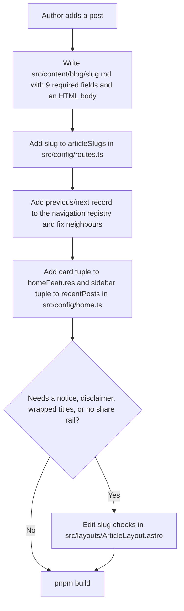

# ~~Astro Content Authoring Architecture Plan~~ ✅ **COMPLETED**

<critical_warning>
> **CRITICAL WARNING:** This plan is a prerequisite of `documents/todo/astro_cloudflare_workers_migration_plan.md`. It must be complete, with `pnpm verify:dist` and the full Playwright suite green, before that plan's Step 11 review packet is finalised and before its Step 12 hosted-preview parity re-run, so hosted acceptance runs once against the final article markup. Every authority boundary in the migration plan still applies: no push, DNS, custom-domain, production-version, repository-visibility, or newsletter-destination change. The target remains a faithful rebuild: converted articles must render the same text, links, images, embeds, headings, fragments, endings, and geometry as the retained legacy HTML.
</critical_warning>

<important_note>
> **IMPORTANT NOTE:** The installed Astro is `7.2.9`, which depends on `@astrojs/markdown-satteri` `0.3.8`. Install `@astrojs/mdx` `7.0.8` (peer `astro ^7.0.0`, `@astrojs/markdown-satteri ^0.3.1`). `@astrojs/mdx` `8.0.0` requires `@astrojs/markdown-satteri ^0.4.0`, which only ships with Astro `7.2.10` or later; an Astro upgrade is outside this plan and needs separate user authorisation. Astro's default Markdown pipeline is Sätteri, not remark; `markdown.remarkPlugins` and `rehypePlugins` still exist in the config type but processor-specific options moved to `markdown.processor`. Verify any plugin against the installed processor before relying on it.
</important_note>

## 1. Goal

Make Astro's composable defaults real for this site: an author writes a post as a `.md` or `.mdx` file with a short frontmatter block, and content collections, one article layout, and a small set of content components do everything else (document title, hero, byline, previous and next links, share controls, newsletter form, home card, sidebar entry, feed item, sitemap entry). Every default is overridable per post, but a post that sets nothing beyond the required fields renders correctly.

Today the migrated Astro site has the collection and layouts in place, but the twelve article bodies in `src/content/blog/*.md` are the legacy `.post-body` HTML copied verbatim under a frontmatter block (zero Markdown syntax), the two long-form pages render raw HTML fragments, and article-specific behaviour is hard-coded by slug inside `ArticleLayout.astro` and a hand-maintained navigation registry. Adding a post today requires editing four source files besides the post itself.

The work is complete when:

- all twelve blog posts and both long-form pages are authored Markdown or MDX whose rendered text, link count, image count, iframe count, heading fragments, endings, and document height match the retained legacy HTML within the thresholds in Section 6;
- a new post needs only its content file and its images to appear at its route, in the home listing, in the sidebar, in the feed, and in the sitemap;
- previous and next navigation, byline, card copy, and sidebar label derive from the collection by default and can be overridden per entry;
- no layout, page, or component contains a slug-specific branch;
- document titles compose from `src/config/site.ts` and each entry's uncomposed title, with every current `<title>` value unchanged;
- `pnpm check`, `pnpm test`, `pnpm build`, `pnpm verify:dist`, `pnpm test:e2e`, and `pnpm test:agent-a11y` pass;
- project documentation explains the authoring model without conversation history.

---

## 2. Current State Analysis

### 2.1 Current Implementation Overview

The Astro site on branch `codex/astro-cloudflare-migration` prerenders 20 public routes. Article rendering flows through these owners:

| Concern | Current owner | Assessment |
| --- | --- | --- |
| Blog schema and loader | `src/content.config.ts` (`glob` on `src/content/blog/**/*.md`) | Schema requires `title`, a legacy composed-title field, `description`, `published`, `image`, `imageAlt`, `imageWidth`, `imageHeight`, `byline`; no `draft`, no navigation, no card fields, no `image()` helper |
| Article bodies | `src/content/blog/<slug>.md` | Generated by a retired article migration script from `blog/<slug>.html`; bodies are raw HTML (`
`, `<picture>`, `<ul>`, `<table>`, `<iframe>`, `
`), 2,610 lines total, 0 lines of Markdown syntax |
| Long-form pages | Legacy page HTML via `set:html` in the Books and beginner-guide routes | Generated by a retired page migration script; metadata and navigation duplicated inline in each page file |
| Article route | `src/pages/blog/[slug].astro` | Passes 12 scalar props into the layout and looks up navigation in a retired navigation registry |
| Article layout | `src/layouts/ArticleLayout.astro` | Contains four slug-specific branches: the superseded-notice callout and forced caption for `calorie-calculator-how-to`, the `wrapTitles` set `breakup-energy`, `change`, `idols`, `weak`, the disclaimer for `healthy-low-calorie-foods`, and `floatingShare` off for the calculator article |
| Long-form layout | Retired long-form layout | Near duplicate of `ArticleLayout.astro` with different ending defaults |
| Previous and next links | Retired navigation registry | 12 hand-written records; 7 of them equal chronological adjacency and could be derived |
| Home listing and sidebar | `src/config/home.ts` (`homeFeatures`, `recentPosts`) | 15 hand-written card tuples and 15 sidebar tuples; card copy duplicates post frontmatter with small variations |
| Document title | Each page and each post's legacy composed-title field | Composed strings such as `How To Stay Weak \| Muscle Hacking` stored in frontmatter and page files; `src/config/site.ts` has no separator fields |
| Head metadata | `src/layouts/BaseLayout.astro` inline | One owner, but no resolver, no `titleMode`, no `src/lib/metadata.ts` |
| Ending composition | `src/components/ArticleEnding.astro` | Already a stable composition owner (newsletter, share, disclaimer, navigation, floating rail) and must stay one |
| Callouts | `src/components/Callout.astro` | Exists, but article bodies still carry the legacy `.markdown-alert` markup instead of using it |
| Prose styling | `src/styles/global.css` (`.legacy-content`, `.figurecap`, `.markdown-alert`, table ids), `src/styles/legacy-content.css` (`.intrinsic--*` ratio boxes) | Container class is `.legacy-content`; new content must keep using it because 60 selectors, `scripts/verify-dist.mjs`, and 8 Playwright specs reference it |
| Build verification | `scripts/verify-dist.mjs` | Compares every article's `.legacy-content` text, `a[href]`, `img`, and `iframe` counts, navigation link text, ids, hrefs, and titles, and ending order against the retained `blog/<slug>.html` |

Body constructs across the twelve posts, measured from the current files:

| Construct | Count | Where |
| --- | --- | --- |
| `<picture class="intrinsic intrinsic--*">` plus `
` | 41 images, 28 captions | 8 posts |
| `
` callouts | 2 in posts, 2 in long-form pages | protein, intermittent fasting, books, guide |
| `<iframe class="video" src="https://www.youtube-nocookie.com/embed/…">` | 7 | reject-modernity |
| `
<table id="…" class="table">` with cell ids and colour classes | 3 tables | protein, golden zone, organic |
| `<ol class="ref-list"><li class="ref">` reference lists | 5 lists | protein |
| `
` table of contents | 1 | calorie-calculator-how-to |
| `<a data-content="Links to Amazon" data-toggle="popover">` affiliate links | 3 in posts, 14 in long-form pages | protein, books, guide |
| Headings `h3`-`h5` | 55 total; 44 carry a legacy `id`, 22 of those differ from the GitHub-slugger id Astro would generate, 11 have no id, 1 id is malformed (`id="#bcaa-leucine-content"`) | 6 posts |
| In-page fragment links `href="#…"` | 44 (17 protein, 27 calculator article) | 2 posts |
| Inline `style=""` attributes | 12 in posts, 6 in long-form pages | 4 posts, both pages |
| Blockquotes | 30 | 9 posts |

### 2.2 Current Flow

### 2.3 The Core Problem

The migration reproduced the legacy site faithfully but stopped at the HTML boundary: the content collection validates frontmatter while the body remains legacy markup, and per-post presentation decisions live in code keyed by slug rather than in the entry. The result is that Astro's central benefit, composable defaults where plain Markdown works without configuring each component, is not yet available to the author. Each new post costs four file edits outside the post, and each exception costs a layout edit.

### 2.4 Affected User Scenarios

| Scenario | Impact today |
| --- | --- |
| Write a new post | Must hand-write HTML paragraphs, figure blocks, and callouts; must edit routes, navigation, and home configuration |
| Change a post's hero caption or byline wording | Works in frontmatter, except the calculator article whose caption is hard-coded in the layout |
| Give a post a custom previous or next link | Edit the registry, and edit the layout's `wrapTitles` set if the labels are custom |
| Rename the site or change the title separator | Edit 14 composed title strings and every page title literal |
| Add an image to a post | Copy the file to `public/img/`, hand-write `<picture>` markup with a bespoke `.intrinsic--newN` ratio class and manual `width`/`height` |
| Reviewer checks parity | The existing `verify:dist` gate compares text and counts against legacy HTML, which makes conversion safe to verify |

### 2.5 Technical Constraints

- Preserve the exact public URL contract from the migration plan: no-slash article routes under `/blog/`, slash section routes, self-canonicals on `https://www.musclehacking.com`.
- Keep every document prerendered. Only `/api/subscribe` runs per request. The Worker bundle imports `src/config/routes.ts` through `src/features/newsletter/schema.ts`, so `routes.ts` must stay plain data with no `node:fs` and no `import.meta.glob`.
- `scripts/shape-routes.mjs` and `scripts/verify-dist.mjs` import `src/config/routes.ts` under plain Node after `astro build`, so the blog slug list must also be readable without Vite.
- `scripts/verify-dist.mjs` compares each generated article body (`.legacy-content` text, `a[href]`, `img`, `iframe` counts) and navigation (`#post-nav` link text, `id`, `href`, `title`) with the retained `blog/<slug>.html`. Auto-derived blog navigation links must therefore keep the legacy relative `href` form (bare slug such as `healthy-organic-post`), while explicitly authored links keep the `href` exactly as written (for example `/blog/best-protein-powder-for-building-muscle`).
- Content Security Policy in `public/_headers` allows frames only from `https://www.youtube-nocookie.com` and images only from `'self'` and `data:`.
- No analytics, external browser dependency, legal claim, identity fact, or provider credential may be added.
- No `prefers-reduced-motion` gates or animation timing conditionals.
- Use `trash`, never `rm`, for removed files.
- Do not upgrade Astro, the Cloudflare adapter, React, Wrangler, or any pinned tool. Add only `@astrojs/mdx` `7.0.8` and commit the lockfile.
- The retained legacy tree (`blog/*.html`, `books/index.html`, `lose-fat-gain-muscle/index.html`, `css/`, `js/`) stays in the repository as audited migration input.
- The prose container keeps the class name `legacy-content` in this plan; renaming it touches 60 CSS selectors and 8 test files and is deliberately excluded.
- The calculator-page guide (`src/content/pages/calculator-guide.html`, `calculator-guide.ts`, `scripts/migrate-calculator-guide.mjs`, `src/components/CalculatorGuideIntro.astro`) is a distinct public surface owned by the calculator feature and is excluded from this plan; it stays where it is and the new `pages` collection loader must not match `.html` or `.ts` files.

### 2.6 Existing Infrastructure That Can Be Reused

- `src/components/ArticleEnding.astro`, `PostNavigation.astro`, `NewsletterSignup.astro`, `ShareLinks.astro`, `SocialShareRail.astro`, `AffiliateDisclaimer.astro`, `Callout.astro`, `BackToTop.astro`: keep as-is; only their inputs change.
- `src/layouts/BaseLayout.astro` and `ContentLayout.astro`: keep the shell; `BaseLayout` gains the single metadata component.
- `src/config/site.ts`, `src/config/routes.ts`: extend, do not replace.
- `scripts/verify-dist.mjs` legacy comparison loop: the primary regression gate for the conversion; extend it rather than replacing it.
- `tests/fixtures/legacy/pages.json`: legacy titles, descriptions, and H1 text per route.
- `src/styles/legacy-content.css` `.intrinsic--*` ratio boxes and `src/styles/global.css` prose rules: reused by the `Figure` component so converted images keep their geometry.
- `src/components/CalculatorGuideIntro.astro` table-of-contents markup (`nav#toc_container > p#toc-h + ul#toc-ul`): the reference markup for the shared `TableOfContents` component.
- The retired article migration script's publication and update maps are already encoded in frontmatter; the script is retired after conversion.
- Node script `github-slugger` `2.0.0` is installed transitively and is the id algorithm Astro uses for Markdown headings.

---

## 3. Desired State

### 3.1 Desired State Requirements

- **REQ-1 (MUST):** Every blog post is a `.md` or `.mdx` file in `src/content/blog/` whose body is Markdown plus the shared content components. Raw HTML in a body is limited to the allowlist in Section 5, Step 6.
- **REQ-2 (MUST):** A post with only the required frontmatter fields (`title`, `description`, `published`, `image`, `imageAlt`) renders its route, hero, derived byline, chronological previous and next links, article ending, home card, sidebar entry, feed item, and sitemap entry with no other file edit.
- **REQ-3 (MUST):** Every default is overridable in frontmatter: byline, card copy, sidebar label, navigation links and labels, title wrapping, floating share rail, affiliate disclaimer, heading self-links, hero notice, SEO title, canonical override.
- **REQ-4 (MUST):** One `ArticleLayout.astro` serves blog posts and long-form pages. It accepts a resolved article model and contains no slug, path, or collection-specific branch.
- **REQ-5 (MUST):** Document titles compose in `src/lib/metadata.ts` from `site.name`, `site.titleSeparator`, and each route's uncomposed title. No frontmatter or page stores a composed title. Every current `<title>` value in Section 5, Step 2 is unchanged.
- **REQ-6 (MUST):** The rendered text, `a[href]` count, `img` count, `iframe` count, navigation text, ids, hrefs, titles, ending order, and floating-rail presence of every converted post equal the retained legacy HTML as checked by `scripts/verify-dist.mjs`.
- **REQ-7 (MUST):** Every legacy heading `id` and every in-page fragment target in the twelve posts still resolves after conversion, except the malformed `id="#bcaa-leucine-content"`, which becomes `bcaa-leucine-content`.
- **REQ-8 (MUST):** Home listing and sidebar derive from the blog and pages collections plus one typed pinned-section record, sorted by `published` descending, and render the exact card and sidebar strings the site renders today.
- **REQ-9 (MUST):** New-post images live beside the post under `src/content/blog/<slug>/`, are validated by the `image()` schema helper, and render through Astro's image pipeline with explicit dimensions. Existing posts keep their `/img/` public URLs.
- **REQ-10 (MUST):** `draft: true` entries and entries with a future `published` date are excluded from routes, listings, feed, sitemap, and `llms.txt`.
- **REQ-11 (MUST NOT):** Change any visible copy, image, URL, colour, or geometry beyond the verified defects listed in Section 4.2. Any converted route's `document.documentElement.scrollHeight` must match the legacy tree within 1 px at 1440 px and 2 px at 390 px, the same tolerance the fifth-review parity pass used.
- **REQ-12 (MUST NOT):** Add a client framework, a remote image source, a third-party script, or request-time rendering.
- **REQ-13 (SHOULD):** `documents/content/editing.md` becomes an authoring guide with a copy-ready post template and the complete frontmatter reference.

### 3.2 Defaults and Fallbacks

- **Ordering default:** the blog collection is sorted by `published` descending, then by `id` ascending for equal dates. All lists, feeds, and adjacency use this one ordering.
- **Navigation default:** `previous` is the next older published post, `next` is the next newer published post, labels are `Previous Post` and `Next Post`, visible text is the target's `shortTitle ?? linkTitle ?? title`, the `title` attribute is the target's `linkTitle ?? title`, and the `href` is the bare target slug. The oldest post has no `previous`; the newest has no `next`. A frontmatter `navigation.previous` or `navigation.next` object replaces the derived link; the value `false` removes it. An explicit link renders exactly its own `href`, `label`, `title`, and `displayTitle ?? title`.
- **Title wrapping default:** `navigation.wrapTitles` defaults to `true` when either rendered label is not `Previous Post` or `Next Post`, otherwise `false`.
- **Byline default:** `By Jay — Posted {Month YYYY}` when only `published` is set, `By Jay — Updated {Month YYYY}, Posted {Month YYYY}` when `updated` is set, with the author display name from `site.authorDisplayName`. A frontmatter `byline` string replaces it verbatim.
- **Card default:** `card.title ?? title`, `card.description ?? imageCaption ?? description`, `card.imageAlt ?? imageAlt`, `card.image ?? image`, `card.ratio ?? '5 / 3'`, date `{Month YYYY}` from `published`.
- **Sidebar default:** label is `shortTitle ?? title`.
- **Ending default:** `ending.floatingShare` `true`, `ending.disclaimer` `false`, `ending.headingLinks` `true`; newsletter placement `article-bottom` for blog posts and `longform-bottom` for pages; form id and campaign `article-bottom` for blog posts and `content-bottom` for pages.
- **Title mode default:** `composed` (`{title}{site.titleSeparator}{site.name}`); `prefixed` only for `/`; `absolute` only where a route's approved title has no suffix (`/blog/`, `/join/`).
- **Image default:** a relative path (`./<slug>/hero.png`) is processed by Astro and its dimensions are read from the asset; a string beginning with `/img/` is served unprocessed and requires `imageWidth` and `imageHeight`.
- **Fallback order for a missing default:** frontmatter override, then derived value, then build failure with a message naming the entry id and field. No silent empty output.

### 3.3 Verification Checklist

**Functional:**
- [x] A fixture post with only the five required fields builds, renders at `/blog/<id>`, and appears in the home list, sidebar, `feed.xml`, `sitemap.xml`, and `llms.txt`.
- [x] Every override in the frontmatter reference changes exactly the output it names.
- [x] `[slug].astro`, `ArticleLayout.astro`, and all content components contain no string equal to any blog slug or route path.

**Defaults and fallbacks:**
- [x] Derived navigation reproduces the legacy links for the 7 posts with default labels; the 5 overridden posts render their explicit links.
- [x] Derived bylines match 8 posts and both long-form pages; the 4 overridden posts render their explicit bylines.
- [x] A draft or future-dated fixture entry produces no route, listing, feed, sitemap, or `llms.txt` output.

**Compatibility:**
- [x] `pnpm verify:dist` passes the extended legacy comparison for all 12 posts and both long-form pages.
- [x] All 21 generated HTML files emit the titles in Section 5, Step 2.
- [x] Document-height parity holds within 1 px at 1440 px and 2 px at 390 px on every converted route.
- [x] `pnpm test:e2e` and `pnpm test:agent-a11y` pass.

**Ops and documentation:**
- [x] `documents/content/editing.md`, `documents/architecture/site.md`, `README.md`, root `AGENTS.md`, and `documents/AGENTS.md` describe the new owners.
- [x] The retired article/page migration scripts, navigation registry, long-form layout, and legacy Books/guide HTML sources are in Trash, and no active script, test, or document references them.

---

## 4. Additional Context

### 4.1 User-Provided Context

The user's request, in their words: "we want to centralise the code + templates as much as possible via components, layouts, and content collections. While there are variations between them, part of the reason we are migrating to Astro is so that we can more easily write blog posts and focus on the content, writing them as .md/.mdx files, with content collections, components and layouts doing a lot of the heavy lifting. e.g. we might have components for how images are rendered in blog posts, a layout that contains the standard previous/next component, etc. We want to have it structured and standardised as much as possible while facilitating flexibility in components for areas that we sometimes want to edit, with good defaults (example being prev/next post being customisable but defaulting to the actual next/previous post)."

The user's target property, quoted from Astro: "Astro provides composable defaults: authors can write plain Markdown without configuring each component, while still using custom layouts and components when needed."

The user asked that this plan link to the migration plan and be required before that plan's next step. They noted they only see the rendered output and did not know whether the source already worked this way; inspection showed it does not (Section 2.1).

Decisions the user made when asked:

1. **Scope:** convert everything now. All 12 posts and the 2 long-form pages become Markdown or MDX in this plan, with the existing `verify:dist` legacy comparison and the E2E parity suites as the regression proof.
2. **Format:** Markdown plus MDX where needed. Add `@astrojs/mdx`; plain `.md` for prose-only posts; `.mdx` when a post needs `Figure`, `Callout`, `YouTube`, `References`, `TableOfContents`, or `AffiliateLink`. One collection, one layout.
3. **Home listing and sidebar:** derive automatically from the collections sorted by published date, with the three section entries (guide, books, supplements) pinned at their legacy positions, and optional `card.*` frontmatter to keep the existing card wording.
4. **Images:** new posts co-locate images validated by the `image()` schema helper and rendered through Astro `Image`/`Picture`; existing posts keep their stable `/img/` public URLs.

The user's workspace rules also apply: read `AGENTS.md` first, use `pnpm`, use Node from `.nvmrc`, use `trash` for removals, no `git add -A`, no push, and `AGENTS.md` outranks the `build-astro-websites` skill where they conflict.

### 4.2 Background and Decisions

- **Skill guidance applied:** the `build-astro-websites` skill's content reference (one typed source of truth; validate at the collection boundary; filter drafts and future dates; one explicit ordering; query once in `getStaticPaths()`; Markdown for portable prose, MDX only where components are embedded), its components reference (typed props with domain meaning; composition and slots over boolean combinations; layouts own document structure, pages own route data), its images reference (import from `src/`, explicit dimensions, no lazy-loading of the likely LCP image), and its metadata reference (`site.ts` owns name and separators; `src/lib/metadata.ts` composes; `PageMetadata.astro` renders once; only the home page is `prefixed`; `seoTitle` only when SEO wording must differ).
- **Skill guidance not applied:** the metadata reference says a pathname registry must not be the default source of route metadata. The migration plan's Step 3 deliberately made `src/config/routes.ts` the owner of section-route titles and descriptions, and six modules plus the Worker import it. This plan keeps `routes.ts` as the owner for section pages but stores uncomposed titles there; blog and long-form entries own their metadata in the collection. The `.legacy-content` class name and `src/content/blog/<slug>/` image placement (instead of `src/assets/`) are also deliberate departures for parity cost and author ergonomics.
- **Why `@astrojs/mdx` 7.0.8:** the installed Astro `7.2.9` pins `@astrojs/markdown-satteri` `0.3.8`; `@astrojs/mdx` `8.0.0` peers `^0.4.0`, which requires Astro `7.2.10`. Upgrading Astro is outside this plan.
- **Why a generated slug file:** `src/config/routes.ts` is imported by the Worker bundle (through the newsletter schema), by Vite (pages, tests), and by plain Node scripts. None of those can share a filesystem or `import.meta.glob` lookup safely, so a small script writes `src/config/blog-slugs.generated.ts` from the content directory before `dev`, `check`, `test`, and `build`, and `verify:dist` fails if it is stale. The author never edits a slug list.
- **Why relative hrefs for derived links:** the legacy pages link neighbouring posts with bare relative slugs, and `verify-dist.mjs` compares `href` attributes exactly. Normalising to absolute paths would change public markup and fail the gate; it is a separate decision.
- **Why explicit HTML headings for legacy ids:** 22 legacy heading ids differ from the slug Astro would generate, and 44 in-page links plus unknown external deep links depend on them. MDX accepts an HTML heading with an explicit `id`; the `heading-links.ts` client script selects DOM headings and does not depend on Astro's `getHeadings()`. Headings without a legacy id use Markdown syntax and receive generated ids.
- **Why `Figure` keeps the legacy ratio-box markup:** `src/styles/legacy-content.css` sizes 41 in-body images through bespoke `.intrinsic--*` padding ratios. Reusing that markup for existing images keeps geometry identical; new posts pass real dimensions and the component uses `aspect-ratio` instead.
- **Verified defects fixed by this plan (allowed by the migration plan's "verified technical defects" rule):** the malformed heading id `#bcaa-leucine-content` loses its leading `#`; empty `

` pairs around blockquotes in `idols` are dropped; inline `style` attributes that only repeat a stylesheet rule are dropped; `
` becomes `<nav>`; `<a target="_blank">` keeps `rel="noopener"`.
- **Alternatives rejected:** Markdown-only with a directive plugin (custom plugin against an unverified Sätteri plugin API; MDX is the documented path); a single MDX-only format (forces an import block on prose-only posts); keeping legacy HTML bodies and only supporting new posts (leaves two authoring models and four slug branches in the layout); deriving slugs with `node:fs` inside `routes.ts` (breaks the Worker bundle); moving existing images to `src/` now (changes 53 public image URLs and `og:image` values during an open parity review).
- **Excluded scope, recorded so nobody re-derives it:** renaming `.legacy-content`; calculator-page guide conversion; `/about/`, `/contact/`, `/privacy/` pages; structured data; analytics; Astro upgrade; pagination of the blog index; migrating existing images to `src/`.
- **Retained legacy data that drives overrides:** Section 5, Step 6 lists every per-post override exactly, derived by comparing home configuration, the retired navigation registry, and each post's frontmatter with the derivable defaults.

---

## 5. Implementation Plan

### ~~Step 1: Add the MDX integration and the slug generator~~ ✅ **COMPLETED**

**Objective:** Enable `.mdx` entries without upgrading Astro, and remove the hand-maintained slug list.

#### 1.1 High-Level Approach

- `pnpm add @astrojs/mdx@7.0.8` and commit `pnpm-lock.yaml`. Register `mdx()` before `react()` in `astro.config.mjs`.
- Create `scripts/sync-blog-slugs.mjs`: read `src/content/blog/`, keep top-level `*.md` and `*.mdx` filenames, sort, and write `src/config/blog-slugs.generated.ts` exporting `export const blogSlugs = [...] as const;`. Support `--check` that exits non-zero when the file differs.
- Run the script in `package.json` before `dev`, `check`, `test`, and `build`; run `--check` in `verify:dist`.
- Change `src/config/routes.ts` to import `blogSlugs` from the generated file and build the blog route entries from it. Keep `PublicRoute` plain data.

**Success criteria:**
- `pnpm check` passes; `node_modules/@astrojs/mdx/package.json` reports version `7.0.8`; `pnpm install --frozen-lockfile` succeeds with no peer warning for `@astrojs/markdown-satteri`.
- `astro.config.mjs` `integrations` is `[mdx(), react()]`.
- Deleting `src/config/blog-slugs.generated.ts` and running `pnpm build` regenerates it with the 12 current slugs in alphabetical order.
- Editing the generated file by hand and running `pnpm verify:dist` fails with the message `src/config/blog-slugs.generated.ts is stale; run node scripts/sync-blog-slugs.mjs`.
- `tests/unit/routes.test.ts` still reports 20 routes and 12 blog slugs.
- `grep -rn "articleSlugs = \[" src/config/routes.ts` returns nothing.

### ~~Step 2: Centralise document metadata composition~~ ✅ **COMPLETED**

**Objective:** Compose every title from `site.ts` so no entry or page stores a composed title, without changing any emitted title.

#### 2.1 High-Level Approach

- Extend `src/config/site.ts` with `titleSeparator: ' | '`, `titlePrefixSeparator: ': '`, and `language: 'en'`. Remove `defaultTitle`; keep `defaultDescription` for the feed.
- Create `src/lib/metadata.ts` exporting `PageMetadataInput` (`title`, `description`, `titleMode?: 'composed' | 'prefixed' | 'absolute'`, `canonicalPath`, `image?`, `indexable?`, `article?`, `socialTitle?`) and `resolvePageMetadata(input, site)` returning the resolved metadata fields. Throw on empty title, empty description, a `composed` title already ending with the separator plus site name, or a `prefixed` title already starting with the site name plus prefix separator.
- Create `src/components/head/PageMetadata.astro` that renders the head tags currently inline in `BaseLayout.astro` (charset, viewport, description, robots, canonical, icons, Open Graph, Twitter, `<title>`), exactly once, from the resolved object. `BaseLayout.astro` accepts `metadata: PageMetadataInput` and renders `PageMetadata` once. Set `<html lang={site.language}>`.
- Convert every page under `src/pages/` to pass uncomposed titles. Convert `routes.ts` section titles to uncomposed values and add `titleMode` where a route is `prefixed` or `absolute`.
- Remove the legacy composed-title field from the blog schema; add optional `seoTitle`. The article model resolves `seoTitle ?? title` as the metadata title.

Expected document titles after this step (must equal the current build output):

| Route | Mode | `<title>` |
| --- | --- | --- |
| `/` | prefixed, descriptor `Gain Muscle And Lose Fat (Without The BS)` | `Muscle Hacking: Gain Muscle And Lose Fat (Without The BS)` |
| `/blog/` | absolute | `Muscle Hacking Blog` |
| `/books/` | composed | `Fitness & Health Books Worth Reading \| Muscle Hacking` |
| `/calorie-calculator/` | composed | `Calorie And Macro Calculator (Bulking, Maintenance or Cutting) \| Muscle Hacking` |
| `/join/` | absolute | `Join the Muscle Hacking Newsletter` |
| `/lose-fat-gain-muscle/` | composed | `How to Lose Fat And Gain Muscle (As A Beginner) \| Muscle Hacking` |
| `/one-last-step/` | composed | `One Last Step \| Muscle Hacking` |
| `/supplements/` | composed | `The Best Muscle Building Supplement Stack (Based on Research) \| Muscle Hacking` |
| `/404.html` | composed | `Page not found \| Muscle Hacking` |
| `/blog/reject-modernity-embrace-masculinity` | composed from `seoTitle` | `Reject Modernity Embrace Masculinity: Meaning Behind The Meme \| Muscle Hacking` |
| the other 11 `/blog/<slug>` routes | composed from `title` | `{title} \| Muscle Hacking` |

**Success criteria:**
- `tests/unit/metadata.test.ts` (Vitest) covers composed, prefixed, absolute, empty title, empty description, already-suffixed, and already-prefixed cases; the last four throw.
- Before starting, record the 21 current `<title>` values from `dist/client/**/*.html` into `tests/fixtures/expected-titles.json`; after the step, `scripts/verify-dist.mjs` asserts every generated file's `<title>` equals the fixture value, and the check passes.
- `grep -rn "| Muscle Hacking" src/pages src/content src/config` returns nothing.
- `grep -rn "titleMode: 'prefixed'" src` matches only the home page input.
- Every generated HTML file has exactly one `<title>`, one `meta[name="description"]`, one `link[rel="canonical"]`, one `og:title`, one `twitter:title`, and `<html lang="en">`.
- `tests/e2e/metadata.spec.ts` and `tests/e2e/routes.spec.ts` pass unchanged.

### ~~Step 3: Define the content model and collection helpers~~ ✅ **COMPLETED**

**Objective:** Put every per-entry decision in the schema with typed defaults, and resolve them in one library.

#### 3.1 High-Level Approach

- Rewrite `src/content.config.ts` with two collections:
  - `blog`: `glob({ pattern: '*.{md,mdx}', base: './src/content/blog' })`.
  - `pages`: `glob({ pattern: '*.{md,mdx}', base: './src/content/pages' })` with an extra required `path` field (`'/books/'` or `'/lose-fat-gain-muscle/'`) that must exist in `routes.ts`, and `listed: z.boolean().default(true)`.
- Shared article schema built with `({ image }) =>`:

| Field | Type | Default | Purpose |
| --- | --- | --- | --- |
| `title` | string, required | none | Visible H1 |
| `seoTitle` | string | `title` | Metadata title when wording must differ |
| `description` | string, required | none | Meta description and feed summary |
| `published` | date, required | none | Ordering, byline, card date, feed |
| `updated` | date | none | Byline `Updated` segment |
| `draft` | boolean | `false` | Excluded from every output when `true` |
| `image` | `image()` or string starting `/img/`, required | none | Hero and default card image |
| `imageWidth`, `imageHeight` | positive integers | read from asset | Required only when `image` is a `/img/` string |
| `imageAlt` | string, required | none | Hero alt text |
| `imageCaption` | string | none | Hero caption and default card description |
| `byline` | string | derived | Verbatim override |
| `shortTitle` | string | none | Sidebar label and default navigation display text when other entries link here |
| `linkTitle` | string | `title` | Navigation `title` attribute and display fallback when other entries link here |
| `card.title`, `card.description`, `card.imageAlt`, `card.image`, `card.ratio` | strings, `card.image` also accepts `image()` | see 3.2 | Home card overrides |
| `navigation.previous`, `navigation.next` | link object or `false` | derived | Link object: `href` (bare slug or absolute path), `label`, `title`, `displayTitle` |
| `navigation.wrapTitles` | boolean | derived from labels | `#post-nav` wrapping |
| `ending.floatingShare` | boolean | `true` | Floating share rail |
| `ending.disclaimer` | `'generic'`, `'calculator'`, or `false` | `false` | Affiliate disclaimer |
| `ending.headingLinks` | boolean | `true` | Heading self-link controls |
| `notice.variant`, `notice.label`, `notice.html` | strings | none | Callout rendered between byline and hero; `html` is the only trusted-HTML frontmatter field |
| `canonicalOverride` | URL | none | Existing field, unchanged |

- Create `src/lib/content/`:
  - `collections.ts`: `getPublishedPosts()` (filters `draft` and `published > now`, applies the one ordering), `getListedPages()`, `getListing()` (posts, listed pages, and `pinnedSections` from `home.ts` merged by `published` descending).
  - `article.ts`: `resolveArticle(entry, collection)` returning the `ArticleModel` consumed by the layout: `title`, `metadata`, `hero`, `byline`, `navigation`, `ending`, `notice`, `canonicalPath`, `formId`, `campaign`, `placement`.
  - `navigation.ts`: `deriveNavigation(entry, orderedPosts)` and `resolveLink(link, orderedPosts)` implementing the defaults in 3.2.
  - `byline.ts`: `deriveByline(published, updated, authorDisplayName)` using `en-US` long month names and UTC.
  - `cards.ts`: `resolveCard(entry)` and `resolveSidebarLabel(entry)`.
- Reduce `src/config/home.ts` to `pinnedSections`: one record for `/supplements/` (`published: 2023-08-01`, `title: 'The Best Muscle Building Supplement Stack (Based on Research)'`, `description: 'Summary of 10+ years of supplement research.'`, `image: '/img/muscle-building-supplement-stack.png'`, `imageAlt: 'Muscle Building Supplement Stack'`, `sidebarTitle: 'Muscle Building Supplement Stack (Based on Research)'`, `ratio: '5 / 3'`). Books and guide come from the `pages` collection.
- `src/pages/feed.xml.ts`, `sitemap.xml.ts`, and `llms.txt.ts` consume `getPublishedPosts()` for blog entries; `sitemap` and `llms` keep `routes.ts` for section routes.

**Success criteria:**
- `pnpm check` passes with the new schema; an entry missing `title`, `description`, `published`, `image`, or `imageAlt` fails `pnpm build` naming the entry id and field.
- A `/img/` string `image` without `imageWidth` and `imageHeight` fails validation; a relative `./<slug>/hero.png` image resolves width and height from the file.
- `tests/unit/content-navigation.test.ts`: given the 12 current entries, `deriveNavigation` reproduces the legacy links (href, label, title, display text) for `australian-health-star-rating`, `best-protein-powder-for-building-muscle`, `calorie-calculator-how-to`, `healthy-low-calorie-foods`, `healthy-organic-post`, `reject-modernity-embrace-masculinity`, and `what-is-intermittent-fasting`; the oldest post has no `previous`; the newest has no `next`.
- `tests/unit/content-byline.test.ts`: `deriveByline` returns `By Jay — Posted April 2024` for `2024-04-01` and `By Jay — Updated April 2024, Posted October 2018` for `2018-10-01` plus `2024-04-01`.
- `tests/unit/content-listing.test.ts`: `getListing()` returns 15 items whose `href` sequence equals the current `homeFeatures` order and whose card `title`, `description`, `imageAlt`, `image`, `date`, and `ratio` equal the current `typedHomeFeatures` values; sidebar labels equal the current `recentPosts` labels.
- A fixture entry with `draft: true` and one with `published` one year ahead are absent from `getPublishedPosts()`, `getListing()`, and the built `feed.xml`, `sitemap.xml`, and `llms.txt`.
- `feed.xml` item titles, links, guids, dates, and descriptions are byte-identical to the pre-change build.

### ~~Step 4: Unify the article layout and add the content components~~ ✅ **COMPLETED**

**Objective:** One layout, one header, and a small component library so authors never write presentation HTML.

#### 4.1 High-Level Approach

- Move article components to `src/components/article/` (`ArticleEnding.astro`, `PostNavigation.astro`, `ShareLinks.astro`, `SocialShareRail.astro`, `NewsletterSignup.astro`, `AffiliateDisclaimer.astro`) and add `ArticleHeader.astro` (H1, byline, `notice` slot, hero `Figure`, caption). Update imports.
- Rewrite `src/layouts/ArticleLayout.astro` to accept `article: ArticleModel` and `class?: string`, render `BaseLayout` with `article.metadata`, `main.article-page` (plus `longform-page` when the model says so), `ArticleHeader`, `div.legacy-content` with `data-heading-links="off"` when `ending.headingLinks` is `false`, the default slot, and `ArticleEnding` fed from the model. Move the retired long-form layout to Trash. Remove every slug check.
- Create `src/components/content/` with typed props and scoped CSS only where the rule is new:
  - `Figure.astro`: props `src` (`ImageMetadata` or `/img/` string), `alt`, `width`, `height` (required for string `src`), `ratio?` (legacy `intrinsic--*` token), `align?: 'centre'`, `loading?` (`'lazy'` default), `id?`; default slot is the caption. With `ratio` it emits `<picture class="intrinsic intrinsic--{ratio}"></picture>
…
`; without it, `<figure>` with `<Image>` for assets or `` for public strings, explicit width and height, and the same caption paragraph.
  - `Callout.astro`: existing component; add support for the `notice` slot use.
  - `YouTube.astro`: props `id`, `title`; emits `<iframe class="video" src="https://www.youtube-nocookie.com/embed/{id}" title="{title}" frameborder="0" allow="accelerometer; autoplay; clipboard-write; encrypted-media; gyroscope; picture-in-picture" allowfullscreen>` and rejects any other host at build.
  - `References.astro`: wraps the slotted Markdown ordered list in `
`; move the `.ref-list` and `.ref` rules in `global.css` to also match `.references ol` and `.references li` with identical values (17 px desktop, 14 px at 767 px and below).
  - `TableOfContents.astro`: props `items: TocItem[]` (`href`, `label`, `title?`, `children?`), `heading` default `Table of Contents`; emits `<nav id="toc_container" aria-label="Table of contents">
…
<ul id="toc-ul">…`. `CalculatorGuideIntro.astro` switches to it with its existing items.
  - `AffiliateLink.astro`: props `href`, `note` default `Links to Amazon`; emits `<a data-content="{note}" data-toggle="popover" href rel="noopener" target="_blank">` around the slot.
  - `index.ts` exporting the components map for `<Content components={…} />`. Verify with `@astrojs/mdx` `7.0.8` whether capitalised components in the map resolve without a per-file import; if not, every `.mdx` post imports from `'../../components/content'` in one line and the guide documents it.
- Rewrite `src/pages/blog/[slug].astro`: `getStaticPaths` from `getPublishedPosts()`, `resolveArticle(entry, 'blog')`, `render(entry)`, `<ArticleLayout article><Content components /></ArticleLayout>`, plus the `notice` slot when the model has one.
- Rewrite `src/pages/books/index.astro` and `src/pages/lose-fat-gain-muscle/index.astro` as thin pages: `getEntry('pages', 'books')` or `'guide'`, the same resolve and render.

**Success criteria:**
- `grep -rnE "calorie-calculator-how-to|healthy-low-calorie-foods|breakup-energy|'idols'|'weak'|'change'" src/layouts src/pages/blog src/components` returns nothing.
- The retired long-form layout and navigation registry no longer exist, and active source contains no references to them.
- `ArticleLayout.astro` props are exactly `article` and optional `class`.
- Rendering a `Figure` with `ratio="new2"`, `src="/img/majin-buu-eating.gif"`, `width={500}`, `height={280}` produces markup byte-equal, ignoring whitespace, to the legacy `<picture class="intrinsic intrinsic--new2">…</picture>
…
` block (`tests/unit/figure.test.ts` using Astro's container API, or a build snapshot).
- Rendering `YouTube` with a non-`youtube-nocookie.com` host throws at build.
- `tests/e2e/ui-parity.spec.ts`, `rejected-visual-parity-regressions.spec.ts`, and `fifth-review-parity.spec.ts` pass unchanged, including the `#toc_container`, `.project-callout`, `.markdown-alert`, `p.figurecap`, and `.ref` assertions.
- The calculator page's guide TOC markup after switching to `TableOfContents` is text-identical to the current output (`verify:dist` calculator checks pass).

### ~~Step 5: Derive the home listing and sidebar from the collections~~ ✅ **COMPLETED**

**Objective:** New content appears on the home page and in the sidebar without editing configuration.

#### 5.1 High-Level Approach

- `HomeListing.astro` renders `getListing()`; keep the first card eager and `fetchpriority="high"`, the rest lazy; keep the 700 by 420 or 700 by 361 intrinsic sizes chosen by `ratio`.
- `Sidebar.astro` renders `getListing()` labels.
- Remove `homeFeatures`, `typedHomeFeatures`, and `recentPosts` from `home.ts`.

**Success criteria:**
- Built `index.html` and `blog/index.html` `.article-list` markup and `.sidebar-recent` markup are byte-identical to the pre-change build except for attribute order.
- Adding a fixture post dated today makes it the first home card and first sidebar item in `pnpm build` output without any other edit.
- `tests/e2e/ui-parity.spec.ts` home-card assertions pass.

### ~~Step 6: Convert the twelve posts to Markdown and MDX~~ ✅ **COMPLETED**

**Objective:** Replace every HTML body with authored content that renders identically.

#### 6.1 High-Level Approach

- Before editing, snapshot the current build: copy `dist/client/blog/*.html`, `dist/client/books/index.html`, and `dist/client/lose-fat-gain-muscle/index.html` to `/Users/sacino/Documents/codex/web-development/musclehacking/content-authoring-baseline/` for side-by-side comparison. Do not commit them.
- Conversion rules, applied per post in the order oldest to newest, one commit per post:

| Legacy construct | Authored form |
| --- | --- |
| `
…
` | Markdown paragraph |
| `<em>`, `<strong>`, `<a href>` | `*…*`, `**…**`, `[…](url)`; external links that had `target="_blank"` use `<a … target="_blank" rel="noopener">` only when the legacy attribute existed (count-checked) |
| `<ul>`, `<ol>`, `<ol start="5">` | Markdown lists; `start` via `5.` numbering |
| `<blockquote>` | `>` quote |
| `<h3 id="x">` where `x` equals the GitHub-slugger id of the text | `### Heading` |
| `<h3 id="x">` where `x` differs, or the heading is linked from the page | raw `<h3 id="x">Heading</h3>` (allowlisted) |
| `<picture class="intrinsic intrinsic--T"></picture>
…
` | `<Figure src alt width height ratio="T">caption</Figure>` |
| `
` | `<Callout variant="note">` with Markdown body |
| `<iframe class="video" src="…embed/ID" title="T">` | `<YouTube id="ID" title="T" />` |
| `<ol class="ref-list"><li class="ref">` | `<References>` wrapping a Markdown ordered list |
| `
` | `<TableOfContents items={[…]} />` |
| `<a data-toggle="popover" …>` | `<AffiliateLink href>text</AffiliateLink>` |
| `
<table …>` | raw HTML kept verbatim (allowlisted) |
| ` ` | kept |
| ``, `` inline | kept inline (allowlisted) |
| `id` on `<ol>`/`<ul>`/`
` (`ul-nm1`, `start-p`) | dropped when `grep` finds no reference in `src/styles`, `src/scripts`, or `tests`; otherwise kept via raw HTML |
| inline `style="…"` | dropped; if document-height parity then fails, reproduce the rule in `global.css` scoped to the affected route class |
| empty `

` | dropped |

- Raw HTML allowlist for `.md` and `.mdx` bodies: `table` blocks (with their `div.table-responsive` wrapper, `thead`, `tbody`, `tr`, `th`, `td`, `ul`, `li`, `picture`, `img` inside them), headings with an explicit `id`, `br`, `span`, `sup`, `sub`, and `a` when it carries `target`, `rel`, `title`, or `id`. Everything else must be Markdown or a component.
- Per-post frontmatter overrides (everything not listed here uses the defaults):

| Post | Overrides |
| --- | --- |
| `australian-health-star-rating` | `byline: "By Jay — June 2018"` |
| `best-protein-powder-for-building-muscle` | `card.imageAlt: "Five scoops of protein powder labelled whey, soy, pea, rice, and hemp protein"` |
| `breakup-energy` | `byline: "By Jay — Posted September 5, 2025"`; `card.description: "A new fundamental force has been discovered."`; `card.imageAlt: "Breakup Energy"`; `navigation.previous: { href: "/lose-fat-gain-muscle/", label: "Start Here", title: "How to Lose Fat And Gain Muscle", displayTitle: "How to Lose Fat And Gain Muscle (As A Beginner)" }`; `navigation.next: { href: "/blog/best-protein-powder-for-building-muscle", label: "Nutrition Related", title: "Best Protein Powder for Muscle Gain: An Evidence-Based Approach", displayTitle: "Best Protein Powder for Muscle Gain" }` |
| `calorie-calculator-how-to` | `byline: "By Jay — March 2018"`; `imageCaption: "How to use the Calorie and Macro Calculator."`; `ending.floatingShare: false`; `ending.headingLinks: false`; `notice: { variant: "important", label: "Important", html: "This page has been superseded by the explanation below the <a href=\"/calorie-calculator/#how-to-use\">calorie calculator</a>.  I kept this page up so you can still enjoy the picture of Moe holding a calculator.  No problem." }` |
| `change` | `shortTitle: "You Don’t Want To Change"`; `card.title: "You Don’t Want To Change"`; `card.description: "If you were serious about wanting to change your life, you’d do it now."`; `navigation.previous: { href: "/blog/best-protein-powder-for-building-muscle", label: "Nutrition Related", title: "Best Protein Powder for Muscle Gain: An Evidence-Based Approach" }`; `navigation.next: { href: "/blog/reject-modernity-embrace-masculinity", label: "Society Related", title: "Reject Modernity, Embrace Masculinity: The Meaning Behind The Meme" }` |
| `healthy-low-calorie-foods` | `shortTitle: "The Golden Zone: Healthy Low Calorie Foods"`; `linkTitle: "The Golden Zone: Healthy Low Calorie Foods"`; `card.imageAlt: "Archer standing behind a black and gold background with the words The Golden Zone"`; `ending.disclaimer: generic` |
| `healthy-organic-post` | `byline: "By Jay — May 2018"` |
| `idols` | `card.imageAlt: "First, They Kill Your Idols."`; `navigation.previous` and `navigation.next` identical to `change` |
| `normal` | `linkTitle: "On Normalcy"`; `card.description: "Do you strive to be ‘normal’?"`; `card.imageAlt: "Do you strive to be normal?"`; `card.ratio: "100 / 51.57142857"`; `navigation.next: { href: "/supplements/", label: "Next Post", title: "Muscle Building Supplement Stack (Based on Research)" }` |
| `reject-modernity-embrace-masculinity` | `seoTitle: "Reject Modernity Embrace Masculinity: Meaning Behind The Meme"`; `shortTitle: "Reject Modernity, Embrace Masculinity"` |
| `weak` | `card.imageAlt: "How To Stay Weak."`; `navigation.previous` and `navigation.next` identical to `change` |
| `what-is-intermittent-fasting` | none |

- Keep `image`, `imageAlt`, `imageWidth`, `imageHeight`, `imageCaption`, `description`, `published`, and `updated` values exactly as they are now; delete the legacy composed-title field from every post.
- Extend `scripts/verify-dist.mjs`: keep the existing text, count, navigation, ending, and rail checks; add a fragment check that every `id` on `h2`-`h5` in the retained legacy body (with the `#` stripped from the malformed one) exists in the generated body, and every `href="#…"` in the generated body targets an element on the page; extend the same body-text, count, and ending checks to `/books/` and `/lose-fat-gain-muscle/` against `books/index.html` and `lose-fat-gain-muscle/index.html`.
- Add `tests/unit/authoring-lint.test.ts` (Vitest): parse every entry body and fail on any raw HTML tag outside the allowlist, on the legacy composed-title field in frontmatter, and on `<p` anywhere in a body.
- Move the retired article migration script to Trash and delete its check-command mention from active documents.

**Success criteria:**
- `pnpm verify:dist` passes for all 12 posts, including the new fragment check; `grep -c "<p" src/content/blog/*.md src/content/blog/*.mdx` reports `0` for every file.
- `tests/unit/authoring-lint.test.ts` passes, and fails when a `
` tag is inserted into any post.
- Legacy heading ids present after conversion: all 44 retained ids, with `bcaa-leucine-content` replacing `#bcaa-leucine-content`; all 44 in-page fragment links resolve.
- `img` count 41, `iframe` count 7, `a[href]` counts per post equal the legacy counts (the existing `verify-dist` assertion).
- Document height per converted route, measured with the audited tree served at `http://127.0.0.1:4173` (`python3 -m http.server 4173` from the repository root) and the Worker at `http://127.0.0.1:8787`, differs by at most 1 px at 1440 px and 2 px at 390 px; record the 28 measurements in `documents/testing/README.md`.
- `./scripts/run-e2e-local.sh --workers=3` reports 0 failures; `pnpm test:agent-a11y` passes. The wrapper owns its own Wrangler preview; never pre-start one.
- Side-by-side screenshots of every converted route at 1440 px and 390 px against the baseline snapshot show no visible difference other than the verified defect fixes in Section 4.2; store them under the baseline directory and reference the path in Step 10 documentation.

### ~~Step 7: Convert the two long-form pages to the pages collection~~ ✅ **COMPLETED**

**Objective:** Books and the beginner guide become collection entries rendered by the same layout.

#### 7.1 High-Level Approach

- Create `src/content/pages/books.mdx` and `src/content/pages/guide.mdx` from `books.html` and `guide.html` with the Step 6 conversion rules and allowlist.
- Frontmatter for `books`: `path: "/books/"`, `title: "Fitness & Health Books Worth Reading"`, `description` as in `routes.ts`, `published: 2023-12-01`, `updated: 2025-09-01`, `image: "/img/fitness-books-worth-reading.png"`, `imageWidth: 700`, `imageHeight: 420`, `imageAlt: "Fitness Books Worth Reading"`, `shortTitle: "Gym & Fitness Books Worth Reading"`, `card.title: "Gym & Fitness Books Worth Reading"`, `card.description: "Fitness (ish) books worth reading."`, `ending.disclaimer: generic`, `navigation.previous` and `navigation.next` identical to `change`.
- Frontmatter for `guide`: `path: "/lose-fat-gain-muscle/"`, `title: "How to Lose Fat And Gain Muscle (As A Beginner)"`, `description` as in `routes.ts`, `published: 2024-09-01`, `image: "/img/lose-fat-gain-mucle-beginner.png"`, `imageWidth: 1700`, `imageHeight: 1020`, `imageAlt: "How to Lose Fat And Gain Muscle (As A Beginner)"`, `shortTitle: "How To Lose Fat And Gain Muscle (As A Beginner)"`, `card.title: "Getting Started: How To Lose Fat And Gain Muscle"`, `card.description: "A guide for beginners."`, `navigation.previous` and `navigation.next` identical to `change`.
- Move the legacy Books/guide HTML and retired page migration script to Trash. Leave `calculator-guide.html`, `calculator-guide.ts`, and `scripts/migrate-calculator-guide.mjs` untouched.

**Success criteria:**
- Derived bylines equal `By Jay — Updated September 2025, Posted December 2023` and `By Jay — Posted September 2024` with no `byline` override.
- The extended `verify-dist` long-form checks pass for both routes; `#post-nav` renders two links with labels `Nutrition Related` and `Society Related`, `white-space: normal` titles, and `#sh-box` present once.
- Document-height parity holds within the Step 6 thresholds for both routes.
- `src/pages/books/index.astro` and `src/pages/lose-fat-gain-muscle/index.astro` are each at most 15 lines and contain no title, description, byline, image, or navigation literal.

### ~~Step 8: Prove the authoring model with a fixture post~~ ✅ **COMPLETED**

**Objective:** Demonstrate REQ-2 and REQ-9 end to end without publishing new content.

#### 8.1 High-Level Approach

- Add `tests/fixtures/authoring/example-post.mdx` and `tests/fixtures/authoring/example-post/hero.png` (a 700 by 420 PNG generated with `sharp`), using only the five required fields and a body that exercises a Markdown paragraph, a heading, a `Figure` with a relative image import, a `Callout`, and a `YouTube` embed.
- Add `tests/unit/authoring-fixture.test.ts` that copies the fixture into `src/content/blog/`, runs `astro build` into a temporary `outDir`, asserts the outputs below, and removes the copy in `finally`. Mark it with a Vitest tag so `pnpm test` runs it but it can be skipped with `--exclude` when iterating.

**Success criteria:**
- The temporary build emits `blog/example-post.html` with one `h1` equal to the fixture title, a hero `` with `width="700" height="420"`, a `figure` containing an `_astro/` processed image, a `.project-callout`, and an `iframe.video` with a `youtube-nocookie.com` source.
- The fixture appears first in `index.html` `.article-list`, first in `.sidebar-recent`, and in `feed.xml`, `sitemap.xml`, and `llms.txt`.
- Its `#post-nav` shows only `Previous Post` linking to `breakup-energy`, with `white-space: nowrap` titles.
- After the test, `src/content/blog/` contains no `example-post` files and `git status` is clean for that directory.

### ~~Step 9: Extend the automated gates~~ ✅ **COMPLETED**

**Objective:** Keep the new invariants enforced by the existing commands.

#### 9.1 High-Level Approach

- Add the unit tests named in Steps 2, 3, 4, 6, and 8 under `tests/unit/`.
- Extend `scripts/verify-dist.mjs` as described in Steps 1, 2, and 6.
- Add `tests/e2e/content-authoring.spec.ts` (Playwright, both projects): for every route in `routes.ts` with `owner: 'blog'` plus `/books/` and `/lose-fat-gain-muscle/`, assert one `h1`, one `.byline`, one `.hero-image`, one `[data-content-ending]`, and no `.markdown-alert` element (all callouts are now `.project-callout`); for `/blog/calorie-calculator-how-to`, assert the `Important` callout precedes the hero image in DOM order and that `[data-heading-links="off"]` is present.
- Update `documents/testing/README.md` with the new suites and the document-height table.

**Success criteria:**
- `pnpm test` passes with the new suites and reports at least 60 tests.
- `pnpm verify:dist` output line reads `Verified 21 HTML files, 20 public routes, expected titles, article and long-form bodies, fragments, discovery output, CSP, links, images, browser output forbidden strings, and JavaScript budgets.`
- `pnpm test:e2e` includes `content-authoring.spec.ts` with 0 failures in both projects.
- Removing `<Callout>` from `books.mdx` makes `content-authoring.spec.ts` fail; restoring it makes it pass.

### ~~Step 10: Synchronise documentation~~ ✅ **COMPLETED**

**Objective:** A cold reader can add a post, override any default, and know the owners.

#### 10.1 High-Level Approach

- Rewrite `documents/content/editing.md` as the authoring guide: the copy-ready post template (five required fields plus a body example), the full frontmatter reference table from Step 3, the raw-HTML allowlist, the component catalogue with one example each, image placement rules, the draft and future-date rule, and the commands to run.
- Update `documents/architecture/site.md` sources-of-truth table with `src/lib/metadata.ts`, `src/lib/content/`, `src/components/content/`, `src/components/head/PageMetadata.astro`, the `pages` collection, and `src/config/blog-slugs.generated.ts`; remove references to the retired navigation, layout, and migration sources.
- Update `README.md` editing list, root `AGENTS.md` source ownership (add `src/lib/`, `src/components/content/`, and `src/content/pages/`), and `documents/AGENTS.md` (this plan alongside the migration plan).
- Update `documents/testing/README.md` and add a checkpoint entry to `documents/todo/astro_cloudflare_workers_migration_plan.md` stating that this plan is complete and that Steps 5, 10, and 15 of the migration plan now depend on the authored content model.

**Success criteria:**
- The documentation scrub returns no references to the retired navigation, layout, migration sources, or legacy composed-title field outside historical bug records.
- `documents/content/editing.md` contains a fenced post template that, when copied to `src/content/blog/example.md` with a valid image, builds without error (verified once during execution, then removed with `trash`).
- Every file path named in the updated documents exists.

---

## 6. Testing Plan

### 6.1 Source-of-Truth Regression Artefacts

| Artefact | Why it is authoritative | Expected use |
| --- | --- | --- |
| `blog/<slug>.html` (12 files, commit `9bf25d0`, retained at the repository root) | Exact legacy article bodies, navigation blocks, and heading ids | `scripts/verify-dist.mjs` text, count, navigation, fragment, and ending comparison for every converted post; must pass completely |
| `books/index.html` and `lose-fat-gain-muscle/index.html` (retained) | Exact legacy long-form bodies | Same comparison extended to both long-form routes; must pass completely |
| `src/content/blog/*.md` as they exist before Step 6 | The migrated HTML bodies and current frontmatter values that the conversion must reproduce | Read-only reference while converting; the override table in Step 6 was derived from them |
| Retired navigation registry and `src/config/home.ts` before Steps 3 to 5 | Current navigation, card, and sidebar strings the site renders | Unit-test expectations for derived navigation, cards, and sidebar labels; retired only after those tests pass |
| `dist/client/**/*.html` built from the current commit before Step 2 | Current `<title>` values and home/sidebar markup | `tests/fixtures/expected-titles.json` and the byte-comparison in Step 5 |
| `tests/fixtures/legacy/pages.json` | Legacy titles, descriptions, H1 text, and form counts | Existing `verify-dist` newsletter placement check; unchanged |
| The measured legacy document heights described in `documents/testing/README.md` | The accepted geometry tolerance from the fifth parity review | Step 6 and 7 height parity, 1 px at 1440 px, 2 px at 390 px |

<critical_warning>
> **CRITICAL WARNING:** Do not replace the retained `blog/*.html`, `books/index.html`, and `lose-fat-gain-muscle/index.html` comparisons with hand-written expectations or reduced snippets. The `verify-dist` comparison against the full legacy files is the only proof that a converted body lost no text, link, image, embed, or fragment. The `example-post` fixture in Step 8 is synthetic by design because no new post exists yet; it proves the authoring model, not parity.
</critical_warning>

### 6.2 Unit Tests

| Test Case | Component | Expected Result |
| --- | --- | --- |
| Title composition modes and rejections | `src/lib/metadata.ts` | Composed, prefixed, absolute results match; empty, already-suffixed, already-prefixed inputs throw |
| Derived navigation | `src/lib/content/navigation.ts` | Reproduces the 7 legacy default-link posts; oldest has no previous; newest has no next; explicit links pass through verbatim; `false` removes a link |
| Wrap-title derivation | `src/lib/content/navigation.ts` | `true` for `breakup-energy`, `change`, `idols`, `weak`, books, guide; `false` for the other 8 posts |
| Byline derivation | `src/lib/content/byline.ts` | Exact strings for posted-only and updated cases |
| Listing and cards | `src/lib/content/collections.ts`, `cards.ts` | 15 items in the legacy order with the legacy card and sidebar strings |
| Draft and future filtering | `src/lib/content/collections.ts` | Fixture entries excluded |
| Schema validation | `src/content.config.ts` | Missing required field fails; string image without dimensions fails; relative image resolves dimensions |
| Figure markup | `src/components/content/Figure.astro` | Legacy ratio markup byte-equal ignoring whitespace; asset path renders a processed `_astro/` image with dimensions |
| YouTube host guard | `src/components/content/YouTube.astro` | Non-allowed host throws |
| Authoring lint | all entries | No disallowed raw HTML, no legacy composed-title field, no `<p` |
| Slug generator | `scripts/sync-blog-slugs.mjs` | Output matches directory; `--check` fails on drift |
| Fixture post build | `tests/unit/authoring-fixture.test.ts` | Route, listing, feed, sitemap, `llms.txt`, and navigation outputs as in Step 8 |
| Route registry | `tests/unit/routes.test.ts` | Still 20 routes and 12 slugs from the generated file |

### 6.3 Integration Tests

1. **Legacy body parity**
   - Action: `pnpm build && pnpm verify:dist`.
   - Expected: every post and long-form route passes text, `a[href]`, `img`, `iframe`, navigation, fragment, ending-order, rail, and title checks.
   - Verify: exit code 0 and the summary line in Step 9.

2. **Full route matrix and interactions**
   - Action: run `./scripts/run-e2e-local.sh --workers=3` and `pnpm test:agent-a11y`. The wrapper owns its own Wrangler preview; never pre-start one.
   - Expected: 0 failures across both projects; heading links, share rail, callout geometry, navigation geometry, and newsletter placements unchanged.
   - Verify: Playwright report; existing specs unchanged except where a selector moved with a component path.

3. **Document-height parity**
   - Action: serve the legacy tree at `http://127.0.0.1:4173` and the Worker at `http://127.0.0.1:8787`; measure `document.documentElement.scrollHeight` for each of the 12 posts and 2 long-form routes at 1440 px and 390 px in Chromium.
   - Expected: at most 1 px difference at 1440 px and 2 px at 390 px.
   - Verify: record the table in `documents/testing/README.md`.

4. **Composable-default proof**
   - Action: run the Step 8 fixture test, then manually copy the guide's post template into `src/content/blog/` with a real image, run `pnpm dev`, open the route, the home page, and `feed.xml`.
   - Expected: the post renders with hero, derived byline, `Previous Post` link to `breakup-energy`, ending, and card; no other file was edited.
   - Verify: `git status` shows only the added content files; remove them with `trash` afterwards.

5. **No-JavaScript rendering**
   - Action: load three converted posts (`weak`, `best-protein-powder-for-building-muscle`, `reject-modernity-embrace-masculinity`) with JavaScript disabled.
   - Expected: all text, images, tables, callouts, embeds, and navigation links render; heading self-links are absent, as on the legacy site.
   - Verify: Playwright with `javaScriptEnabled: false`.

---

## 7. UI/UX Changes

### 7.1 Visual Components

| Component | Location | Purpose | Interaction |
| --- | --- | --- | --- |
| `ArticleHeader` | `src/components/article/ArticleHeader.astro` | H1, byline, optional notice, hero figure and caption | None |
| `Figure` | `src/components/content/Figure.astro` | In-body image with caption, legacy ratio box or asset pipeline | None |
| `Callout` | `src/components/Callout.astro` | Note, Important, Warning callouts in bodies and the hero notice | None |
| `YouTube` | `src/components/content/YouTube.astro` | youtube-nocookie embed within CSP | Player controls |
| `References` | `src/components/content/References.astro` | Reference list with legacy type size | None |
| `TableOfContents` | `src/components/content/TableOfContents.astro` | Nested in-page navigation with legacy ids | Fragment links |
| `AffiliateLink` | `src/components/content/AffiliateLink.astro` | External affiliate link with the retained data attributes | Link |
| `PageMetadata` | `src/components/head/PageMetadata.astro` | Single head owner | None |

No visible design changes are introduced. Every component reproduces existing rendered output; the verified defect fixes in Section 4.2 are the only permitted differences.

## Implemented Solution

- Added Astro MDX support, deterministic published-slug generation, central metadata composition, strict `blog` and `pages` collection schemas, and filtered collection helpers.
- Replaced the duplicated article and long-form rendering paths with `ArticleLayout.astro`, a resolved `ArticleModel`, focused article components, and shared authored-content components.
- Converted all twelve blog posts plus Books and the beginner guide to authored Markdown/MDX. Navigation, bylines, listing cards, sidebar links, feed, sitemap, and `llms.txt` now derive from collection data with explicit overrides only where required.
- Retired the legacy article/page migration scripts, navigation registry, long-form layout, and legacy Books/guide HTML sources. The generated calculator guide remains separate and unchanged.
- Added metadata, schema, byline, navigation, listing, authoring-lint, component, fixture-build, E2E, fragment, and distribution regressions. The disposable fixture proves published inclusion and draft/future exclusion across routes and discovery output.
- Preserved the audited render with route-scoped parity styles. All 28 desktop/mobile document-height measurements pass at the required 1px/2px tolerances. Final side-by-side screenshots are stored at `/Users/sacino/Documents/codex/web-development/musclehacking/content-authoring-baseline/side-by-side/`.
- Final verification: frozen install passed; Astro check reported 0 errors and 5 retained deprecation hints; Vitest passed 97 tests; distribution verification passed 21 HTML files and 20 public routes; Playwright passed 258 tests with 22 intentional skips; accessibility passed 6 scans.
